Alternative Publishing
----------------------

> Alternative publishing refers to funneling information from all kinds
> of sources such as events, blogs, email, or even external sources like
> Twitter feeds, and then publishing that data in a new format such as
> RSS (Really Simple Syndication), Sitefinity content (news, events,
> blogs, list items) or as a new Twitter feed. You can even mash
> together different sources of data.
>
> All this funneling collects the incoming data to an area called a
> publishing point. Often the data will have a large number of fields,
> and, depending on the source of the data, these fields will have
> different names. The process of mapping determines what fields are
> used and where the data for each field should go. Mapping occurs on
> the inbound trip to the publishing point and on the outbound journey
> to be published.
>
> Alternative publishing can be automatic, such as is the case for
> forums. When you create a new forum the Alternative Publishing area
> Generate RSS feed is enabled by default.

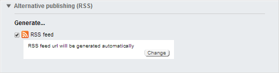

> To see all the feeds configured for your site, click the
> *Administration \> Alternative Publishing* menu option. The screenshot
> shows feeds for ForumsRSS (created automatically for all forum posts)
> and Classic Car Parts (generated when the Classic Car Parts forum was
> created).

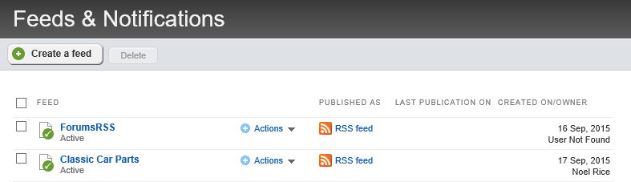

> Click the ForumsRSS item to see how the feed is configured and how to
> actually view the feed. The screenshot below shows the default
> configuration. Notice the *Publish as...* field has a URL that RSS
> readers and web browsers can use to view the feed.

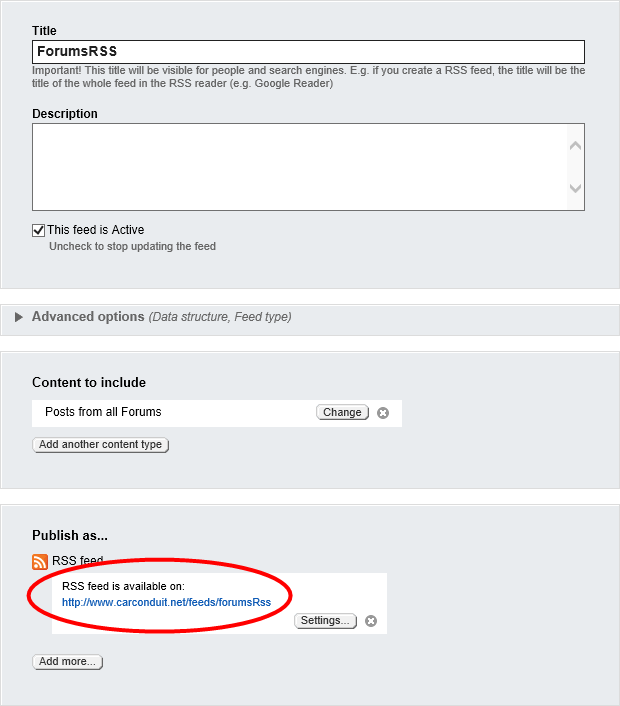

> Try clicking the RSS feed link. Depending on your browser and how it's
> configured, the RSS will show up as a formatted list of articles. The
> screenshot below shows how RSS is displayed in Internet Explorer.
> Consult your browser's documentation for specifics on setting up the
> browser to read RSS feeds.

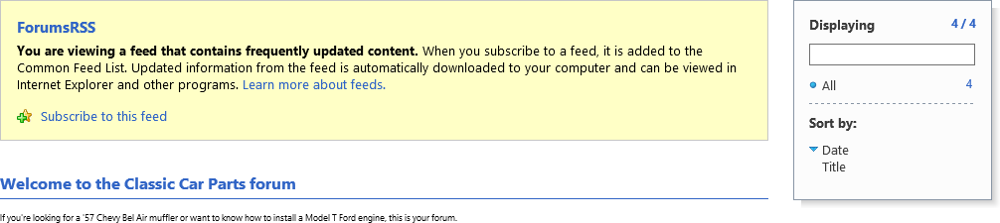

#### Create a new Feed Manually

> This next example describes creating a new custom feed. The example
> takes the RSS feed from an external blog site and funnels it into news
> content.
>
> The walk-through will require an external RSS feed URL. The example
> uses [http://blog.falafel.com/feed/](http://blog.falafel.com/feed/)
> but any valid RSS feed URL will do. Save the RSS URL for upcoming
> steps.
>

#### Note: 
> You can find RSS URLs at hundreds of sites. The link is usually marked with some variation of the RSS logo .

1.  Click the *Administration \> Alternative Publishing* menu option.
    This will bring you to the Feeds and Notifications page.

2.  Click the *Create a feed* button.

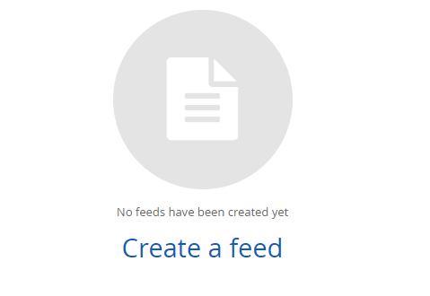

3.  Enter a *Title* and *Description* for the feed.

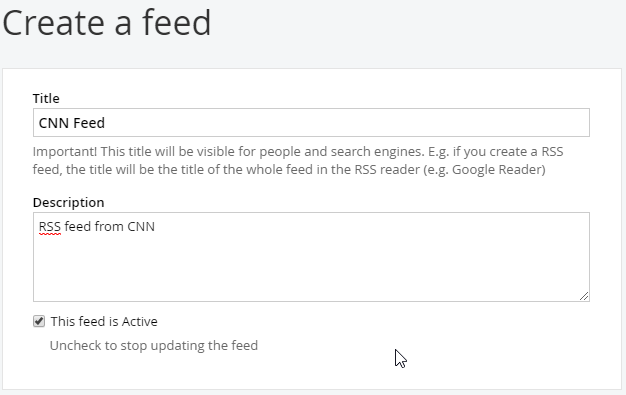

4.  Click the *Add another content type* button.

5.  The *Content to Include* dialog displays. Select the *External
    RSS/Atom feed* radio button and enter the URL of the RSS feed into
    the Url name text box. From the *Schedule publication updates
    interval* drop down list, select *1 hour*. Click the *Done* button.

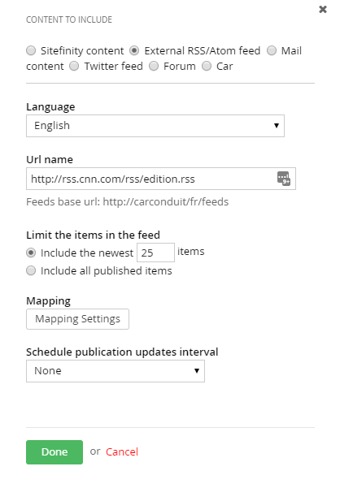

> The *Content to Include* section should now look something like the
> screenshot below that shows the RSS URL you're importing the data
> from.

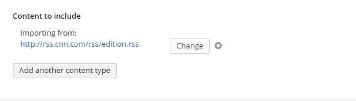

6.  Click the *Publish As \> Add more* button to display the *Content to
    include* dialog. Select the *Sitefinity content* option. From the
    *Import data as* drop down list, select *News* items. Select the
    check box for the *Automatically publish imported data* option.
    Click the *Done* button.

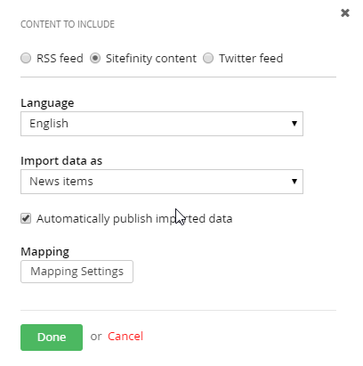

#### Note: 
> By default, the imported data is not published
> automatically, giving you a chance to review each item before it goes
> out to the public.

7.  Click the *Save changes* button.

8.  Select the *Run* option from the Actions drop down list. This action
    will import the data and push it to news content.

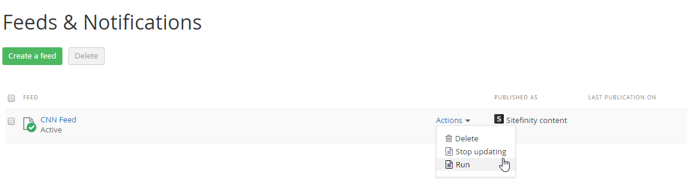

9.  Select the *Content \> News* menu option.

> The imported items from the external blog are now news content. All of
> the items are published and visible from any page with a News widget.

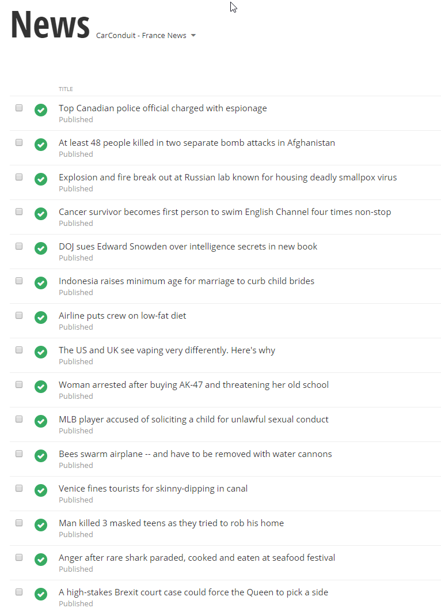
