Analytics Setup
===============
> To get started with Google Analytics, select the *Marketing \>
> Analytics* menu option. Then click the *Configure Analytics* link.

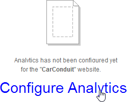

> By setting up a project on the Google API site you will receive a
> *Client id* and *Secret*. You will register the domain you want
> tracked and finally, you will receive a *Tracking* code snippet that
> uniquely identifies your site. That snippet is pasted into a widget
> that is dropped on every page on your site that you want tracked.
> Later, you can access and modify this data from the *Marketing \>
> Analytics* page.
>
> []{#Google_API_Configuration .anchor}Google API Configuration
>
> The first thing you'll need is a Google login, either an existing
> Gmail account or a new account just for this purpose.
>
> Then navigate to the Google API console. You can use the [Google API
> console](https://console.developers.google.com/project) link at the
> top of the Sitefinity Analytics page to get there. The following steps
> obtain a client ID and client secret that you can use to configure
> Analytics in Sitefinity.
>
#### Note: 
> At the time of writing, the screenshots and steps were
> valid, but the API setup may change at any time.
>

1.  Click the *Create Project* button.

2.  In the *New Project* dialog, enter a readable *Project Name* to
    display in the console. A project ID is created for you
    automatically. If you agree with the terms of service, click the *I
    agree* checkbox. Click the *Create* button.

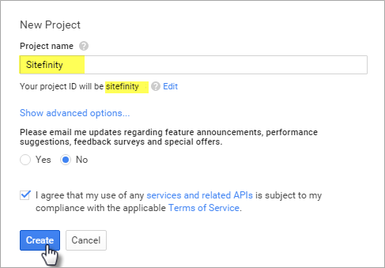

> It will take a little time while Google creates the project and it
> appears in the list.

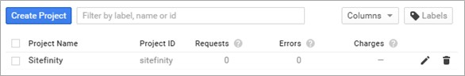

3.  Click the link for your new project.

4.  From the menu on the left, click the *APIs & auth \> APIs* option.
    The APIs that your project can use will be listed.

5.  Click the *Analytics API*.

6.  Click the *Enable API* button.

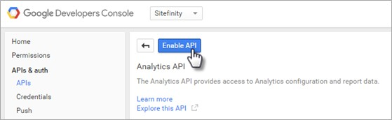

7.  Click the *Credentials* link on the left hand menu.

8.  Click *Add credentials*, then *Oauth 2.0 client ID*.

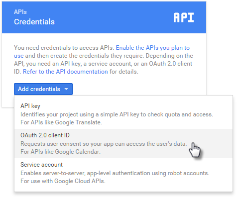

9.  In the Create client ID page, select the *Web application* type, and
    provide a unique *Name* for the client ID. The *Authorized
    JavaScript origins* needs a public URI, that is, it should end with
    .com, .net, .org, etc. For the *Authorized redirect URIs*, you can
    take the URI you used for Authorized Javascript origins and append */Sitefinity/marketing/Analytics* 
    (use the exact upper and lower case). See the screenshot below for a working example.

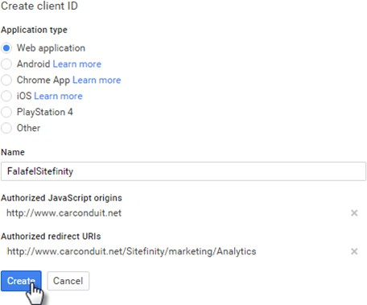

#### Note: If you're testing on a local machine, you can edit your
> [Hosts](https://en.wikipedia.org/wiki/Hosts_(file)) file to create a
> mock public URI, by adding a line similar to the example below:
>
> *192.168.56.1* [*www.carconduit.net*](http://www.carconduit.net/)

1.  Click the *Create* button. A dialog will pop up with your new client
    ID and client secret.

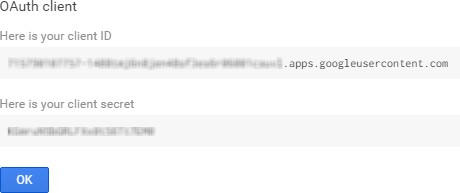

#### Sitefinity Analytics Configuration

> Select the *Marketing \> Analytics* menu item.
>
> Enter the Client Id and Client Secret you obtained from [the Google
> API Configuration](#Google_API_Configuration) topic steps, and then
> click the *Login to Google* button.

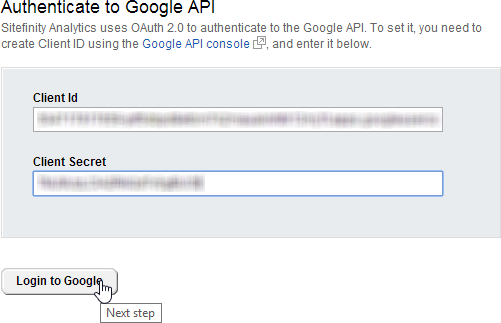

> If you see a popup from Google to have access, click the *Allow*
> button to continue.

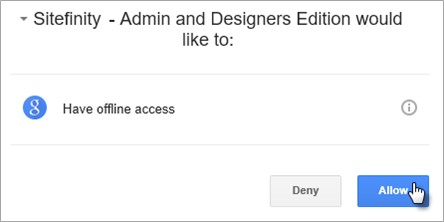

> The actions you've taken so far will bring you to the second step of
> the process, selecting a Google Analytics account. Select from the
> list of *Available accounts*, enter the domain you want to have
> tracked and click the *Save settings* button.

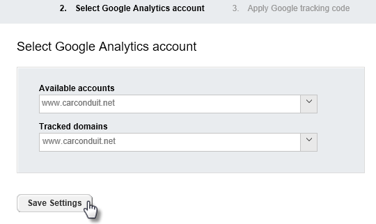

> The third and last step presents you with the take-away from the whole
> process \-- the Google tracking code. Copy the JavaScript code from
> the dialog and save it for later use in the pages that you want to
> track. To look at the Dashboard and available reports, click the *Go
> to Analytics* button.

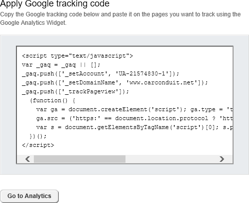

#### Tracking Pages

> To allow Google Analytics to hook into your pages and start collecting
> information, drag the Google Analytics widget from the Script and
> Styles group onto pages that should be tracked.

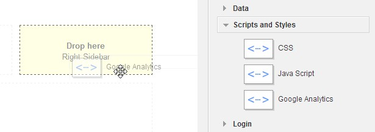

#### Note: 
> For easier maintenance, consider adding the widget to a page
> template so entire groups of pages are tracked automatically.
>
> Click the Google Analytics widget *Edit* button and paste the Google
> Analytics code that you copied during setup. Then click the *Save*
> button. The code will be included with the page but will not be
> visible.

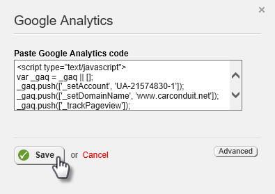

#### Analytics Dashboard and Reports

> As users navigate the site, they leave valuable information about
> their interests. For example, how many new visitors are there? What
> culture and languages do they expect? What are the capabilities of the
> devices they are using? What web browsers are they using? What content
> interest them? What terms are they searching on?
>
> All this information and more are found on the *Marketing \>
> Analytics* page. The left hand panel has top-level links for a
> Dashboard, and reports for Visitors, Traffic sources and Content.

#### Dashboard

> The Dashboard provides an at-a-glance overview of your site's success.
> The drop down allows you to switch views that examine daily Visits,
> Pageviews, Bounce rate (the number users that enter the site and then
> leave), Average time on the site, Average Pages per visit and New
> visits rate. The scale for the left-hand axis of the chart shows
> quantity of visits, etc. while the bottom of the chart shows the day
> each data point was recorded.

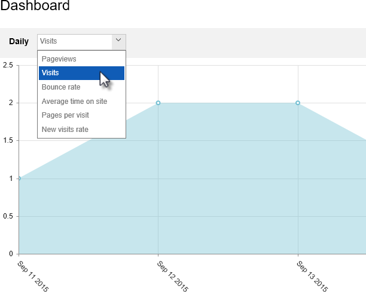

> On the right hand of the chart, the date selection down-arrow displays
> a dialog where you can dial in a date range.

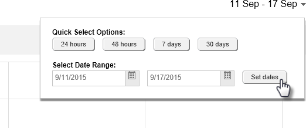

> Below the date selection, a set of three buttons groups data by day,
> week or month. At the far right side of these buttons is the *Map /
> Chart* button that toggles between views.

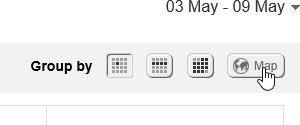

> The Map view is handy for quickly spotting the relationships between
> the data and locations in the world. The Dashboard below shows a
> concentration of new visits coming from Mexico and the northern
> regions of South America. Both chart and map show a detailed breakdown
> below the main summary graphic.

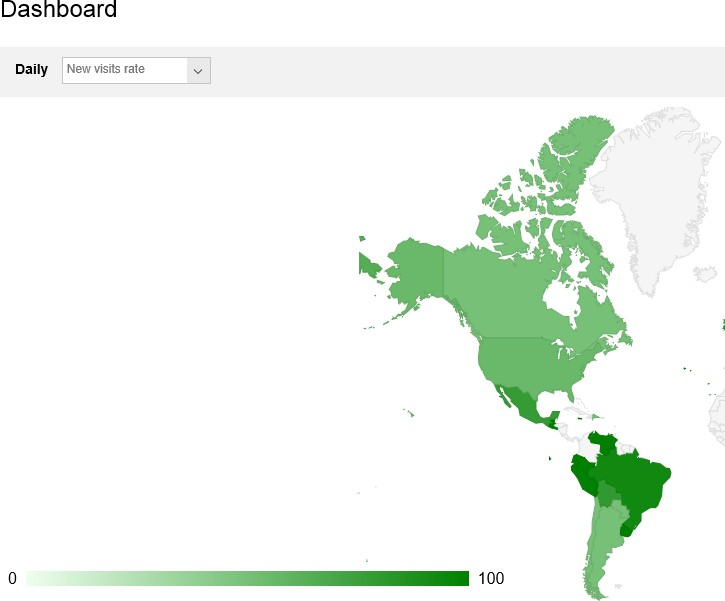

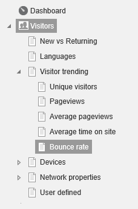

#### Visitors

> The Visitors group of reports help explain the direction your site is
> going in. The Visitor trending reports reveal how many new unique
> visitors enter the site in one week compared to another, how long
> people stay on the site and how many pages do they visit.
>
> Devices include reports on operating systems, mobile devices,
> browsers, resolutions and screen colors being used.
>
> Network properties reports list the service providers that carry users
> to your site and the host sites that visits to your site originate
> from.
>
 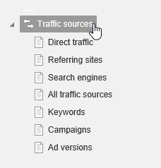
 
#### Traffic Sources

> Traffic sources detail what route visitors take to get to your site.
> That is, do people navigate to your site directly, are they redirected
> to your site from a partner's web site, or do they arrive via search
> engines? This view also helps determine if your marketing campaigns
> are effective.
>
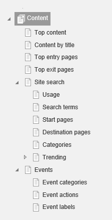

#### Content

> Content reports help rank the best pages and content. What pages do
> your visitors enter the site at? Do they use a Site search to find
> your site and if they do, what were they searching on? What page was
> the user on when they decided to leave your site?
