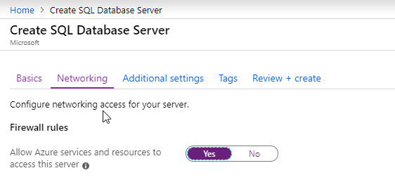

Azure Deployment
----------------

Publishing to the cloud makes your site instantly more scalable and
reliable. Need failover capability or to suddenly expand capacity? You
can take your Sitefinity site as it is now and push it up to Azure.

The technologies used in this example are Sitefinity 12, Visual Studio
2019, SQL Server Management Studio 18.2 and the [Azure
portal](https://portal.azure.com/) The Sitefinity
website and Sitefinity database are already created on the development
server. We'll be creating the following elements in Azure during this
walk-through: Resource Group, SQL Server, SQL Database, a Storage
account and the App Service for the Sitefinity website.

#### Prepare the Sitefinity Website and Database

On your local development machine, if you haven't already, create a
new Sitefinity website, and use MS SQL as the database. You should be
able to login to the Sitefinity backend.

#### Create the Azure SQL Server

In the Azure portal
- First Create a new resource group to contain all your resources for your Sitefinity Cloud needs

- Create a new SQL Server. Make a note of the server path, the user name and password. 

- Be sure that the *Allow Azure Services to Access the Server* checkbox is enabled.

#### Note: 
If you use the resource group for everything related to the
site, you can move the entire site to another account later if the
website changes hands or is bought.

Open the SQL Server *Settings* blade, select *Firewall*, and click the
*Add client IP* link. Make sure the *Allow access to Azure services*
switch is turned on. Save the Firewall settings.

This should work fine in Enterprise environments with static IPs. If
you're experimenting with this at home with dynamic IPs, you'll have
to add new entries whenever your IP expires.

#### Create the Azure SQL Database

Next, create a SQL database that will hold the Sitefinity data. You
can leave the source as *Blank database* -- it will be populated later
from imported data.

#### Publish the Database

The simplest way to publish the database is from Microsoft SQL Server
Management Studio 18 or later. This route allows
you to use the *Deploy Database to Microsoft Azure SQL Database...*
option directly to an Azure Database.

Click through the Introduction page to reach the Deployment Settings.

In Deployment Settings, click the *Connect* button.

In the Connect to Server dialog, enter the Server name, Login and
Password you saved when you created the Azure server. Click the
*Connect* button to return to Deployment settings.

The database name will carry over from your original database
instance. Use the *Microsoft Azure SQL Database Settings* to adjust to
resources for the target database. We're using the Standard edition
here, with a maximum database size of 250 GB. The Temporary file name
points to a location that stores a "bacpac" file, but, other than
making sure we have space at that location, we don't need to worry
about it. Clicking the *Next* button, navigates you to a summary page.

At the Summary, click the *Finish* button.

Depending on the size of the database, connection speed and Azure
resources, the import will process. This example Sitefinity database
took about 4 or 5 minutes to complete.

Prepare the Sitefinity Application for Publication
--------------------------------------------------

On your local development machine, open the Sitefinity site in Visual
Studio. In the Solution Explorer, click the *Show All Files* button,
then open *App\_Data\\Sitefinity\\*. Find your *Sitefinity.lic* file,
right-click and select *Include in Project* from the context menu.

Move down to the *App\_Data\\Sitefinity\\Configuration* directory and
add any config files you want included in the project.

Open the *DataConfig.config* file and copy the connection string for
the Azure database into the *connectionString* attribute. Also, change
the value of the *dbType* attribute to *SqlAzure*.

Open the project's *web.config* file for editing. Locate the
*\<sectionGroup name="telerik"* Make sure the storageMode is equal to "Auto" or at least "Database" but definitely **NOT** "File System"

#### Publish to Azure

In the Solution Explorer, right-click the Visual Studio project and
select *Publish* from the context menu. In the Publish Web dialog,
select Microsoft Azure App Service.

#### Note: 
You will need to have the Azure SDK installed to get the
Microsoft Azure App Service publish target.

Click the *New...* button to create a new App Service.

Enter a Web App Name or leave the automatic defaults. Use the Resource
Group created earlier to keep all the website elements in one
container. The App Service plan is defined by your Resource Group, so
you can leave the default. Click the *Create* button.

Make sure you choose an appropriate Hosting plan for your service

Your deploy settings should download automatically. Click on Deploy and wait few minutes till the site appears in your default browser

The Visual Studio Output window will show the build progress. Then
Visual Studio will kick off a browser to display the Sitefinity --
Azure website.

And finally, the backend screen at its new Azure web address:

**Next Topic**
[Alternative Publishing](../Alternative%20Publishing/readme.md)