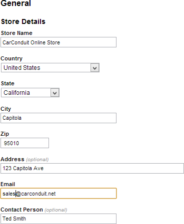
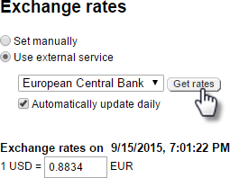
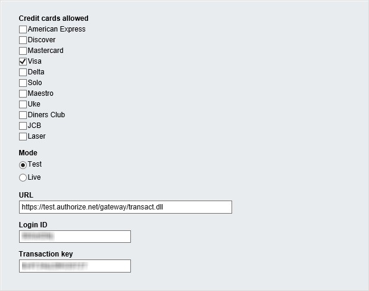
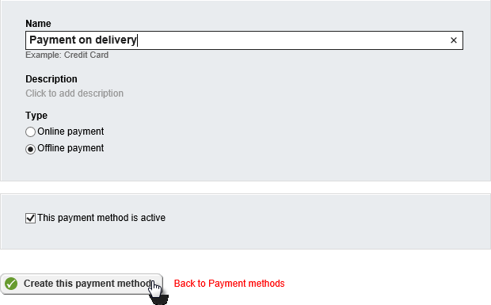
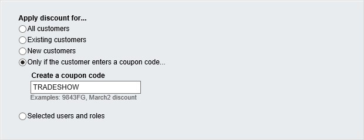

Ecommerce
---------

> Before a set of pages can be built that form a shopping experience for
> visitors, the site administrator must configure a minimal set of
> options. In particular, you must set up a store, shipping methods and
> payment methods. Also, most sales require tax rates be set up. If you
> want enable product reviews, you need to configure comment settings to
> allow it.

#### Configure a Store

> From the *Ecommerce \> Store* settings menu option you can configure
> online stores so they can accept customer orders.

1.  Select the *Ecommerce \> Store settings \> General link*.

2.  In the Store Details section, enter the Store Name, Address and
    Email.

3.  The Advanced section has an option to Save credit card number in
    database. This only needs to be selected if credit cards are not
    processed immediately. The option to Bypass real-time payment
    processing allows you to skip setting up credit card authorization,
    just to test the system.

4.  Click the *Save* button.

#### Configure Tax

> Configuring taxes determines when and how taxes are added to orders.
> Click the Tax link. The default excludes the tax until checkout.
> Instead, you can include the tax in the price automatically or you can
> manually include the taxes in the price as the price is entered. Leave
> the defaults.

#### Configure Measurement Units

> This section determines how product weight and dimensions are
> measured. Click the Measurement Units tab. Mass unit (weight) can be
> Pound, Kilogram or Gram. Length unit can be Inch, Meter, Centimeter,
> or Millimeter. Leave the defaults here.

#### Configure Currency

> This section determines the currencies your site will handle and the
> exchange rate for those currencies. Click the Currencies tab. A
> default currency will display. Click the Add currencies button and
> select one or more from the list of standard currencies, then click
> the Done button.

> Once new currencies are added, the Exchange rates section displays.
> While you can set the exchange rate manually, the Use external service
> option allows you to select a service from a drop down and populate
> the exchange rates automatically. Just click the Get rates button. To
> recalculate the rates daily, select the Automatically update daily
> check box.

#### Shipping Methods

> Shipping methods describe how products will be delivered to the
> customer. You can either use a carrier, like Federal Express or you
> can handle the shipping arrangements yourself *offline*.
>
> If you decide to ship online using a carrier, you will need to setup
> an account. Typically, each carrier will have a developer site that
> allows you to sign up for a test account that you can use to verify
> your ecommerce system will work before going live.

#### Creating an Online Shipping Method

> To demonstrate creating a shipping method that uses an online carrier,
> this example uses a FedEx test account.

1.  Go to the FedEx developer site at <http://fedex.com/us/developer/>
    and create an account. Collect the account URL, Password, License
    Key, MeterID and Account number from the confirmation page and the
    follow up email sent by the developer site.

2.  Select the *Ecommerce \> Shipping* methods menu option.

3.  Click the *Create a shipping method* link.

4.  Enter a Name for the method. Select the Area you will ship to using
    this method. Leave the Standard (Shipping carriers). Select FedEx
    Shipping Carrier from the drop down list.

5.  Select the check boxes for all types of shipping that you want to
    include in this method.

6.  Using the information from the FedEx developer site, enter the Url,
    Password, License Key, MeterID and Account Number.

7.  Click the *Create this shipping method* button.

#### Creating an Offline Shipping Method

To ship offline:

1.  Select the *Ecommerce \> Shipping* methods menu option.

2.  Click the *Create a shipping* method link.

3.  Enter a Name for the method. The screenshot below uses *Slow Train*
    as an offline shipping method example. Select the Area you will ship
    to using this method.

4.  Select the *Custom (Offline)* radio button.

5.  Shipping offline requires that you set the shipping cost
    specifically. In the Shipping price area, you can base the price on
    Weight, Total price, Fixed price per order, Fixed percentage of the
    total price or Quantity. This example uses the Fixed percentage of
    total price option with Shipping price set to 10%.

6.  Click the *Create this Shipping method* button.

#### Payment Methods

> Payment methods describe how orders will be paid for: online with a
> credit card or offline where you handle the payment arrangements.
>
> Creating an Online Payment Method
>
> Online payment methods describe how a commercial payment processor
> like PayPal or Authorize.Net AIM handle your site's credit card
> transactions. Online payment processing services typically have live
> accounts for production online ordering and test accounts to help
> verify that your processing will be correct.
>
> Each payment processor has its own set of information that must be
> entered in Sitefinity's payment type. Typically, the payment processor
> supplies you with a URL of a service that performs the processing and
> some kind of authentication such as login id or vendor name. The
> payment processor developer documentation may also supply test credit
> card numbers that will not charge an account but will pass validation.
>
> For example, you can sign up at the Authorize.Net developer center for
> a test account at
> [https://developer.authorize.net/testaccount/.](https://developer.authorize.net/testaccount/)
> Here's an example walk-through that uses Authorize.Net AIM to create
> an online payment type:

1.  Sign up for a new account at
    [[https://developer.authorize.net/testaccount/]{.underline}.](https://developer.authorize.net/testaccount/)
    Collect the login ID and Transaction key they provide.

2.  In Sitefinity, select the *Ecommerce \> Payment methods* menu
    option.

3.  Click the *Create a payment method* link.

4.  Enter a Name for the method, for example, Credit Card.

5.  Select Authorize.Net AIM from the Payment processor drop down list.

6.  The Payment processor drop down list selection cascades to set the
    allowed credit cards and required authentication settings.

7.  Select the check boxes for credit card types you will accept on your
    site. For now, leave the Mode radio button at Test. Set the URL to
    [[https://test.authorize.net/gateway/transact.dll]{.underline}.](https://test.authorize.net/gateway/transact.dll)
    Enter the Login ID and Transaction key supplied by the developer
    site.

8.  In this example, the Timeout is 30000 milliseconds (30 seconds), the
    Payment type is Sale and the API version at the time of this writing
    is 3.1.

9.  Click the *Create this payment method* button.

10. Once you test that the online payment methods work, you can change
    the URL to a live URL (you get this URL from the payment processor)
    and switch the Mode from Test to Live.

#### Creating an Offline Payment Method

> The offline payment method simply defines a Name. Once you enable the
> This payment method is active checkbox, you can use the method. This
> leaves the responsibility for collecting payment to you. To create an
> offline payment method:

1.  Select the *Ecommerce \> Payment methods* menu option.

2.  Click the *Create a payment method* link.

3.  Enter a Name for the method. The screenshot below uses Payment on
    delivery as an offline payment example.

4.  Make sure that the *This payment method is active* checkbox is
    enabled and click the *Create this payment method* button.

#### Taxes

> You don't want to lookup tax amounts for every purchase. Instead,
> Sitefinity allows you to define taxes based on the unique combination
> of shipping or billing location and the country where the product is
> to be delivered. Taxes are associated with products when the product
> is created. Tax amounts are calculated automatically during the
> checkout process based on the rates that you define. The screenshot
> below defines a tax named Standard VAT for shipping addresses where
> the country of delivery is the United Kingdom, the rate is defined as
> 20% and is not applied to shipping costs.

#### Note: 
> You can import and export taxes as CSV (comma delimited)
> files from the *Ecommerce \> Taxes* page.

#### Tax Classes

> Tax classes allow you to subdivide a tax into different rates or to
> flag some products as tax exempt. For example, the United Kingdom
> Value Added Tax (VAT) might have a standard rate of 20%, a reduced
> rate of 5% for some items like home energy and a zero rate for certain
> goods and services like food and children's clothes.
>
> Select the *Ecommerce \> Tax Classes* menu item. Then click the
> *Create a tax class* button. Enter a name for the tax class (the
> actual rate is defined when creating or editing a tax). There is a
> single field to enter the Tax class name.

> Once your tax rates are defined, return to *Ecommerce \> Taxes*. You
> can create a new tax or edit an existing tax. Below the Standard rate
> for the tax, you should see tax classes you have created. The
> screenshot below shows the standard 20% VAT rate, a 5% rate for home
> energy, a zero rate for children's clothes and a rate for postage.
> Notice that the postage tax class is flagged Tax exempt.

> When content creators build a product catalog and define new products,
> they can select a Tax class from the list.

#### Discounts

> Discounts allow you to promote products by offering lower rates based
> on the customer belonging to a group. For example, the user may have
> attended a tradeshow where they received a coupon code. To create a
> discount:

1.  Navigate to *Ecommerce \> Discounts*.

2.  Click the *Create a Discount* button.

3.  Enter a Name for the discount and a Discount amount. The discount
    amount can be percentage or an absolute currency amount. If you want
    to limit the number of times the discount can be applied, enter a
    number in the *This discount can be used* text box.

> The *Apply discount for...* section creates a group of customers based
> on a criterion. The discount can be for All customers, Existing
> customers, New Customers, customers that enter a coupon code (this
> shows up in the checkout process) or based on Sitefinity roles or
> particular users. This example applies the discount if the customer
> enters a coupon code.

> You can limit the discount to be effective only between a Start date
> and End date.

> You can also establish a threshold where the amount must be within a
> certain Minimum subtotal or Maximum subtotal.

4.  Click the *Create this discount* button to add the discount.