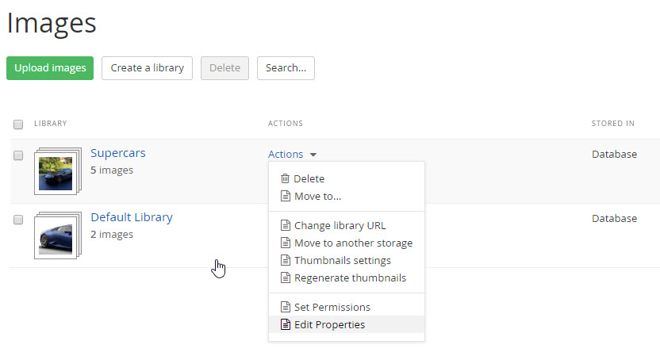
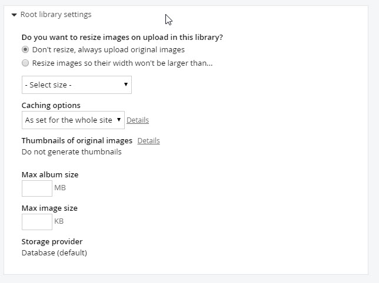
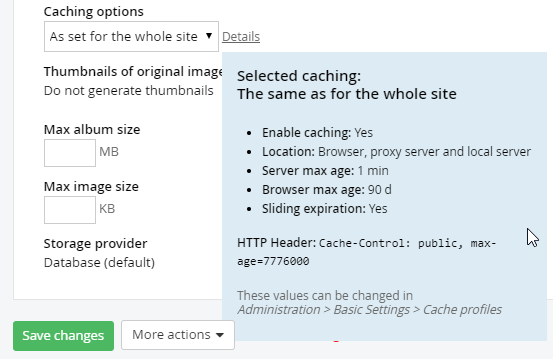

Image Libraries
---------------

When an image library is first setup, the Root library settings may
not get a lot of attention, but you will need to review this
configuration to get the best performance and behavior out of the
site. To edit image library settings, select the *Content \> Images*
menu option. 

In the Actions menu for a library, select the *Edit
properties* option, then open the Root library settings section.

The top section allows you to automatically resize images as they are
uploaded. You can keep the original dimensions or limit images a
selected width.

Browser caching defaults to the same settings as those used for the
entire site: *No caching*, *Standard caching* with a duration of 90
days, *Long caching* of 365 days, or *No explicit client caching*. To
set the cache settings globally, navigate to *Administration \>
Settings \> Advanced settings \> System \> Output Cache Settings*.

What if a page won't update and you think it may be cached? You can
disable the cache to make sure caching is not part of the problem.

#### Note: 
Consider turning off caching during initial development of
your site, then turn it back on for production.

The default album size is \"anything goes\", but you should make a
decision on what the maximum image size should be. You don\'t want
huge file uploads that take over the server hard disk. Limit the
overall album size by setting *Max album size* in megabytes and *Max
image size* in kilobytes.

You can change the *Storage provider* to be *Database* or *File
System*. By default, all the binary data for images, videos, documents
and files are stored in the database, but you can use the file system
to store all of this data.

#### Note: 
Be aware that the saved data will still be unreadable when
viewed in the file system. For example, you won't be able to find
"logo.png" as separate file. Using the file system mechanism just
shifts the load of where the binary data is stored.

Server caching options can default to the same as used for the entire
site (set from *Administration \> Settings \> Advanced Settings \>
System \> Output Cache Settings*). You could also elect the *No
caching* option, *Standard Caching* with a 2-minute duration and *Long
Caching* with a 20-minute duration.

1.  Caching is set to *As set for the whole site* as the default. Click
    the *Details* link to see the current settings. The details popup
    shows the caching options, the HTTP Header equivalent, and help on
    where to reconfigure these settings.

**Next Topic**
[Backend Theme](../Backend%20Theme/readme.md)
