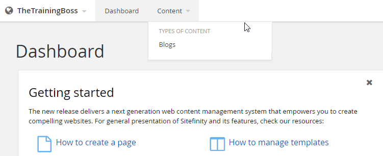

Modules
-------

Content and features are supplied through Sitefinity's plug-in
modules. Using modules, you can install new features as they become
available. Sitefinity ships with a full complement of modules that
support the features for your Sitefinity. Sitefinity modules are
managed from *Administration \> Modules & Services*.

Selecting this item reveals a list of registered modules and their
installation status. The screenshot below shows a small sample.

A green checkbox indicates that a module is installed and active, a
grey x shows a module that is installed but not activated, and finally
a grey dash (-) represents a module that is registered but not
installed.

#### Installing a Module

To install a new module, click the *Install a module* button.
Sitefinity prompts you for the details of the module to be installed.
These details correspond to the name and description columns of the
Modules and Services list.

The Type value is the fully-qualified name of the module class
including the assembly.

Selecting the *Do not start* option will install, but not activate the
module. You will need to manually activate the module before it will
be available. If you wish to both install and activate your module
simultaneously, select the option labeled *When the whole application
is opened for the first time*.

#### Disabling an Installed Module

Each module in Sitefinity can be disabled to save resources by
reducing the memory footprint. This is especially helpful in shared
hosting scenarios, where resources are limited. To disable an active
module, open the Actions menu to the right of the module description
and select *Deactivate*.

A disabled module is not loaded into memory by Sitefinity, but retains
any information and settings previously entered when it was active.
Any backend pages and associated widgets are also hidden, but not
deleted.

#### Activating a Disabled Module

Disabled modules are shown in the list with the label Inactive. To
enable a module, select the *Activate* option from the Actions menu.
Activating a disabled module restores its functionality and
configuration settings along with any associated pages and widgets.

#### Uninstalling a Disabled Module

Once a module is disabled, it can be safely uninstalled by selecting
Uninstall from the Actions menu of a disabled module. Uninstalling a
module does *not* delete any data or database tables that are used by
the module. Reinstalling a module will restore the previous data, but
reset all configuration settings, pages, and widgets.

#### Deleting an Uninstalled Module

Once a module is uninstalled, it can be deleted safely. Newly
installed modules that have not been activated can also be deleted
safely. This is done by selecting Delete from the Actions menu of an
uninstalled module. Deleting a module will remove it from the list of
modules and services and require reinstallation (see the Installing a
Module section) to restore its functionality.

Security Permissions
--------------------

Use permissions to get fine-grain control over your Sitefinity assets.
A Permission allows a user to perform actions, such as edit pages,
delete blog posts or make comments. A Role is a collection of
permissions. A user is assigned one or more roles to obtain the
permissions for those roles.

To view the built-in roles that come with Sitefinity, click the
*Administration \> Roles* menu item. For example, users with the
Authors role have permission to create content but not delete it.

#### Creating a Role

The following steps show how to create a new role for bloggers that
has permissions to view, modify and manage blog posts.

1.  Click the *Create a role* button. In the Role text box that appears,
    enter *Bloggers* and click the *Create* button.

2.  Click the *Permissions* link for the Bloggers role.

The extensive list of permissions covers all possible capabilities of
a user in Sitefinity. Scroll through the list and notice that, by
default, the role has no permissions. Without enabling some
permissions, users with this role will not be able create, modify or
delete anything in the system.

3.  Locate *Blogs \> BlogPost* section of the list.

4.  Click the *Change* button. Enable the *View blog post* and *Modify
    blog and manage posts* check boxes.

5.  Click the *Done* button to close the dialog.

6.  Click the *Back* to all items link.

#### Creating a User

These next steps show how to create a single user and assign the new
Bloggers role to the user.

1.  Select the Administration \> Users menu item.

2.  Click the Create a user button. This will display the Create a user
    page.

3.  All fields in the first section of the Create a user page are
    required except for Photo, about and Nickname.

4.  By default, the This user can access site backend option is checked.
    The option includes the Backenduser role for this user
    automatically. Leave the option checked. Also select the new
    Bloggers role.

5.  Click the Create this user button.

6.  The new user shows up in the users list.

To test that the new user can login and has the permissions that come
with the Bloggers role, Click the *Logout* link found in the upper
right corner of the page, then login as the new user. Now the
administration menu should include both the Dashboard and Content menu
items. You should be able to select the *Content \> Blogs* menu item,
add blog posts and edit blog posts.

#### What's with the "Someone is already using this username"

When logging in for the second time under the same user name, the
dialog below appears:

You can eliminate this message using the *Administration \> Settings
\> Advanced \> Security* option. Check the *Automatically logout
backend users from other HTTP clients on login* so that logins from a
new location automatically logout of the old location.

The *Disable the limit of active simultaneous backend users* checkbox
can be selected, assuming the site is licensed for unlimited users or
has Security Token Service with windows authentication.

**Next Topic**
[Workflow](../Workflow/readme.md)