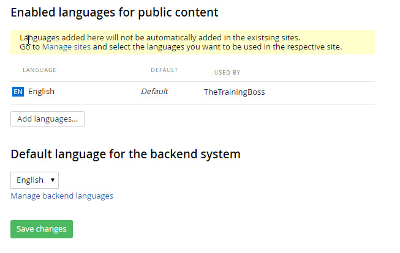
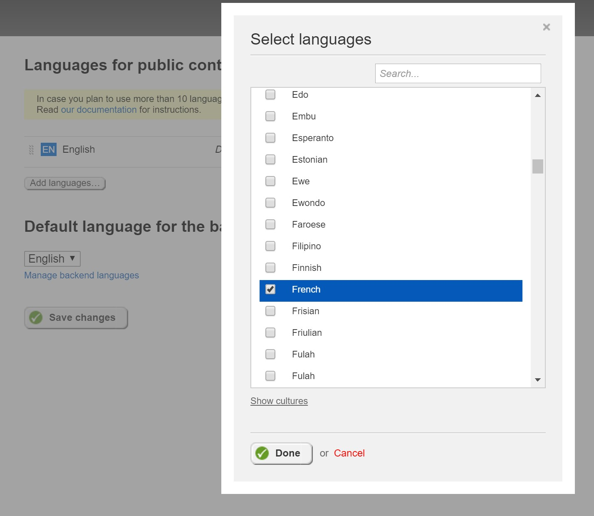
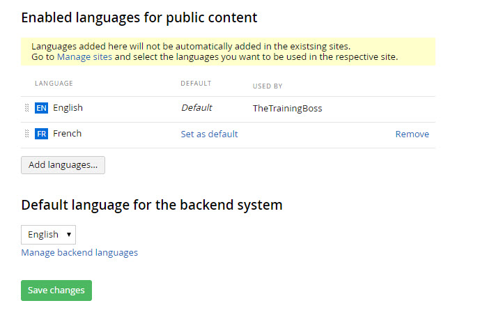
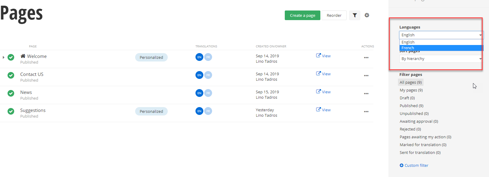
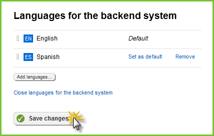
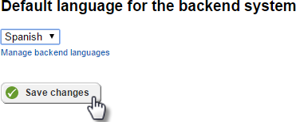
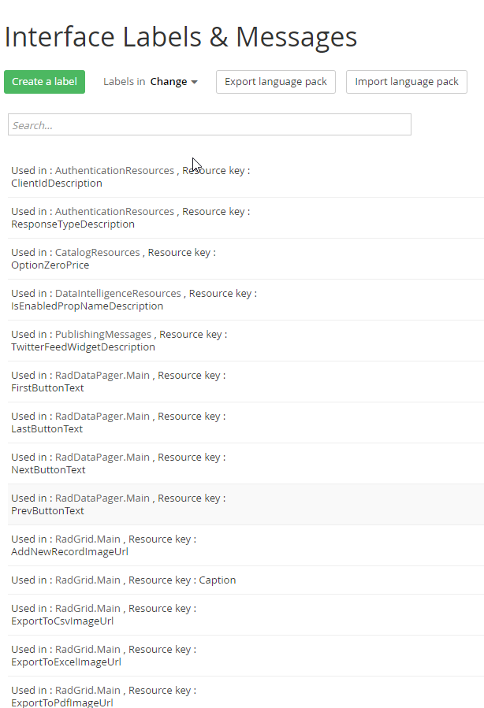
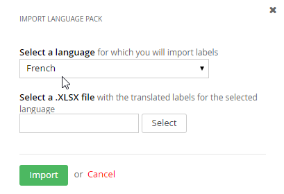
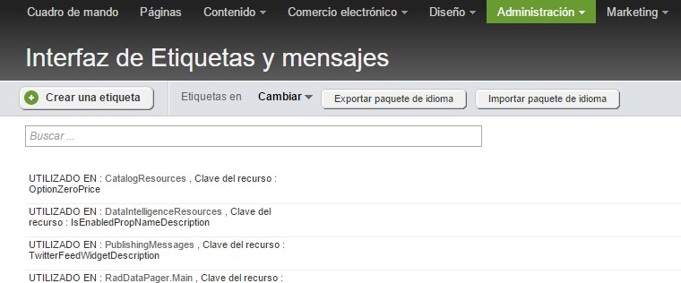
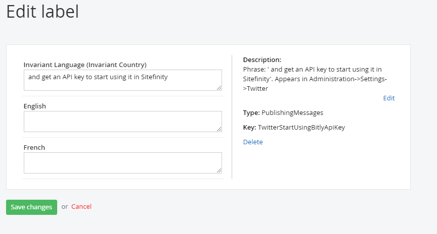

Multilingual Content
--------------------

If you need to create a multilingual site, you will need to configure
languages. You can find the languages settings under *Administration
\> Settings \> Languages.*

Click the *Add* button to start adding your languages. You can also
add region specific languages by selecting the *Show Cultures* link in
the modal window.

In the *Multilingual URLs* section, you can define the strategy for
your multilingual content URLs. Unless you absolutely want to have a
subdomain defined for every language, the default option should work
pretty well for you. The *Directories* strategy makes it a lot easier
to manage languages without having to match languages with your sub
domains.

Once you have defined the languages, now you can start adding
multilingual content to your site. Sitefinity includes nice visual
indicators for multilingual sites, to improve the editing experience.

You will notice that now you have a language selector on the right
hand of the screen that allows you to quickly navigate to another
language.

#### Multilingual Back End Pages

Localizing back end pages use a similar mechanism used to localize
front end pages. To change the back-end language:

1.  From the Administration menu select the *Settings \> Languages*
    option

2.  Click the *Manage backend languages* link to see the *Add
    languages\...* button.

3.  Click *Add languages\...* to display the *Select languages* dialog.

4.  Select one or more languages from the list and click the *Done*
    button.

5.  Finally, click the *Save changes* button.

After clicking the *Close languages for the backend system* link, a
drop down will allow you to choose the language for the backend
system. Select a new language from the drop down list, then click the
*Save changes* button.

There is no immediate change. You need to load translated [[Labels &
Messages]{.underline}](#Labels_&_Messages) to see the effect.

#### Labels & Messages

The *Administration \> Labels & Messages* menu item displays a page
that lists all the labels, captions and other text in the system that
 can be localized. These labels populate all text in the system
including the Administration menu text, widget text and even the
column headings in grid widgets. Each label can be edited to define
the Invariant language (the default language) and for each language
you have configured from the *Administration \> Settings \>
Languages*. You can create labels for user interface elements in the
backend and then export those settings as an XLSX "Language Pack", or
you can import a language pack that already has the translations.

#### Importing and Editing a Language Pack

You can import \"language packs\" of translated labels and messages in
.xlsx spreadsheet format. Sample language packs can be downloaded from
the [Sitefinity marketplace online](http://www.sitefinity.com/developer-network/marketplace)

To import a language pack, click the *Import language pack* button,
select the language from the drop down list, and select the downloaded
XLSX spreadsheet file. Click the *Import* button. It will take some
time to import and update the system.

Refresh the page to see all the resourced items in the system backend
display in the corresponding language.

To edit any of the labels, click the item in the list and edit the
Invariant (default) language, and each language you have defined.

**Next Topic**
[Image Libraries](../Image%20Libraries/readme.md)