Multisite
==============
Multisite capability allows you to have multiple sub sites within a
single Sitefinity instance. This means that you can share your
content, users, and permissions and so on, while still managing all
sites from a single user interface. You can even duplicate pages
between sites and share forms. This works particularly well for a
series of sites that have a similar purpose but serve different sets
of customers, for example a series of banks for different groups of
depositors, a group of stores located in different geographical areas
or even businesses located in different countries. If your site needs
an international presence, each individual sub site can even have its
own language.

#### Note: 
Sites can be created within multi-site management as shown
below, or existing sites can be migrated to multi-site using Site
Synchronization.
 
Multisite management requires an Enterprise license. See the
[Sitefinity Editions](http://www.sitefinity.com/editions) page for a
list of features included with each edition of Sitefinity.

Verify that the multisite feature is active using the Administration
\> Modules & Services option.

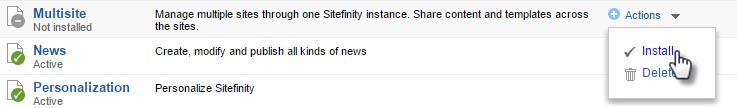

A drop down list in the upper left corner of the back-end
administration pages shows the name of the site you're currently
working on (named MultiSiteDemo in this example). Opening the list
allows you to manage sites or navigate to global settings (the
*Administration \> Settings* page).

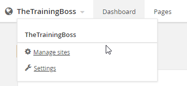

Let's create a second site:

1.  From the drop down list click the *Manage sites* link. This brings
    you to a list of sites that will initially contain only the one
    site.

2.  Click the *Create a site* button.

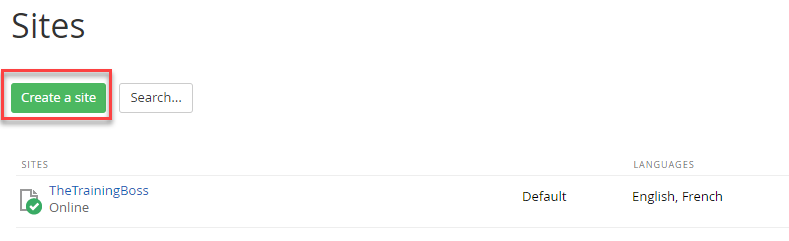

3.  Enter the *Name* and *Domain* of the new site. The radio buttons at
    the bottom of the area allow you to create an empty site from
    scratch or duplicate pages and settings from existing site. This
    second option can be a great timesaver if the sites have similar
    structure and content.

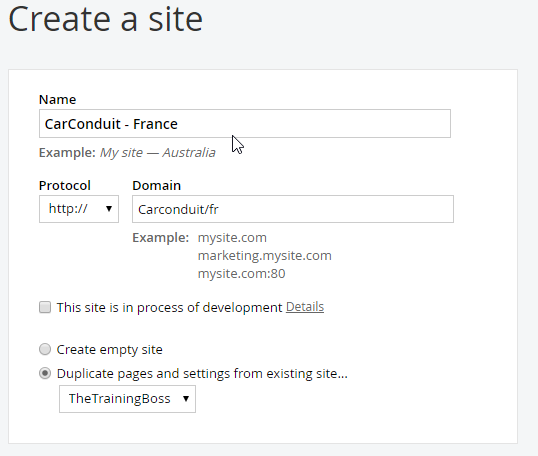

#### Note: 
If you're developing the site and want to add a second
domain that can be used for preview, check the This site is in the
process of development checkbox and enter a Testing domain.

4.  The *Languages for public content* area will have a default
    language. In this example, click the *Add languages...* button,
    select *French* from the list and finally, click the *Done* button.
    Next to the *French* entry, click the *Set as default* link.

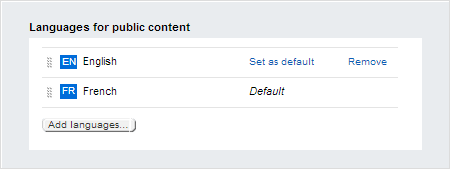

5.  Leave *This site is in offline mode* option unchecked.

#### Note: 
If you check this option you'll be prompted to either show a
message such as "The page is not accessible" or redirect the visitor
to another page when they try to open a page on the site.

6.  Click the *Continue* button.

7.  Next, identify where the content for the site will come from. Notice
    in the screenshot below that, by default, all modules use only data
    from this site. Also, only the Libraries entry is checked, meaning
    that the Content menu for this site will have only Images, Videos,
    Documents & Files, and Forms.

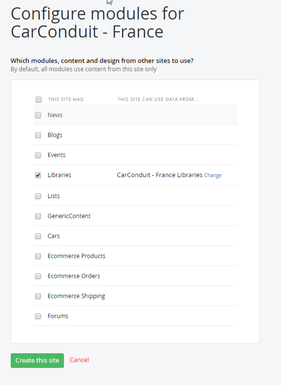

8.  Select the *News* checkbox.

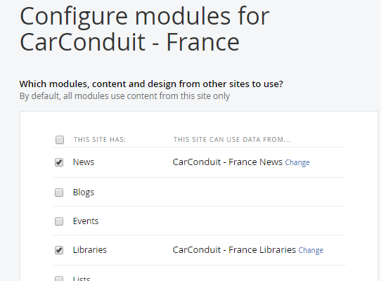

9.  Click the *Change* link for the *News* item.

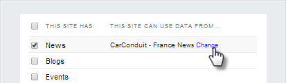

10. Select the *Default News* checkbox. This will allow the new site to
    use news created on the site and also from the original site. Click
    the *Done* button.

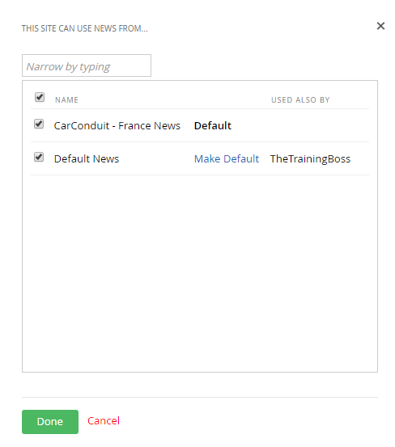

11. Click the *Create this site* button. It will take a little time
    while the new site is built.

12. Now the dropdown list in the upper left lists both the original site
    and the new site. The dropdown allows you to select which site
    you're working with at any one time. Select *CarConduit -- France*
    from the list.

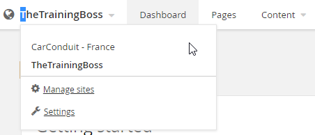

13. With the *CarConduit -- France* site selected from the list, try
    creating a page, it will already be setup for localization:

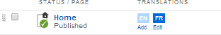

14. Using the multisite dropdown list, switch back to the default site.

15. Select the *Content \> News* menu item.

16. Create a news item.

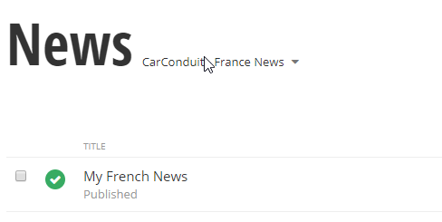

17. Using the multisite dropdown list, switch to the *CarConduit --
    France* site.

18. Notice that you have access to two news sources, one for the
    *CarConduit -- France* site that is currently active and *Default
    News* from the default site. Select *Default News*.

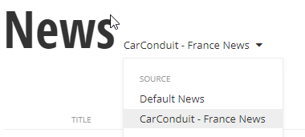

The news item from the default site is available here and, because
this site is set to use the French language setting, the translation
buttons are already available.

**Next Topic**
[Image Libraries](../Image%20Libraries/readme.md)