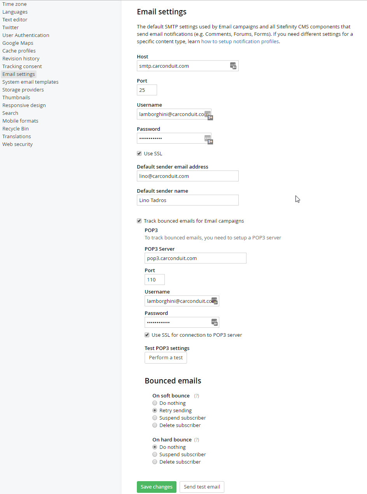
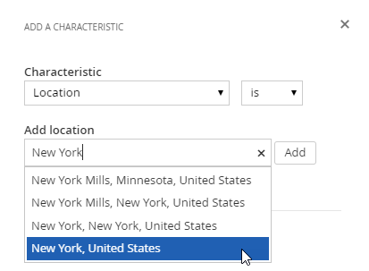
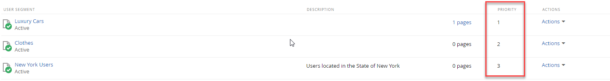
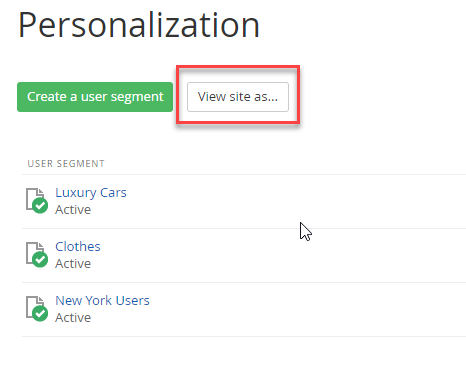
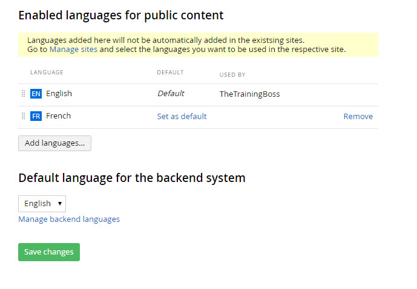
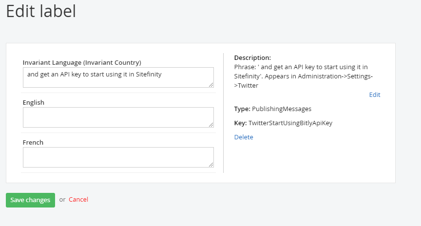

Sitefinity© Admins Workshop
========================================

*©2019 Alain "Lino" Tadros*
>
> All rights reserved. No parts of this work may be reproduced in any
> form or by any means - graphic, electronic, or mechanical, including
> photocopying, recording, taping, or information storage and retrieval
> systems - without the written permission of the publisher.
>
> Products that are referred to in this document may be either
> trademarks and/or registered trademarks of the respective owners. The
> publisher and the author make no claim to these trademarks.
>
> While every precaution has been taken in the preparation of this
> document, the publisher and the author assume no responsibility for
> errors or omissions, or for damages resulting from the use of
> information contained in this document or from the use of programs and
> source code that may accompany it. In no event shall the publisher and
> the author be liable for any loss of profit or any other commercial
> damage caused or alleged to have been caused directly or indirectly by
> this document

Table of Content
================

[Administrators](./Administrators/readme.md)

[Email and Notification Configuration](./email-and-notification-configuration/readme.md)

[Campaign Email](./campaign-email)

[Personalization](#personalization)

[Modules](#modules)

[Workflow](#workflow)

[Azure Deployment](#azure-deployment)

[Alternative Publishing](#alternative-publishing)

[Multilingual Content](#multilingual-content)

[Image Libraries](#image-libraries)

[Changing Backend Themes](#changing-backend-themes)

[Ecommerce](#ecommerce)

Administrators
==============

> As an administrator, you will be configuring the Sitefinity website
> environment for content authors, designers and developers to work in.
> You want to give everyone the tools they need while still protecting
> security and resources. The sections that follow explain setup of key
> areas of the site like Ecommerce, email setup, modules, security and
> site management.

Email and Notification Configuration
------------------------------------

Emails can be triggered by:

-   An administration action such as a password reset or signup email.

-   User action on content such as making a comment, creating an order
    or email from a campaign. These emails are *notifications*.

> Both administrative emails and notifications from content can use the
> exact same settings, but both should be filled out.
>
> Administrator generated emails are configured through Administration
> \> Settings \> Advanced. Select the System \> SMTP (Email Settings)
> node. Make sure that the SMTP server is entered in the Host text box
> and that the Port is correct for your server. Also enter the UserName
> and Password credentials for the server. Depending on the SMTP server
> requirements, you may need enter settings for *Domain*,
> *DeliveryMethod*, and *Enable SSL*.
>
> The SMTP server configuration is set at *Administration \> Settings \>
> Advanced \> Notifications \> Profiles \> Default*.
>

Campaign Email
--------------

> To configure campaign email, such as newsletters and A/B campaigns,
> first add your SMTP server details to *Administration \> Settings \>
> Advanced \> Notifications \> Profiles \> Default*. See the [Email and
> Notification Configuration](#_bookmark1) section for more information.
>
> Under *Administration \> Settings \> Email Campaigns* you can send an
> email message to verify that the SMTP server is configured correctly.

Bounced Messages
>
> Invalid email addresses "bounce" or fail to deliver. Under
> *Administration \> Settings \> Email Campaigns*, enable the *Track
> bounced* messaged check box to manage bounced messages. You will need
> address and authentication info for the POP3 server that will retrieve
> bounced messages.

> The POP3 server can optionally respond to the temporary and permanent
> email delivery problems using *Soft bounce* and *Hard bounce* options.
> The Soft bounce options handle temporary problems such as when the
> recipient's mailbox is full, the email server is offline or the email
> is too large. Hard bounce responds to permanent delivery problems like
> incorrect email addresses, a bad domain name or if the recipient's
> server blocks email delivery.
>
> In the screenshot below, if the email server is offline, the server
> will retry. If the recipients' server blocks email delivery, the
> subscriber will be suspending.

Personalization
---------------

> Using a combination of user segments, personalized
> pages, and the Personalization Preview Console, you can create customized
> experiences for every visitor to your website.
>
> Personalization allows tailoring pages to specific groups of users.
> These groups or *segments*, can be identified by their location, the
> time of day, and even the length of their stay on the site.
>
#### User Segments
>
> The key to content personalization lies in defining user segments from
> the Sitefinity administration menu under Marketing \> Personalization.

> Click the *Create a User Segment* link to define the characteristics
> for that segment.

>
> Click *Add a characteristic* to create one or more of these
> characteristics to define as broad or detailed a segment you wish to
> target. You can add as many characteristics as you need to pinpoint
> your target audience.

> For example, selecting *Location* presents an input to define one or
> more geographical regions (cities, states, countries, etc.) that will
> identify users of the segment.

Here is a partial listing of some commonly used characteristics:

-   *Landing URL*: any user who enters your website from the page you
    define here will be identified as a user of that segment, even if
    they navigate to other pages later.

-   *Location*: uses geocoding to identify a city, state, or country
    where a user is located.

-   *Time of day*: defines an interval of time during which visitors are
    considered to be users of the segment.

-   *Role*: the role of the user in the Sitefinity system.

-   *Profile Fields*: Fields that define the user such as name,
    nickname, preferred language or number of posts can be used to
    identify characteristics.

-   Purchases by Department, price range, type of product and so on.

-   *Marketo* data fields if the Sitefinity site is connected to the
    [Marketo](http://www.marketo.com/%C3%A2%E2%82%AC%C5%BD) product.

> Each selection will be added to the user segment definition. To enable
> the segment, select the *This user segment is active* check box and
> save your changes.

#### AND/OR Logic
>
> You can create flexible criteria using AND and OR sections within the
> editor. For example, the user visited the Home page AND the location
> is Texas OR the time is between 8 and 10 AM OR the visit was between 0
> and 180 seconds.

> Users that match all criteria of a segment will be identified as
> members of that segment. Users can belong to several different
> segments simultaneously.
>
#### Segment Priority
>
> Users segments are displayed in priority order, from top to bottom.
> The topmost matched segment determines the personalized
> content a user will see.

> To reset priority, use the *Up* and *Down* options from the Actions menu.

#### Creating Personalized Pages

> Your initial, "original" pages are served to everyone that isn't part
> of a segment. To personalize Sitefinity pages, create alternate
> versions for specific users.
>
> From the list of Pages, open the Actions menu for the page and select
> *Personalize*.

> Sitefinity will prompt you to select a segment. Click the *Create and
> go to edit content* button. A copy of the original page is created.
> You can edit the copied page just like you would with any other
> Sitefinity page and publish your changes.

> Reloading the pages list reveals a new Personalized link next to the
> page.

> Clicking the link will list personalized versions, allowing you to
> open and modify them, or to delete them by clicking the trash can
> icon.

#### Previewing Personalized Pages

> To test that segment criteria and personalized pages work as expected,
> open the preview console from *Marketing \> Personalization*, then
> click *View site as...* button.

> The personalization console sidebar lets you view the page as if you
> were part of a segment.

> To define an ad-hoc set of characteristics, click the *Custom* link.

> The Device preview drop down switches between views of the page
> displayed on various smart devices like iPhone, Android and tablets.

Multilingual Content
--------------------

> If you need to create a multilingual site, you will need to configure
> languages. You can find the languages settings under *Administration
> \> Settings \> Languages.*

{width="6.527083333333334in"
height="3.76875in"}

> 82 \| ADMINISTRATORS
>
> Click the *Add* button to start adding your languages. You can also
> add region specific languages by selecting the *Show Cultures* link in
> the modal window.

{width="6.520138888888889in"
height="5.665277777777778in"}

83 \| ADMINISTRATORS

> In the *Multilingual URLs* section, you can define the strategy for
> your multilingual content URLs. Unless you absolutely want to have a
> subdomain defined for every language, the default option should work
> pretty well for you. The *Directories* strategy makes it a lot easier
> to manage languages without having to match languages with your sub
> domains.

{width="6.520138888888889in"
height="6.170138888888889in"}

> 84 \| ADMINISTRATORS
>
> Once you have defined the languages, now you can start adding
> multilingual content to your site. Sitefinity includes nice visual
> indicators for multilingual sites, to improve the editing experience.
>
> You will notice that now you have a language selector on the right
> hand of the screen that allows you to quickly navigate to another
> language.

{width="3.3534722222222224in"
height="2.11875in"}

> Multilingual Back End Pages
>
> Localizing back end pages use a similar mechanism used to localize
> front end pages. To change the back-end language:

1.  From the Administration menu select the *Settings \> Languages*
    option

2.  Click the *Manage backend languages* link to see the *Add
    languages\...* button.

3.  Click *Add languages\...* to display the *Select languages* dialog.

4.  Select one or more languages from the list and click the *Done*
    button.

85 \| ADMINISTRATORS

5.  Finally, click the *Save changes* button.

{width="3.9118963254593178in"
height="2.493333333333333in"}

> After clicking the *Close languages for the backend system* link, a
> drop down will allow you to choose the language for the backend
> system. Select a new language from the drop down list, then click the
> *Save changes* button.

{width="4.416666666666667in"
height="1.8569444444444445in"}

> There is no immediate change. You need to load translated [[Labels &
> Messages]{.underline}](#Labels_&_Messages) to see the effect.
>
> []{#Labels_&_Messages .anchor}Labels & Messages
>
> The *Administration \> Labels & Messages* menu item displays a page
> that lists all the labels, captions and other text in the system that
> can be localized. These labels populate all text in the system
> including the Administration menu text, widget text and even the
> column headings in grid widgets. Each label can be edited to define
> the Invariant language (the default language) and for each language
> you have configured from the *Administration \> Settings \>
> Languages*. You can create labels for user interface elements in the
> backend and then export those settings as an XLSX "Language Pack", or
> you can import a language pack that already has the translations.
>
> 86 \| ADMINISTRATORS
>
> Importing and Editing a Language Pack
>
> You can import \"language packs\" of translated labels and messages in
> .xlsx spreadsheet format. Sample language packs can be downloaded from
> the [Sitefinity
> marketplace](http://www.sitefinity.com/developer-network/marketplace)
> [online.](http://www.sitefinity.com/developer-network/marketplace)

{width="6.408482064741907in"
height="3.65625in"}

> To import a language pack, click the *Import language pack* button,
> select the language from the drop down list, and select the downloaded
> XLSX spreadsheet file. Click the *Import* button. It will take some
> time to import and update the system.

{width="4.079096675415573in" height="2.64in"}

87 \| ADMINISTRATORS

> Refresh the page to see all the resourced items in the system backend
> display in the corresponding language.

{width="6.513888888888889in"
height="2.7333333333333334in"}

> To edit any of the labels, click the item in the list and edit the
> Invariant (default) language, and each language you have defined.

{width="6.4970286526684164in"
height="2.5729166666666665in"}

> 88 \| ADMINISTRATORS

Image Libraries
---------------

> When an image library is first setup, the Root library settings may
> not get a lot of attention, but you will need to review this
> configuration to get the best performance and behavior out of the
> site. To edit image library settings, select the *Content \> Images*
> menu option. In the Actions menu for a library, select the *Edit
> properties* option, then open the Root library settings section.

{width="6.490821303587052in"
height="5.304166666666666in"}

> The top section allows you to automatically resize images as they are
> uploaded. You can keep the original dimensions or limit images a
> selected width.
>
> Browser caching defaults to the same settings as those used for the
> entire site: *No caching*, *Standard caching* with a duration of 90
> days, *Long caching* of 365 days, or *No explicit client caching*. To
> set the cache settings globally, navigate to *Administration \>
> Settings \> Advanced settings \> System \> Output Cache Settings*.

89 \| ADMINISTRATORS

> What if a page won't update and you think it may be cached? You can
> disable the cache to make sure caching is not part of the problem.
>
> **Note:** Consider turning off caching during initial development of
> your site, then turn it back on for production.
>
> The default album size is \"anything goes\", but you should make a
> decision on what the maximum image size should be. You don\'t want
> huge file uploads that take over the server hard disk. Limit the
> overall album size by setting *Max album size* in megabytes and *Max
> image size* in kilobytes.
>
> You can change the *Storage provider* to be *Database* or *File
> System*. By default, all the binary data for images, videos, documents
> and files are stored in the database, but you can use the file system
> to store all of this data.
>
> **Note:** Be aware that the saved data will still be unreadable when
> viewed in the file system. For example, you won't be able to find
> "logo.png" as separate file. Using the file system mechanism just
> shifts the load of where the binary data is stored.
>
> 90 \| ADMINISTRATORS
>
> Server caching options can default to the same as used for the entire
> site (set from *Administration \> Settings \> Advanced Settings \>
> System \> Output Cache Settings*). You could also elect the *No
> caching* option, *Standard Caching* with a 2-minute duration and *Long
> Caching* with a 20-minute duration.

1.  Caching is set to *As set for the whole site* as the default. Click
    the *Details* link to see the current settings. The details popup
    shows the caching options, the HTTP Header equivalent, and help on
    where to reconfigure these settings.

{width="4.397222222222222in"
height="2.8784722222222223in"}

91 \| ADMINISTRATORS

Changing Backend Themes
-----------------------

> Sitefinity comes with an improved backend theme:

-   *Reduced top navigation*, to leave more room for the work area.

-   *Less graphics and color,* to remove unnecessary clutter and reduce
    distraction.

-   *More focus on content,* to improve the interaction with content and
    tasks.

-   *Increased emphasis on actions,* to make it faster and intuitive to
    complete user tasks.

{width="7.025in" height="3.64375in"}

> 92 \| ADMINISTRATORS
>
> To switch to the new theme, you need to login to Sitefinity CMS with
> Administrator privileges and:

1.  Go to *Settings\>Advanced\>Appearance.*

> In field *BackendTheme,* enter *Light*.

{width="6.025in" height="2.69375in"}

2.  Click on the *Save changes* button.

Ecommerce
---------

> Before a set of pages can be built that form a shopping experience for
> visitors, the site administrator must configure a minimal set of
> options. In particular, you must set up a store, shipping methods and
> payment methods. Also, most sales require tax rates be set up. If you
> want enable product reviews, you need to configure comment settings to
> allow it.

93 \| ADMINISTRATORS

> Configure a Store
>
> From the *Ecommerce \> Store* settings menu option you can configure
> online stores so they can accept customer orders.

1.  Select the *Ecommerce \> Store settings \> General link*.

2.  In the Store Details section, enter the Store Name, Address and
    Email.

{width="4.341666666666667in"
height="5.113888888888889in"}

> 94 \| ADMINISTRATORS

3.  The Advanced section has an option to Save credit card number in
    database. This only needs to be selected if credit cards are not
    processed immediately. The option to Bypass real-time payment
    processing allows you to skip setting up credit card authorization,
    just to test the system.

{width="5.3530304024496935in"
height="1.6354166666666667in"}

4.  Click the *Save* button.

95 \| ADMINISTRATORS

> Configure Tax
>
> Configuring taxes determines when and how taxes are added to orders.
> Click the Tax link. The default excludes the tax until checkout.
> Instead, you can include the tax in the price automatically or you can
> manually include the taxes in the price as the price is entered. Leave
> the defaults.

{width="4.195138888888889in"
height="4.270138888888889in"}

> Configure Measurement Units
>
> This section determines how product weight and dimensions are
> measured. Click the Measurement Units tab. Mass unit (weight) can be
> Pound, Kilogram or Gram. Length unit can be Inch, Meter, Centimeter,
> or Millimeter. Leave the defaults here.

{width="1.8520833333333333in" height="1.675in"}

> 96 \| ADMINISTRATORS
>
> Configure Currency
>
> This section determines the currencies your site will handle and the
> exchange rate for those currencies. Click the Currencies tab. A
> default currency will display. Click the Add currencies button and
> select one or more from the list of standard currencies, then click
> the Done button.

{width="2.9520833333333334in"
height="1.2152777777777777in"}

> Once new currencies are added, the Exchange rates section displays.
> While you can set the exchange rate manually, the Use external service
> option allows you to select a service from a drop down and populate
> the exchange rates automatically. Just click the Get rates button. To
> recalculate the rates daily, select the Automatically update daily
> check box.

{width="2.6560728346456695in"
height="2.0625in"}

> Shipping Methods
>
> Shipping methods describe how products will be delivered to the
> customer. You can either use a carrier, like Federal Express or you
> can handle the shipping arrangements yourself *offline*.
>
> If you decide to ship online using a carrier, you will need to setup
> an account. Typically, each carrier will have a developer site that
> allows you to sign up for a test account that you can use to verify
> your ecommerce system will work before going live.

97 \| ADMINISTRATORS

> Creating an Online Shipping Method
>
> To demonstrate creating a shipping method that uses an online carrier,
> this example uses a FedEx test account.

1.  Go to the FedEx developer site at <http://fedex.com/us/developer/>
    and create an account. Collect the account URL, Password, License
    Key, MeterID and Account number from the confirmation page and the
    follow up email sent by the developer site.

2.  Select the *Ecommerce \> Shipping* methods menu option.

3.  Click the *Create a shipping method* link.

4.  Enter a Name for the method. Select the Area you will ship to using
    this method. Leave the Standard (Shipping carriers). Select FedEx
    Shipping Carrier from the drop down list.

{width="5.941912729658792in"
height="4.168748906386702in"}

> 98 \| ADMINISTRATORS

5.  Select the check boxes for all types of shipping that you want to
    include in this method.

{width="6.005831146106737in"
height="2.586561679790026in"}

6.  Using the information from the FedEx developer site, enter the Url,
    Password, License Key, MeterID and Account Number.

{width="6.004421478565179in"
height="2.82875in"}

7.  Click the *Create this shipping method* button.

99 \| ADMINISTRATORS

> Creating an Offline Shipping Method
>
> To ship offline:

1.  Select the *Ecommerce \> Shipping* methods menu option.

2.  Click the *Create a shipping* method link.

3.  Enter a Name for the method. The screenshot below uses *Slow Train*
    as an offline shipping method example. Select the Area you will ship
    to using this method.

{width="6.004564741907261in"
height="1.9181244531933508in"}

4.  Select the *Custom (Offline)* radio button.

{width="6.003996062992126in"
height="1.1043744531933508in"}

5.  Shipping offline requires that you set the shipping cost
    specifically. In the Shipping price area, you can base the price on
    Weight, Total price, Fixed price per order, Fixed percentage of the
    total price or Quantity. This example uses the Fixed percentage of
    total price option with Shipping price set to 10%.

{width="5.686784776902887in"
height="1.7141666666666666in"}

> 100 \| ADMINISTRATORS

6.  Click the *Create this Shipping method* button.

> Payment Methods
>
> Payment methods describe how orders will be paid for: online with a
> credit card or offline where you handle the payment arrangements.
>
> Creating an Online Payment Method
>
> Online payment methods describe how a commercial payment processor
> like PayPal or Authorize.Net AIM handle your site's credit card
> transactions. Online payment processing services typically have live
> accounts for production online ordering and test accounts to help
> verify that your processing will be correct.
>
> Each payment processor has its own set of information that must be
> entered in Sitefinity's payment type. Typically, the payment processor
> supplies you with a URL of a service that performs the processing and
> some kind of authentication such as login id or vendor name. The
> payment processor developer documentation may also supply test credit
> card numbers that will not charge an account but will pass validation.
>
> For example, you can sign up at the Authorize.Net developer center for
> a test account at
> [https://developer.authorize.net/testaccount/.](https://developer.authorize.net/testaccount/)
> Here's an example walk-through that uses Authorize.Net AIM to create
> an online payment type:

1.  Sign up for a new account at
    [[https://developer.authorize.net/testaccount/]{.underline}.](https://developer.authorize.net/testaccount/)
    Collect the login ID and Transaction key they provide.

2.  In Sitefinity, select the *Ecommerce \> Payment methods* menu
    option.

3.  Click the *Create a payment method* link.

4.  Enter a Name for the method, for example, Credit Card.

101 \| ADMINISTRATORS

5.  Select Authorize.Net AIM from the Payment processor drop down list.

{width="2.560416666666667in"
height="2.76875in"}

6.  The Payment processor drop down list selection cascades to set the
    allowed credit cards and required authentication settings.

7.  Select the check boxes for credit card types you will accept on your
    site. For now, leave the Mode radio button at Test. Set the URL to
    [[https://test.authorize.net/gateway/transact.dll]{.underline}.](https://test.authorize.net/gateway/transact.dll)
    Enter the Login ID and Transaction key supplied by the developer
    site.

{width="4.586255468066492in"
height="3.6165616797900264in"}

> 102 \| ADMINISTRATORS

8.  In this example, the Timeout is 30000 milliseconds (30 seconds), the
    Payment type is Sale and the API version at the time of this writing
    is 3.1.

{width="6.004730971128609in"
height="2.150624453193351in"}

9.  Click the *Create this payment method* button.

10. Once you test that the online payment methods work, you can change
    the URL to a live URL (you get this URL from the payment processor)
    and switch the Mode from Test to Live.

103 \| ADMINISTRATORS

> Creating an Offline Payment Method
>
> The offline payment method simply defines a Name. Once you enable the
> This payment method is active checkbox, you can use the method. This
> leaves the responsibility for collecting payment to you. To create an
> offline payment method:

1.  Select the *Ecommerce \> Payment methods* menu option.

2.  Click the *Create a payment method* link.

3.  Enter a Name for the method. The screenshot below uses Payment on
    delivery as an offline payment example.

4.  Make sure that the *This payment method is active* checkbox is
    enabled and click the *Create this payment method* button.

{width="5.942435476815398in"
height="3.689582239720035in"}

> 104 \| ADMINISTRATORS
>
> Taxes
>
> You don't want to lookup tax amounts for every purchase. Instead,
> Sitefinity allows you to define taxes based on the unique combination
> of shipping or billing location and the country where the product is
> to be delivered. Taxes are associated with products when the product
> is created. Tax amounts are calculated automatically during the
> checkout process based on the rates that you define. The screenshot
> below defines a tax named Standard VAT for shipping addresses where
> the country of delivery is the United Kingdom, the rate is defined as
> 20% and is not applied to shipping costs.

{width="5.876008311461067in"
height="4.673228346456693in"}

> **Note**: You can import and export taxes as CSV (comma delimited)
> files from the
>
> *Ecommerce \> Taxes* page.

105 \| ADMINISTRATORS

> Tax Classes
>
> Tax classes allow you to subdivide a tax into different rates or to
> flag some products as tax exempt. For example, the United Kingdom
> Value Added Tax (VAT) might have a standard rate of 20%, a reduced
> rate of 5% for some items like home energy and a zero rate for certain
> goods and services like food and children's clothes.
>
> Select the *Ecommerce \> Tax Classes* menu item. Then click the
> *Create a tax class* button. Enter a name for the tax class (the
> actual rate is defined when creating or editing a tax). There is a
> single field to enter the Tax class name.

{width="5.57079615048119in"
height="1.3347911198600175in"}

> Once your tax rates are defined, return to *Ecommerce \> Taxes*. You
> can create a new tax or edit an existing tax. Below the Standard rate
> for the tax, you should see tax classes you have created. The
> screenshot below shows the standard 20% VAT rate, a 5% rate for home
> energy, a zero rate for children's clothes and a rate for postage.
> Notice that the postage tax class is flagged Tax exempt.

{width="2.4830785214348206in"
height="2.1553116797900262in"}

> 106 \| ADMINISTRATORS
>
> When content creators build a product catalog and define new products,
> they can select a Tax class from the list.

{width="4.338541119860017in" height="2.125in"}

> Discounts
>
> Discounts allow you to promote products by offering lower rates based
> on the customer belonging to a group. For example, the user may have
> attended a tradeshow where they received a coupon code. To create a
> discount:

1.  Navigate to *Ecommerce \> Discounts*.

2.  Click the *Create a Discount* button.

3.  Enter a Name for the discount and a Discount amount. The discount
    amount can be percentage or an absolute currency amount. If you want
    to limit the number of times the discount can be applied, enter a
    number in the *This discount can be used* text box.

{width="5.94409230096238in"
height="2.347916666666667in"}

107 \| ADMINISTRATORS

> The *Apply discount for...* section creates a group of customers based
> on a criterion. The discount can be for All customers, Existing
> customers, New Customers, customers that enter a coupon code (this
> shows up in the checkout process) or based on Sitefinity roles or
> particular users. This example applies the discount if the customer
> enters a coupon code.

{width="6.003464566929134in"
height="2.3153116797900264in"}

> You can limit the discount to be effective only between a Start date
> and End date.

{width="6.006914916885389in"
height="1.3853116797900262in"}

> You can also establish a threshold where the amount must be within a
> certain Minimum subtotal or Maximum subtotal.

{width="6.000856299212598in"
height="1.7340616797900263in"}

4.  Click the *Create this discount* button to add the discount.