> *Sitefinity 11 for Admins and Designers*
>
> *©2018 Alain "Lino" Tadros*
>
> All rights reserved. No parts of this work may be reproduced in any
> form or by any means - graphic, electronic, or mechanical, including
> photocopying, recording, taping, or information storage and retrieval
> systems - without the written permission of the publisher.
>
> Products that are referred to in this document may be either
> trademarks and/or registered trademarks of the respective owners. The
> publisher and the author make no claim to these trademarks.
>
> While every precaution has been taken in the preparation of this
> document, the publisher and the author assume no responsibility for
> errors or omissions, or for damages resulting from the use of
> information contained in this document or from the use of programs and
> source code that may accompany it. In no event shall the publisher and
> the author be liable for any loss of profit or any other commercial
> damage caused or alleged to have been caused directly or indirectly by
> this document

 {#section .TOCHeading}

Contents {#contents .TOCHeading}
========

[Administrators 3](#administrators)

[Email and Notification Configuration
3](#email-and-notification-configuration)

[Campaign Email 4](#campaign-email)

[Personalization 6](#personalization)

[Modules 16](#modules)

[Workflow 26](#workflow)

[Azure Deployment 43](#azure-deployment)

[Alternative Publishing 75](#alternative-publishing)

[Multilingual Content 81](#multilingual-content)

[Image Libraries 88](#image-libraries)

[Changing Backend Themes 91](#changing-backend-themes)

[Ecommerce 92](#ecommerce)

[Designers 108](#designers)

[Responsive Web Design 109](#responsive-web-design)

[Widget Templates 119](#widget-templates)

[Page Templates 130](#page-templates)

[Themes 149](#themes)

[Sitefinity Feather 157](#sitefinity-feather)

[Creating Page Templates from MVC Layout Files
164](#creating-page-templates-from-mvc-layout-files)

[Widget Designers 180](#widget-designers)

[Index 184](#index)

3 \| ADMINISTRATORS

Administrators
==============

> As an administrator, you will be configuring the Sitefinity website
> environment for content authors, designers and developers to work in.
> You want to give everyone the tools they need while still protecting
> security and resources. The sections that follow explain setup of key
> areas of the site like Ecommerce, email setup, modules, security and
> site management.

Email and Notification Configuration
------------------------------------

> Emails can be triggered by:

-   An administration action such as a password reset or signup email.

-   User action on content such as making a comment, creating an order
    or email from a campaign. These emails are *notifications*.

> Both administrative emails and notifications from content can use the
> exact same settings, but both should be filled out.
>
> Administrator generated emails are configured through Administration
> \> Settings \> Advanced. Select the System \> SMTP (Email Settings)
> node. Make sure that the SMTP server is entered in the Host text box
> and that the Port is correct for your server. Also enter the UserName
> and Password credentials for the server. Depending on the SMTP server
> requirements, you may need enter settings for *Domain*,
> *DeliveryMethod*, and *Enable SSL*.
>
> The SMTP server configuration is set at *Administration \> Settings \>
> Advanced \> Notifications \> Profiles \> Default*.
>
> 4 \| ADMINISTRATORS

{width="4.435201224846894in"
height="4.334061679790026in"}

Campaign Email
--------------

> To configure campaign email, such as newsletters and A/B campaigns,
> first add your SMTP server details to *Administration \> Settings \>
> Advanced \> Notifications \> Profiles \> Default*. See the [Email and
> Notification Configuration](#_bookmark1) section for more information.
>
> Under *Administration \> Settings \> Email Campaigns* you can send an
> email message to verify that the SMTP server is configured correctly.

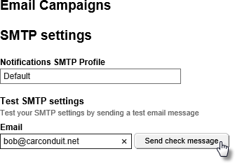{width="2.9055555555555554in"
height="2.0104166666666665in"}

5 \| ADMINISTRATORS

> Bounced Messages
>
> Invalid email addresses "bounce" or fail to deliver. Under
> *Administration \> Settings \> Email Campaigns*, enable the *Track
> bounced* messaged check box to manage bounced messages. You will need
> address and authentication info for the POP3 server that will retrieve
> bounced messages.

{width="2.917777777777778in" height="3.28125in"}

> The POP3 server can optionally respond to the temporary and permanent
> email delivery problems using *Soft bounce* and *Hard bounce* options.
> The Soft bounce options handle temporary problems such as when the
> recipient's mailbox is full, the email server is offline or the email
> is too large. Hard bounce responds to permanent delivery problems like
> incorrect email addresses, a bad domain name or if the recipient's
> server blocks email delivery.
>
> 6 \| ADMINISTRATORS
>
> In the screenshot below, if the email server is offline, the server
> will retry. If the recipients' server blocks email delivery, the
> subscriber will be suspending.

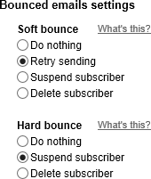{width="1.7703521434820648in" height="2.09375in"}

Personalization
---------------

> Using a combination of [user segments,](#User_Segments) [personalized
> pages,](#Creating_Personalized_Pages) and the
> [Personalization](#Previewing_Personalized_Pages) [Preview
> Console,](#Previewing_Personalized_Pages) you can create customized
> experiences for every visitor to your website.
>
> Personalization allows tailoring pages to specific groups of users.
> These groups or *segments*, can be identified by their location, the
> time of day, and even the length of their stay on the site.
>
> []{#User_Segments .anchor}User Segments
>
> The key to content personalization lies in defining user segments from
> the Sitefinity administration menu under Marketing \> Personalization.

{width="3.8787773403324586in"
height="1.0828116797900262in"}

7 \| ADMINISTRATORS

> Click the *Create a User Segment* link to define the characteristics
> for that segment.

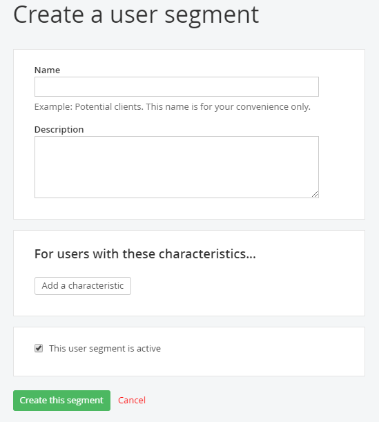{width="5.157672790901137in"
height="4.4859372265966755in"}

> 8 \| ADMINISTRATORS
>
> Click *Add a characteristic* to create one or more of these
> characteristics to define as broad or detailed a segment you wish to
> target. You can add as many characteristics as you need to pinpoint
> your target audience.

{width="5.14573053368329in"
height="6.177187226596676in"}

9 \| ADMINISTRATORS

> For example, selecting *Location* presents an input to define one or
> more geographical regions (cities, states, countries, etc.) that will
> identify users of the segment.

{width="4.76875in" height="3.8833333333333333in"}

> Here is a partial listing of some commonly used characteristics:

-   *Landing URL*: any user who enters your website from the page you
    define here will be identified as a user of that segment, even if
    they navigate to other pages later.

-   *Location*: uses geocoding to identify a city, state, or country
    where a user is located.

-   *Time of day*: defines an interval of time during which visitors are
    considered to be users of the segment.

-   *Role*: the role of the user in the Sitefinity system.

-   *Profile Fields*: Fields that define the user such as name,
    nickname, preferred language or number of posts can be used to
    identify characteristics.

-   Purchases by Department, price range, type of product and so on.

-   *Marketo* data fields if the Sitefinity site is connected to the
    [Marketo](http://www.marketo.com/%C3%A2%E2%82%AC%C5%BD) product.

> 10 \| ADMINISTRATORS
>
> Each selection will be added to the user segment definition. To enable
> the segment, select the *This user segment is active* check box and
> save your changes.

{width="5.103305993000875in"
height="6.0127077865266845in"}

11 \| ADMINISTRATORS

> AND/OR Logic
>
> You can create flexible criteria using AND and OR sections within the
> editor. For example, the user visited the Home page AND the location
> is Texas OR the time is between 8 and 10 AM OR the visit was between 0
> and 180 seconds.

{width="5.103266622922135in"
height="5.0633333333333335in"}

> Users that match all criteria of a segment will be identified as
> members of that segment. Users can belong to several different
> segments simultaneously.
>
> 12 \| ADMINISTRATORS
>
> Segment Priority
>
> Users segments are displayed in priority order, from top to bottom.
> The topmost matched segment determines the [personalized
> content](#Creating_Personalized_Pages) a user will see.

{width="6.968318022747156in" height="0.96875in"}

> To reset priority, use the *Up* and *Down* options from the Actions
> menu.

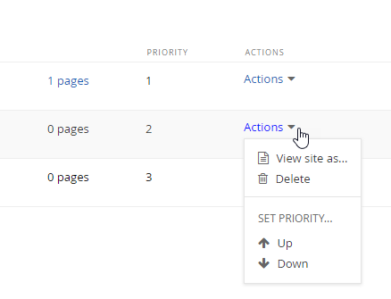{width="2.1866666666666665in" height="2.0in"}

> []{#Creating_Personalized_Pages .anchor}Creating Personalized Pages
>
> Your initial, "original" pages are served to everyone that isn't part
> of a segment. To personalize Sitefinity pages, create alternate
> versions for specific users.
>
> From the list of Pages, open the Actions menu for the page and select
> *Personalize*.

{width="1.925in" height="2.2368055555555557in"}

13 \| ADMINISTRATORS

> Sitefinity will prompt you to select a segment. Click the *Create and
> go to edit content* button. A copy of the original page is created.
> You can edit the copied page just like you would with any other
> Sitefinity page and publish your changes.

{width="4.131944444444445in"
height="1.8020833333333333in"}

> Reloading the pages list reveals a new Personalized link next to the
> page.

{width="4.914376640419947in"
height="0.9270833333333334in"}

> Clicking the link will list personalized versions, allowing you to
> open and modify them, or to delete them by clicking the trash can
> icon.

{width="4.148611111111111in"
height="2.678472222222222in"}

> 14 \| ADMINISTRATORS
>
> []{#Previewing_Personalized_Pages .anchor}Previewing Personalized
> Pages
>
> To test that segment criteria and personalized pages work as expected,
> open the preview console from *Marketing \> Personalization*, then
> click *View site as...* button.

{width="3.4279166666666665in"
height="0.9791666666666666in"}

> The personalization console sidebar lets you view the page as if you
> were part of a segment.

{width="6.611158136482939in"
height="3.711353893263342in"}

15 \| ADMINISTRATORS

> To define an ad-hoc set of characteristics, click the *Custom* link.

{width="4.3853094925634295in"
height="3.8958333333333335in"}

> The Device preview drop down switches between views of the page
> displayed on various smart devices like iPhone, Android and tablets.

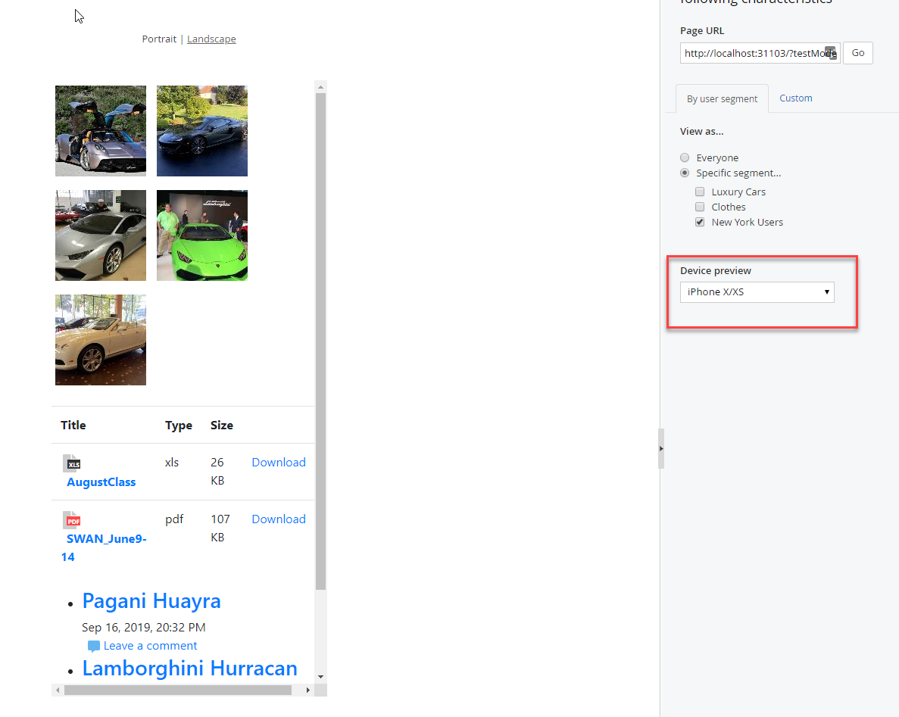{width="6.575in" height="2.6416666666666666in"}

> 16 \| ADMINISTRATORS

Modules
-------

> Content and features are supplied through Sitefinity's plug-in
> modules. Using modules, you can install new features as they become
> available. Sitefinity ships with a full complement of modules that
> support the features for your Sitefinity. Sitefinity modules are
> managed from *Administration \> Modules & Services*.

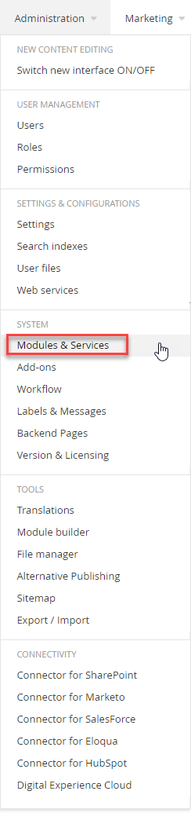{width="3.26875in" height="4.155555555555556in"}

> Selecting this item reveals a list of registered modules and their
> installation status. The screenshot below shows a small sample.

{width="6.461589020122485in"
height="1.489478346456693in"}

> A green checkbox indicates that a module is installed and active, a
> grey x shows a module that is installed but not activated, and finally
> a grey dash (-) represents a module that is registered but not
> installed.

17 \| ADMINISTRATORS

> Installing a Module
>
> To install a new module, click, click the *Install a module* button.
> Sitefinity prompts you for the details of the module to be installed.
> These details correspond to the name and description columns of the
> Modules and Services list.

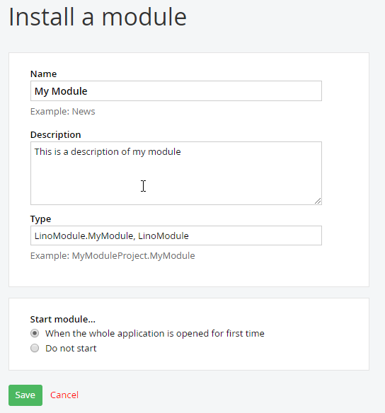{width="4.0098490813648295in"
height="3.1922911198600175in"}

> The Type value is the fully-qualified name of the module class
> including the assembly.
>
> Selecting the *Do not start* option will install, but not activate the
> module. You will need to manually activate the module before it will
> be available. If you wish to both install and activate your module
> simultaneously, select the option labeled *When the whole application
> is opened for the first time*.
>
> Disabling an Installed Module
>
> Each module in Sitefinity can be disabled to save resources by
> reducing the memory footprint. This is especially helpful in shared
> hosting scenarios, where resources are limited. To disable an active
> module, open the Actions menu to the right of the module description
> and select *Deactivate*.

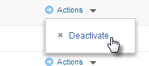{width="2.2270833333333333in"
height="0.9986111111111111in"}

> 18 \| ADMINISTRATORS
>
> A disabled module is not loaded into memory by Sitefinity, but retains
> any information and settings previously entered when it was active.
> Any backend pages and associated widgets are also hidden, but not
> deleted.
>
> Activating a Disabled Module
>
> Disabled modules are shown in the list with the label Inactive. To
> enable a module, select the *Activate* option from the Actions menu.
> Activating a disabled module restores its functionality and
> configuration settings along with any associated pages and widgets.

{width="1.8416666666666666in"
height="1.395138888888889in"}

> Uninstalling a Disabled Module
>
> Once a module is disabled, it can be safely uninstalled by selecting
> Uninstall from the Actions menu of a disabled module. Uninstalling a
> module does *not* delete any data or database tables that are used by
> the module. Reinstalling a module will restore the previous data, but
> reset all configuration settings, pages, and widgets.

{width="1.8416666666666666in"
height="1.39375in"}

> Deleting an Uninstalled Module
>
> Once a module is uninstalled, it can be deleted safely. Newly
> installed modules that have not been activated can also be deleted
> safely. This is done by selecting Delete from the Actions menu of an
> uninstalled module. Deleting a module will remove it from the list of
> modules and services and require reinstallation (see the [Installing a
> Module](#_bookmark8) section) to restore its functionality.

19 \| ADMINISTRATORS

> Security Permissions
>
> Use permissions to get fine-grain control over your Sitefinity assets.
> A Permission allows a user to perform actions, such as edit pages,
> delete blog posts or make comments. A Role is a collection of
> permissions. A user is assigned one or more roles to obtain the
> permissions for those roles.
>
> To view the built-in roles that come with Sitefinity, click the
> *Administration \> Roles* menu item. For example, users with the
> Authors role have permission to create content but not delete it.
>
> Creating a Role
>
> The following steps show how to create a new role for bloggers that
> has permissions to view, modify and manage blog posts.

1.  Click the *Create a role* button. In the Role text box that appears,
    enter *Bloggers*

> and click the *Create* button.

{width="4.781718066491688in"
height="1.3474989063867016in"}

> 20 \| ADMINISTRATORS

2.  Click the *Permissions* link for the Bloggers role.

{width="4.453692038495188in"
height="0.925832239720035in"}

> The extensive list of permissions covers all possible capabilities of
> a user in Sitefinity. Scroll through the list and notice that, by
> default, the role has no permissions. Without enabling some
> permissions, users with this role will not be able create, modify or
> delete anything in the system.

{width="4.2662784339457565in"
height="3.34375in"}

3.  Locate *Blogs \> BlogPost* section of the list.

21 \| ADMINISTRATORS

4.  Click the *Change* button. Enable the *View blog post* and *Modify
    blog and manage posts* check boxes.

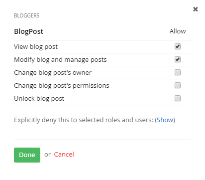{width="3.9227865266841646in"
height="2.9895833333333335in"}

5.  Click the *Done* button to close the dialog.

6.  Click the *Back* to all items link.

> 22 \| ADMINISTRATORS
>
> []{#Creating_a_User .anchor}Creating a User
>
> These next steps show how to create a single user and assign the new
> Bloggers role to the user.

1.  Select the Administration \> Users menu item.

2.  Click the Create a user button. This will display the Create a user
    page.

3.  All fields in the first section of the Create a user page are
    required except for Photo and Nickname.

{width="4.427495625546807in"
height="5.870311679790026in"}

23 \| ADMINISTRATORS

4.  By default, the This user can access site backend option is checked.
    The option includes the Backenduser role for this user
    automatically. Leave the option checked. Also select the new
    Bloggers role.

{width="5.237659667541557in"
height="3.0628116797900264in"}

5.  Click the Create this user button.

6.  The new user shows up in the users list.

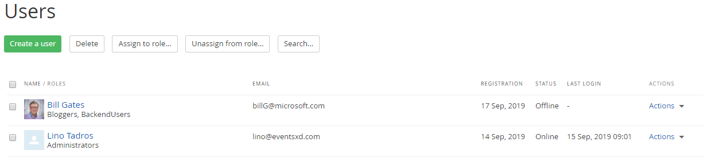{width="6.424201662292213in"
height="1.489478346456693in"}

> 24 \| ADMINISTRATORS
>
> To test that the new user can login and has the permissions that come
> with the Bloggers role, Click the *Logout* link found in the upper
> right corner of the page, then login as the new user. Now the
> administration menu should include both the Dashboard and Content menu
> items. You should be able to select the *Content \> Blogs* menu item,
> add blog posts and edit blog posts.

{width="3.743325678040245in"
height="1.3715616797900263in"}

25 \| ADMINISTRATORS

> "Someone is already using this username"
>
> When logging in for the second time under the same user name, the
> dialog below appears:

{width="3.8345603674540683in"
height="2.2083333333333335in"}

> You can eliminate this message using the *Administration \> Settings
> \> Advanced \> Security* option. Check the *Automatically logout
> backend users from other HTTP clients on login* so that logins from a
> new location automatically logout of the old location.
>
> The *Disable the limit of active simultaneous backend users* checkbox
> can be selected, assuming the site is licensed for unlimited users or
> has Security Token Service with windows authentication.

{width="4.311805555555556in"
height="2.9902777777777776in"}

> 26 \| ADMINISTRATORS

Workflow
--------

> A workflow is an approval process for publishing documents. By
> default, there are no workflows, so you can publish a document
> directly without additional steps. A simple workflow might have just
> two steps, one to approve the document (perhaps a manager must review
> before the document is published) and the publishing step itself. At
> the other end of the spectrum, government organizations have strict
> protocols for publishing with many steps in their approval process.
>
> Workflows can include notification so that a manager receives an email
> when a document is waiting approval.
>
> Defining a Workflow
>
> To define a custom workflow:

1.  In the administration menu, click the *System \> Workflow* item.

2.  No workflow has been created yet, so click the *Define a workflow*
    link.

3.  When the *Select a type* page shows, leave the default *Approval
    before publishing*

> selection.
>
> Approval before publishing is a single level of approval before the
> content is published and becomes available on the website. *2 levels
> of approval* before publishing is for organizations that need multiple
> levels of approval. If you select this option, you need to define the
> two roles that need to approve the content. The *No approval workflow*
> option allows the author to publish immediately without approval.

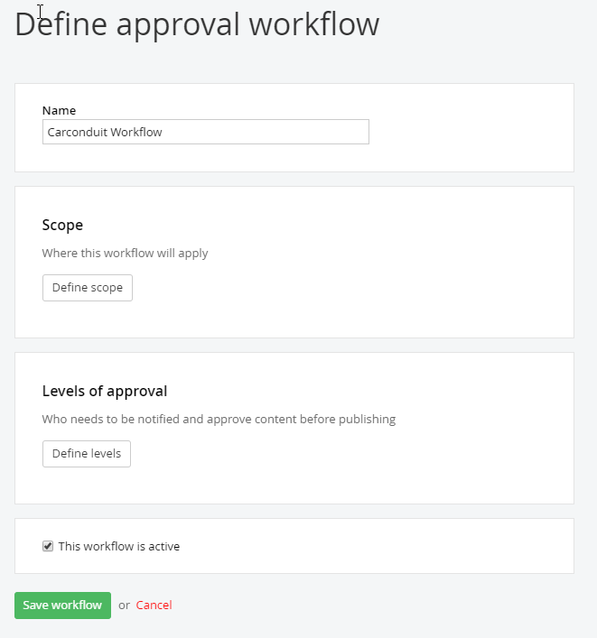{width="5.21038823272091in"
height="2.3333333333333335in"}

4.  Click the *Continue* button.

27 \| ADMINISTRATORS

5.  Now the *Properties* page of the workflow definition displays. Enter
    a *Name* for the workflow.

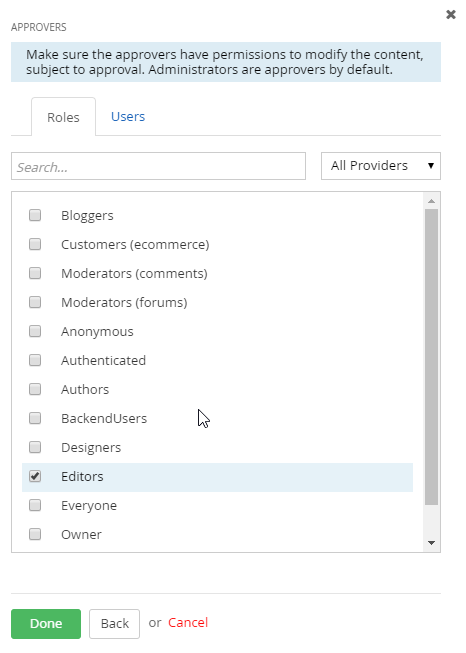{width="5.511280621172354in" height="1.84375in"}

6.  In the *Set approvers* area, select the role that will approve
    items. First click the *Add roles or users* button, then, in the
    *Select roles or users* dialog, select the check box next to one or
    more roles. In this example we check the *Editors* role. Finally,
    click the *Done* selecting button to close the dialog.

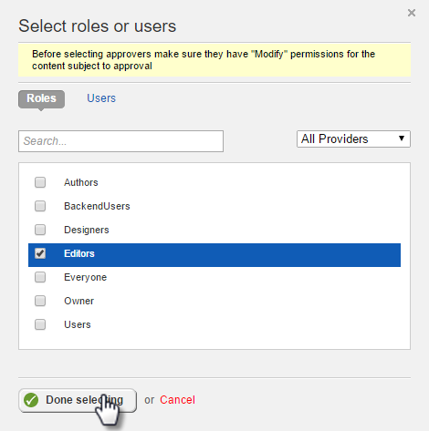{width="4.846458880139982in"
height="4.877811679790026in"}

> 28 \| ADMINISTRATORS

7.  Back in the *Set approvers* area, the *Editors* role is now
    included. Verify that the *Notify users by email* when an item is
    waiting for their approval checkbox is enabled. Now, whenever an
    item has to be approved, everyone who has the *Editors* role will
    automatically get an email.

{width="5.207702318460193in" height="2.09375in"}

> The *Scope* section defines where the workflow will apply. Leave the
> default *All content and pages* selected. This means that the workflow
> will be triggered anytime the save button is clicked for any page or
> content. The remaining workflow options can be left with default
> values.

{width="5.208109142607174in"
height="1.3958333333333333in"}

8.  Click the *Save workflow* button.

> **Note**: The *Allow administrators to skip the workflow* option is
> recommended so that you don\'t have to slog through the approval
> process when you\'re making a lot of changes to the backend.
>
> **Note**: You must [set up an SMTP email server](#_bookmark1) for the
> *Notify users by email when an item is waiting for their approval*
> option to work.

29 \| ADMINISTRATORS

> Testing the Workflow

1.  Log out, then log back in as the [user you created for the previous
    permissions](#Creating_a_User) example.

2.  Edit one of the existing blog posts.

3.  Click the *Save Draft* button (notice that there is no *Publish*
    button).

4.  Click the new *Send for Approval* button. Now the list of blog posts
    shows a new status indicating the content is waiting on approval. A
    user with an editor or administrator role can publish the content.

{width="2.98083552055993in" height="0.94875in"}

> 30 \| ADMINISTRATORS
>
> Site Management Notes on Upgrading
>
> The [Sitefinity documentation on
> upgrading](http://www.sitefinity.com/documentation/documentationarticles/installation-and-administration-guide/upgrade)
> details how to upgrade from Sitefinity 3.7 (and even earlier) to the
> present release of Sitefinity. Many of these instructions center on
> the Upgrade option on the right-click menu of the Project Manager. The
> catch is that the upgrade option will wipe out the Visual Studio
> project file to the default settings and the web configuration file
> also gets set back to its "vanilla" settings. If there is the
> slightest customization, non-standard references, or web configuration
> file changes in your Sitefinity project, these customizations can get
> lost by taking the upgrade menu option.
>
> You can manually merge the Visual Studio project file (.csproj) web
> configuration (web.config) by comparing the files located in the
> Sitefinity installation directory under
>
> \_EmptyProject against your site. The \_EmptyProject files are used to
> create new sites. By comparing your site with the \_EmptyProject you
> can see how the site has been customized since it was created. You can
> use any source comparison tool to compare the project and web config
> files.
>
> Notes on Deployment
>
> The [Sitefinity documentation on
> deployment](http://www.sitefinity.com/documentation/documentationarticles/installation-and-administration-guide/deployment)
> details how to move your Sitefinity application to a production
> server. In addition, be sure not to overwrite the app\_data folder or
> the database in production. These are live and constantly changing.
> With changes happening every second, overwriting the database can
> cause the database to become corrupt. Even when deploying code files
> to the app\_data folder, the database is being updated.
>
> When deploying, zip the project except for the app\_data folder and
> then overwrite the production files. You should merge the web.config
> manually, just as you would with any
>
> .NET application[]{#_bookmark12 .anchor}.
>
> Continuous Delivery
>
> *Continuous delivery* is an approach of automating development changes
> to production frequently and reliably, usually on a regular schedule.
> Continuous delivery isn't about moving content, but deploying elements
> that require development, like new modules or widget modifications.

31 \| ADMINISTRATORS

> Earlier versions of Sitefinity weren't suited for continuous delivery.

-   Sitefinity configuration was tightly bound to the database. Guids in
    the database had to stay in sync with the XML configuration files.
    Moving a configuration file directly to production was likely to
    break the site.

-   You couldn't export dynamic modules that didn't already exist on the
    production server.

-   You couldn't transfer custom fields using Site Sync. You had to
    manually create custom fields on the target site.

> Now, Sitefinity configuration files are cleanly implemented, without
> tight coupling between database and configuration files. Sitefinity is
> able to pick up dynamic module changes automatically. You no longer
> have to manually create custom fields on the production server, you
> can export custom fields on the development server and Sitefinity on
> the production server will automatically detect and apply the changes.
>
> Site Synchronization
>
> The Site Sync module automatically copies content from one site to
> another. For example, if you have a live server and staging server you
> can refresh the staging server with live data. Both servers should be
> running the same version of Sitefinity with the same licensing.
>
> In the example that follows we have two sites named Site1 and Site2
> configured to run in IIS. There is an administrative user in each
> project called SiteSyncIUser1 and SiteSyncUser2, respectively. You can
> setup both sites side-by-side. Site1 will be configured to send data
> to Site2.
>
> To enable site synchronization:

1.  The projects should be hosted in IIS. Configure the Sitefinity
    projects to work in your version of IIS using the steps in the
    documentation foun[d
    here.](http://www.sitefinity.com/documentation/documentationarticles/installation-and-administration-guide/install-sitefinity/configuring-the-iis-to-host-sitefinity-projects)

2.  Run both sites and login to the backend of each.

> 32 \| ADMINISTRATORS

3.  By default, site synchronization is not installed or active so your
    first step will be to select the Administration \> Modules &
    Services menu option. Click the Install option in the Actions menu
    of the Staging and Syncing item. Do this for both sites.

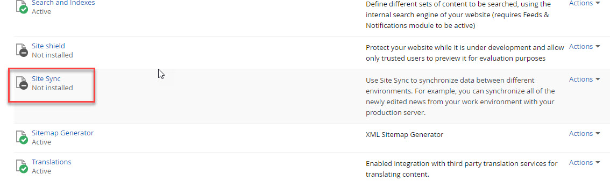{width="6.51875in"
height="1.4402777777777778in"}

4.  [Create a new user](#Creating_a_User) from the *Administration \>
    Users* menu option. This user will only be used for site
    synchronization and will never be logged in. The user should have
    the Administrator role. Do this for both sites and make the name
    unique for each site, e.g. SiteSyncIUser1 and SiteSyncUser2.

5.  Now select the new menu item *Administration \> Staging and Syncing*
    for both sites.

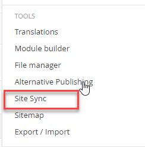{width="1.5303991688538932in"
height="1.59375in"}

6.  Click the Synchronization Settings for each site.

{width="3.0416863517060366in"
height="1.7015616797900261in"}

33 \| ADMINISTRATORS

7.  Select the *Allow content from other sites to be published to this
    site* checkbox on both sites. In the Site key text box, enter 1 for
    the first site and 2 for the second site. Click the Save changes
    button.

8.  In Site1, click the *Add a server button*. In the dialog that
    displays, enter the URL for Site2. Use the administrative username
    and password to the server. Click the *Add this server* button.

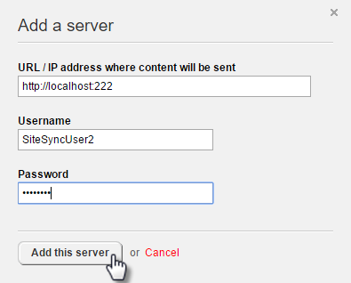{width="4.11436789151356in" height="3.3125in"}

> The Staging and Synchronization screen for the first site now looks
> like this:

{width="4.906944444444444in"
height="3.338888888888889in"}

> 34 \| ADMINISTRATORS

9.  In the first site, click the *Go to sync* link.

10. Click the *Test connection* button.

{width="4.467899168853894in"
height="1.5104166666666667in"}

11. In the What do you want to sync? Area, you can select all kinds of
    Sitefinity content, but for now just select Blogs and Blog Posts.

{width="5.236805555555556in"
height="2.2583333333333333in"}

12. Click the *Sync now* button. You will be warned that related data
    may be synced. Click the *OK* button.

{width="5.225in" height="1.3319444444444444in"}

35 \| ADMINISTRATORS

> A progress bar will display briefly, depending on the amount of data
> being transferred. A summary screen will display the results of the
> sync operation.

{width="6.51875in"
height="3.4118055555555555in"}

> Synchronizing on a schedule
>
> Instead of clicking the *Sync now* button, you can choose the
> *Schedule sync* button and set the sync to run at a regular time,
> every Sunday at 1am for example. Choose the schedule frequency using
> the drop down lists and then click the *Schedule* button. You can run
> the schedule Today or Tomorrow, Every day, or on a specific day or
> date.

{width="5.188888888888889in"
height="0.5083333333333333in"}

> 36 \| ADMINISTRATORS
>
> Multisite
>
> Multisite capability allows you to have multiple sub sites within a
> single Sitefinity instance. This means that you can share your
> content, users, and permissions and so on, while still managing all
> sites from a single user interface. You can even duplicate pages
> between sites and share forms. This works particularly well for a
> series of sites that have a similar purpose but serve different sets
> of customers, for example a series of banks for different groups of
> depositors, a group of stores located in different geographical areas
> or even businesses located in different countries. If your site needs
> an international presence, each individual sub site can even have its
> own language.
>
> **Note**: Sites can be created within multi-site management as shown
> below, or existing sites can be migrated to multi-site using [Site
> Synchronization.](#_bookmark12)
>
> Multisite management requires an Enterprise license. See the
> [Sitefinity Editions](http://www.sitefinity.com/editions) page for a
> list of features included with each edition of Sitefinity.
>
> Verify that the multisite feature is active using the Administration
> \> Modules & Services option.

{width="6.519886264216973in"
height="0.95625in"}

> A drop down list in the upper left corner of the back-end
> administration pages shows the name of the site you're currently
> working on (named MultiSiteDemo in this example). Opening the list
> allows you to manage sites or navigate to global settings (the
> *Administration \> Settings* page).

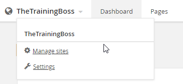{width="3.39375in" height="1.51875in"}

37 \| ADMINISTRATORS

> Let's create a second site:

1.  From the drop down list click the *Manage sites* link. This brings
    you to a list of sites that will initially contain only the one
    site.

2.  Click the *Create a site* button.

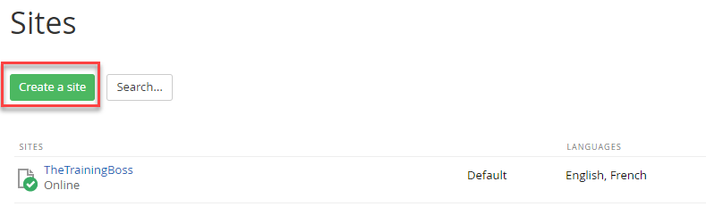{width="4.538888888888889in" height="2.34375in"}

3.  Enter the *Name* and *Domain* of the new site. The radio buttons at
    the bottom of the area allow you to create an empty site from
    scratch or duplicate pages and settings from existing site. This
    second option can be a great timesaver if the sites have similar
    structure and content.

{width="4.705555555555556in"
height="3.2270833333333333in"}

> 38 \| ADMINISTRATORS
>
> **Note**: If you're developing the site and want to add a second
> domain that can be used for preview, check the This site is in the
> process of development checkbox and enter a Testing domain.

4.  The *Languages for public content* area will have a default
    language. In this example, click the *Add languages...* button,
    select *French* from the list and finally, click the *Done* button.
    Next to the *French* entry, click the *Set as default* link.

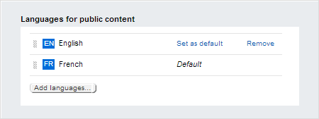{width="4.705555555555556in"
height="1.7805555555555554in"}

5.  Leave *This site is in offline mode* option unchecked.

> **Note**: If you check this option you'll be prompted to either show a
> message such as "The page is not accessible" or redirect the visitor
> to another page when they try to open a page on the site.

6.  Click the *Continue* button.

39 \| ADMINISTRATORS

7.  Next, identify where the content for the site will come from. Notice
    in the screenshot below that, by default, all modules use only data
    from this site. Also, only the Libraries entry is checked, meaning
    that the Content menu for this site will have only Images, Videos,
    Documents & Files, and Forms.

{width="4.696137357830271in"
height="3.6979166666666665in"}

8.  Select the *News* checkbox.

{width="2.3in" height="1.988888888888889in"}

> 40 \| ADMINISTRATORS

9.  Click the *Change* link for the *News* item.

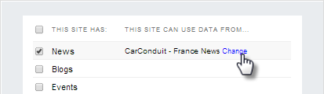{width="4.777083333333334in"
height="1.5402777777777779in"}

10. Select the *Default News* checkbox. This will allow the new site to
    use news created on the site and also from the original site. Click
    the *Done* button.

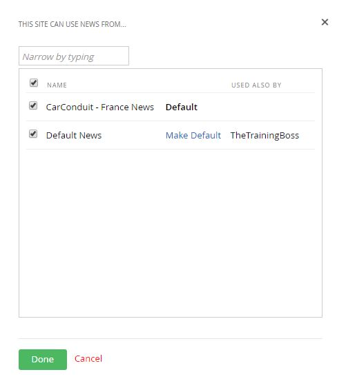{width="4.302325021872266in" height="2.71875in"}

11. Click the *Create this site* button. It will take a little time
    while the new site is built.

12. Now the dropdown list in the upper left lists both the original site
    and the new site. The dropdown allows you to select which site
    you're working with at any one time. Select *CarConduit -- France*
    from the list.

{width="3.2472222222222222in"
height="1.7805555555555554in"}

41 \| ADMINISTRATORS

13. With the *CarConduit -- France* site selected from the list, try
    creating a page, it will already be setup for localization:

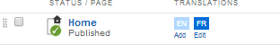{width="3.402083333333333in"
height="1.0819444444444444in"}

14. Using the multisite dropdown list, switch back to the default site.

15. Select the *Content \> News* menu item.

16. Create a news item.

{width="2.9868055555555557in"
height="2.238888888888889in"}

17. Using the multisite dropdown list, switch to the *CarConduit --
    France* site.

18. Notice that you have access to two news sources, one for the
    *CarConduit -- France* site that is currently active and *Default
    News* from the default site. Select *Default News*.

{width="3.673611111111111in"
height="1.4270833333333333in"}

> 42 \| ADMINISTRATORS
>
> The news item from the default site is available here and, because
> this site is set to use the French language setting, the translation
> buttons are already available.

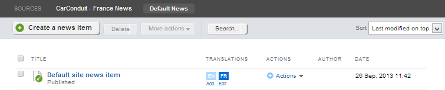{width="6.516666666666667in"
height="1.5604166666666666in"}

43 \| ADMINISTRATORS

Azure Deployment
----------------

> Publishing to the cloud makes your site instantly more scalable and
> reliable. Need failover capability or to suddenly expand capacity? You
> can take your Sitefinity site as it is now and push it up to Azure.

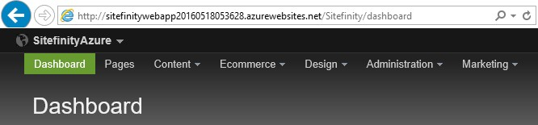{width="6.527083333333334in" height="1.725in"}

> The technologies used in this example are Sitefinity 9, Visual Studio
> 2015 Update 2, SQL Server Management Studio 2014 and the [[Azure
> portal]{.underline}.](https://portal.azure.com/) The Sitefinity
> website and Sitefinity database are already created on the development
> server. We'll be creating the following elements in Azure during this
> walk-through: Resource Group, SQL Server, SQL Database, a Storage
> account and the App Service for the Sitefinity website.

{width="1.8660433070866143in"
height="3.05625in"}

> Prepare the Sitefinity Website and Database
>
> On your local development machine, if you haven't already, create a
> new Sitefinity website, and use MS SQL as the database. You should be
> able to login to the Sitefinity backend.
>
> 44 \| ADMINISTRATORS
>
> []{#Create_the_Azure_SQL_Server .anchor}Create the Azure SQL Server
>
> In the Azure portal, create a new SQL Server. Make a note of the
> server path, the user name and password. Create a new Resource group
> to contain all the elements of your website. Be sure that the *Allow
> Azure Services to Access the Server* checkbox is enabled.

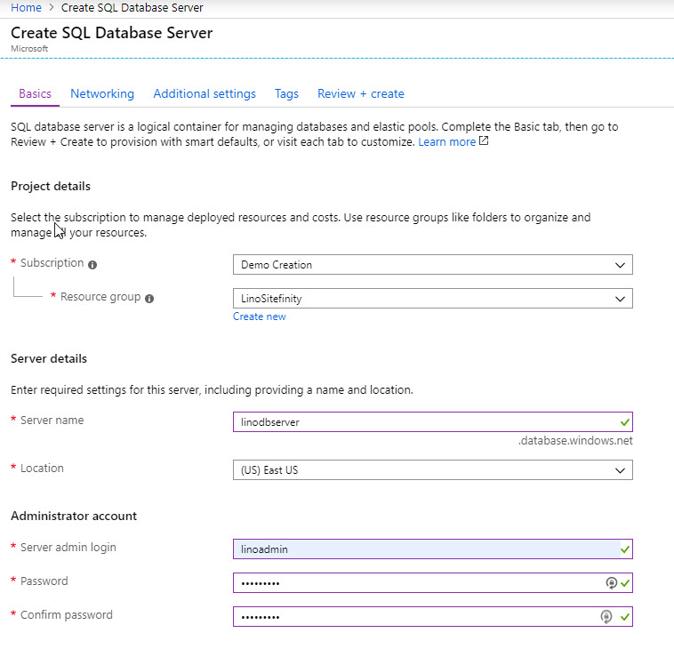{width="3.227759186351706in"
height="7.404374453193351in"}

45 \| ADMINISTRATORS

> **Note**: If you use the resource group for everything related to the
> site, you can move the entire site to another account later if the
> website changes hands or is bought.
>
> Open the SQL Server *Settings* blade, select *Firewall*, and click the
> *Add client IP* link. Make sure the *Allow access to Azure services*
> switch is turned on. Save the Firewall settings.

{width="6.025in" height="3.4319444444444445in"}

> This should work fine in Enterprise environments with static IPs. If
> you're experimenting with this at home with dynamic IPs, you'll have
> to add new entries whenever your IP expires.
>
> 46 \| ADMINISTRATORS
>
> Create the Azure SQL Database
>
> Next, create a SQL database that will hold the Sitefinity data. You
> can leave the source as *Blank database* -- it will be populated later
> from imported data.

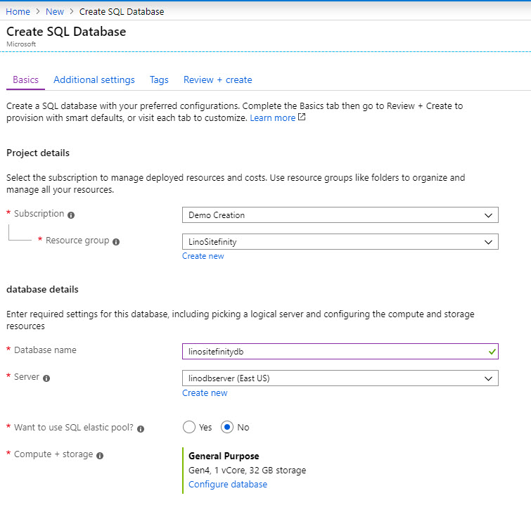{width="2.9520833333333334in"
height="6.108333333333333in"}

47 \| ADMINISTRATORS

> Publish the Database
>
> The simplest way to publish the database is from Microsoft SQL Server
> Management Studio 2014 cumulative update 6 or later. This route allows
> you to use the *Deploy Database to Microsoft Azure SQL Database...*
> option directly to an Azure Database.

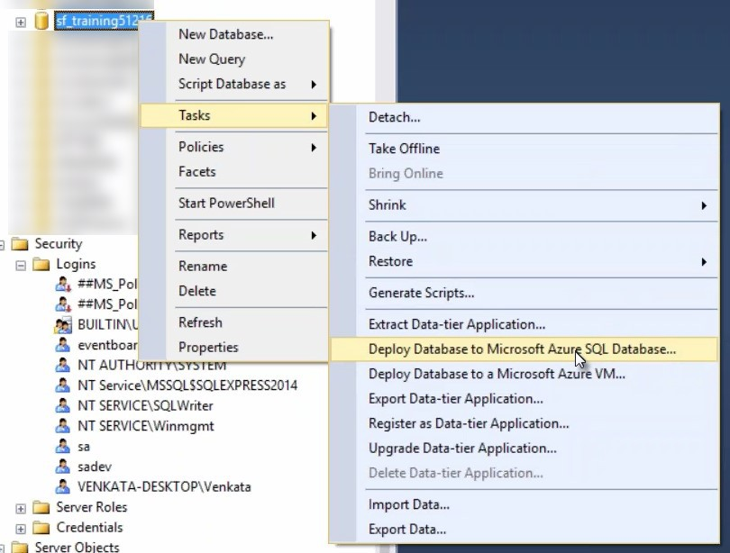{width="6.51875in"
height="4.947222222222222in"}

> Click through the Introduction page to reach the Deployment Settings.

{width="2.265277777777778in"
height="2.127083333333333in"}

> 48 \| ADMINISTRATORS
>
> In Deployment Settings, click the *Connect* button.

{width="6.527083333333334in"
height="6.110416666666667in"}

49 \| ADMINISTRATORS

> In the Connect to Server dialog, enter the Server name, Login and
> Password you saved when you [[created the Azure
> server]{.underline}.](#Create_the_Azure_SQL_Server) Click the
> *Connect* button to return to Deployment settings.

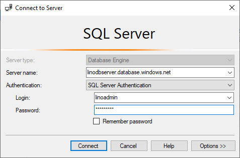{width="6.191666666666666in"
height="4.088888888888889in"}

> 50 \| ADMINISTRATORS
>
> The database name will carry over from your original database
> instance. Use the *Microsoft Azure SQL Database Settings* to adjust to
> resources for the target database. We're using the Standard edition
> here, with a maximum database size of 250 GB. The Temporary file name
> points to a location that stores a "bacpac" file, but, other than
> making sure we have space at that location, we don't need to worry
> about it. Clicking the *Next* button, navigates you to a summary page.

{width="6.527083333333334in"
height="5.340277777777778in"}

51 \| ADMINISTRATORS

> At the Summary, click the *Finish* button.

{width="6.527083333333334in"
height="5.340277777777778in"}

> 52 \| ADMINISTRATORS
>
> Depending on the size of the database, connection speed and Azure
> resources, the import will process. This example Sitefinity database
> took about 4 or 5 minutes to complete.

{width="6.527083333333334in"
height="6.138888888888889in"}

53 \| ADMINISTRATORS

> Prepare the Sitefinity Application for Publication
>
> On your local development machine, open the Sitefinity site in Visual
> Studio. In the Solution Explorer, click the *Show All Files* button,
> then open *App\_Data\\Sitefinity\\*. Find your *Sitefinity.lic* file,
> right-click and select *Include in Project* from the context menu.
>
> Move down to the *App\_Data\\Sitefinity\\Configuration* directory and
> add any config files you want included in the project.

{width="4.548515966754156in"
height="6.72375in"}

> 54 \| ADMINISTRATORS
>
> Open the *DataConfig.config* file and copy the connection string for
> the Azure database into the *connectionString* attribute. Also, change
> the value of the *dbType* attribute to *SqlAzure*.

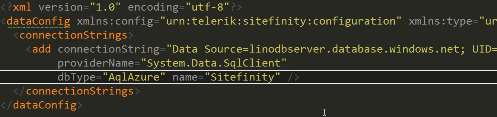{width="6.527083333333334in"
height="1.4152777777777779in"}

> Open the project's *web.config* file for editing. Locate the
> *\<sectionGroup name="telerik"*
>
> *...\>* tag and ***uncomment*** the section. Then find the
> *\<telerik\>* tag and uncomment that section as well.

{width="4.356944444444444in"
height="1.7138888888888888in"}

> Database storage is the suggested way to go for configuration files.
> It allows scaling out more easily, as opposed to copying config files
> across multiple instances. If you think you might need to scale-out,
> go with the database storage up-front.
>
> At the time of this writing, the 2.7 version of the Azure SDK is
> required, even if you're on a later version of the Azure SDK. In the
> web.config *\<runtime\>\<assemblyBinding\>* section, add a
> *dependentAssembly* entry to ensure that the 2.7 version of Azure is
> used.
>
> \<dependentAssembly\>
>
> \<assemblyIdentity name=\"Microsoft.WindowsAzure.ServiceRuntime\"
> publicKeyToken=\"31bf3856ad364e35\"/\>
>
> \<bindingRedirect oldVersion=\"0.0.0.0-2.6.0.0\"
> newVersion=\"2.7.0.0\"/\>
>
> \</dependentAssembly\>

55 \| ADMINISTRATORS

> Here is a listing of the entire \<runtime\> tag in our running example
> for reference.
>
> \<runtime\>
>
> \<assemblyBinding xmlns=\"urn:schemas-microsoft-com:asm.v1\"\>
>
> \<dependentAssembly\>
>
> \<assemblyIdentity name=\"Newtonsoft.Json\"
> publicKeyToken=\"30ad4fe6b2a6aeed\" culture=\"neutral\" /\>
>
> \<bindingRedirect oldVersion=\"0.0.0.0-6.0.0.0\"
> newVersion=\"6.0.0.0\" /\>
>
> \</dependentAssembly\>
>
> \<dependentAssembly\>
>
> \<assemblyIdentity name=\"System.Web.Helpers\"
> publicKeyToken=\"31bf3856ad364e35\"
>
> /\>
>
> \<bindingRedirect oldVersion=\"1.0.0.0-3.0.0.0\"
> newVersion=\"3.0.0.0\" /\>
>
> \</dependentAssembly\>
>
> \<dependentAssembly\>
>
> \<assemblyIdentity name=\"System.Web.WebPages\"
> publicKeyToken=\"31bf3856ad364e35\" /\>
>
> \<bindingRedirect oldVersion=\"0.0.0.0-3.0.0.0\"
> newVersion=\"3.0.0.0\" /\>
>
> \</dependentAssembly\>
>
> \<dependentAssembly\>
>
> \<assemblyIdentity name=\"System.Web.Mvc\"
> publicKeyToken=\"31bf3856ad364e35\" /\>
>
> \<bindingRedirect oldVersion=\"0.0.0.0-5.2.3.0\"
> newVersion=\"5.2.3.0\" /\>
>
> \</dependentAssembly\>
>
> \<dependentAssembly\>
>
> \<assemblyIdentity name=\"System.Web.Razor\"
> publicKeyToken=\"31bf3856ad364e35\" culture=\"neutral\" /\>
>
> \<bindingRedirect oldVersion=\"0.0.0.0-3.0.0.0\"
> newVersion=\"3.0.0.0\" /\>
>
> \</dependentAssembly\>
>
> \<dependentAssembly\>
>
> \<assemblyIdentity name=\"System.Web.WebPages.Razor\"
> publicKeyToken=\"31bf3856ad364e35\" culture=\"neutral\" /\>
>
> \<bindingRedirect oldVersion=\"0.0.0.0-3.0.0.0\"
> newVersion=\"3.0.0.0\" /\>
>
> \</dependentAssembly\>
>
> \<dependentAssembly\>
>
> \<assemblyIdentity name=\"Telerik.Sitefinity.Mvc\"
> publicKeyToken=\"b28c218413bdf563\" culture=\"neutral\" /\>
>
> \<bindingRedirect oldVersion=\"1.3.350.0\" newVersion=\"1.4.360.0\"
> /\>
>
> \</dependentAssembly\>
>
> \<dependentAssembly\>
>
> \<assemblyIdentity name=\"System.Threading.Tasks\"
> publicKeyToken=\"b03f5f7f11d50a3a\" culture=\"neutral\" /\>
>
> \<bindingRedirect oldVersion=\"0.0.0.0-2.6.8.0\"
> newVersion=\"2.6.8.0\" /\>
>
> \</dependentAssembly\>
>
> \<dependentAssembly\>
>
> \<assemblyIdentity name=\"Microsoft.WindowsAzure.ServiceRuntime\"
> publicKeyToken=\"31bf3856ad364e35\"/\>
>
> \<bindingRedirect oldVersion=\"0.0.0.0-2.6.0.0\"
> newVersion=\"2.7.0.0\"/\>
>
> \</dependentAssembly\>
>
> 56 \| ADMINISTRATORS
>
> \<dependentAssembly\>
>
> \<assemblyIdentity name=\"System.Web.Cors\"
> publicKeyToken=\"31bf3856ad364e35\" /\>
>
> \<bindingRedirect oldVersion=\"1.0.0.0-5.2.0.0\"
> newVersion=\"5.2.0.0\" /\>
>
> \</dependentAssembly\>
>
> \</assemblyBinding\>
>
> \</runtime\>
>
> Publish to Azure
>
> In the Solution Explorer, right-click the Visual Studio project and
> select *Publish* from the context menu. In the Publish Web dialog,
> select Microsoft Azure App Service.

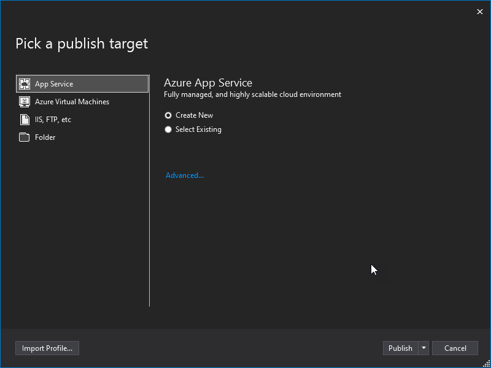{width="5.452083333333333in"
height="3.172222222222222in"}

> **Note**: You will need to have the Azure SDK installed to get the
> Microsoft Azure App Service publish target.

57 \| ADMINISTRATORS

> Click the *New...* button to create a new App Service.

{width="6.5in" height="4.875in"}

> 58 \| ADMINISTRATORS
>
> Enter a Web App Name or leave the automatic defaults. Use the Resource
> Group created earlier to keep all the website elements in one
> container. The App Service plan is defined by your Resource Group, so
> you can leave the default. Click the *Create* button.

{width="6.527083333333334in"
height="4.8805555555555555in"}

59 \| ADMINISTRATORS

> Your deploy settings should download automatically. You can do a quick
> verification using the *Validate Connection* button, then click the
> *Publish* button.

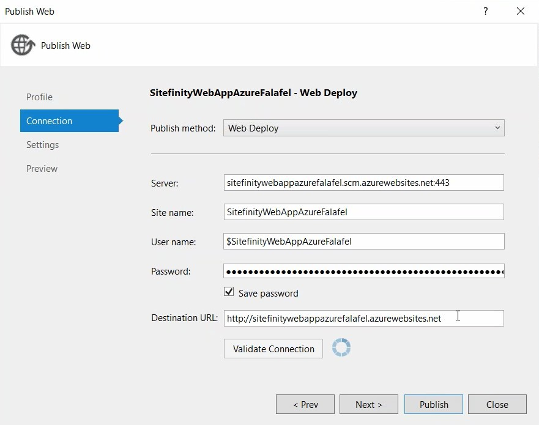{width="6.527083333333334in"
height="5.155555555555556in"}

> 60 \| ADMINISTRATORS
>
> The Visual Studio Output window will show the build progress. Then
> Visual Studio will kick off a browser to display the Sitefinity --
> Azure website.

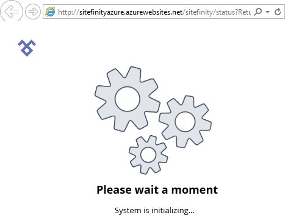{width="4.9222222222222225in"
height="4.213888888888889in"}

> And finally, the backend screen at its new Azure web address:

{width="6.527083333333334in"
height="2.2354166666666666in"}

61 \| ADMINISTRATORS

> Analytics Setup
>
> To get started with Google Analytics, select the *Marketing \>
> Analytics* menu option. Then click the *Configure Analytics* link.

{width="2.59671697287839in" height="2.09375in"}

> By setting up a project on the Google API site you will receive a
> *Client id* and *Secret*. You will register the domain you want
> tracked and finally, you will receive a *Tracking* code snippet that
> uniquely identifies your site. That snippet is pasted into a widget
> that is dropped on every page on your site that you want tracked.
> Later, you can access and modify this data from the *Marketing \>
> Analytics* page.
>
> []{#Google_API_Configuration .anchor}Google API Configuration
>
> The first thing you'll need is a Google login, either an existing
> Gmail account or a new account just for this purpose.
>
> Then navigate to the Google API console. You can use the [Google API
> console](https://console.developers.google.com/project) link at the
> top of the Sitefinity Analytics page to get there. The following steps
> obtain a client ID and client secret that you can use to configure
> Analytics in Sitefinity.
>
> **Note:** At the time of writing, the screenshots and steps were
> valid, but the API setup may change at any time.
>
> 62 \| ADMINISTRATORS

1.  Click the *Create Project* button.

2.  In the *New Project* dialog, enter a readable *Project Name* to
    display in the console. A project ID is created for you
    automatically. If you agree with the terms of service, click the *I
    agree* checkbox. Click the *Create* button.

{width="5.073462379702537in"
height="3.53125in"}

> It will take a little time while Google creates the project and it
> appears in the list.

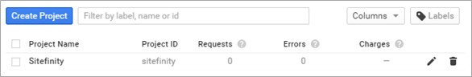{width="6.1101826334208225in" height="1.0in"}

3.  Click the link for your new project.

4.  From the menu on the left, click the *APIs & auth \> APIs* option.
    The APIs that your project can use will be listed.

5.  Click the *Analytics API*.

63 \| ADMINISTRATORS

6.  Click the *Enable API* button.

{width="5.999687226596675in"
height="1.8454166666666667in"}

7.  Click the *Credentials* link on the left hand menu.

8.  Click *Add credentials*, then *Oauth 2.0 client ID*.

{width="4.955575240594926in" height="4.125in"}

> 64 \| ADMINISTRATORS

9.  In the Create client ID page, select the *Web application* type, and
    provide a unique *Name* for the client ID. The *Authorized
    JavaScript origins* needs a public URI, that is, it should end with
    .com, .net, .org, etc. For the *Authorized redirect URIs*, you can
    take the URI you used for Authorized Javascript origins and append

> */Sitefinity/marketing/Analytics* (use the exact upper and lower
> case). See the screenshot below for a working example.

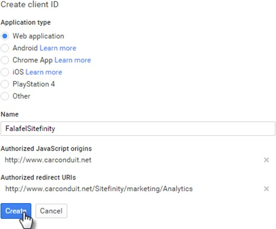{width="5.170138888888889in"
height="4.0784722222222225in"}

> **Note**: If you're testing on a local machine, you can edit your
> [Hosts](https://en.wikipedia.org/wiki/Hosts_(file)) file to create a
> mock public URI, by adding a line similar to the example below:
>
> *192.168.56.1* [*www.carconduit.net*](http://www.carconduit.net/)

65 \| ADMINISTRATORS

10. Click the *Create* button. A dialog will pop up with your new client
    ID and client secret.

{width="5.188888888888889in"
height="2.4604166666666667in"}

> Sitefinity Analytics Configuration
>
> Select the *Marketing \> Analytics* menu item.
>
> Enter the Client Id and Client Secret you obtained from [the Google
> API Configuration](#Google_API_Configuration) topic steps, and then
> click the *Login to Google* button.

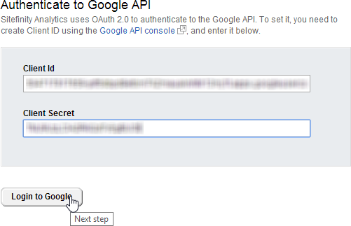{width="6.088888888888889in"
height="3.9604166666666667in"}

> 66 \| ADMINISTRATORS
>
> If you see a popup from Google to have access, click the *Allow*
> button to continue.

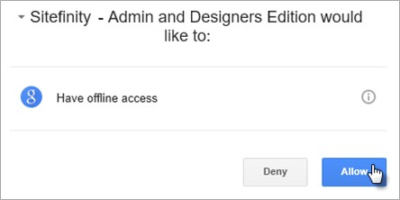{width="4.625in" height="2.3125in"}

> The actions you've taken so far will bring you to the second step of
> the process, selecting a Google Analytics account. Select from the
> list of *Available accounts*, enter the domain you want to have
> tracked and click the *Save settings* button.

{width="5.636805555555555in"
height="3.3666666666666667in"}

67 \| ADMINISTRATORS

> The third and last step presents you with the take-away from the whole
> process \-- the Google tracking code. Copy the JavaScript code from
> the dialog and save it for later use in the pages that you want to
> track. To look at the Dashboard and available reports, click the *Go
> to Analytics* button.

{width="5.865277777777778in" height="4.825in"}

> 68 \| ADMINISTRATORS
>
> Tracking Pages
>
> To allow Google Analytics to hook into your pages and start collecting
> information, drag the Google Analytics widget from the Script and
> Styles group onto pages that should be tracked.

{width="6.423611111111111in"
height="2.2784722222222222in"}

> **Note**: For easier maintenance, consider adding the widget to a page
> template so entire groups of pages are tracked automatically.
>
> Click the Google Analytics widget *Edit* button and paste the Google
> Analytics code that you copied during setup. Then click the *Save*
> button. The code will be included with the page but will not be
> visible.

{width="4.073951224846894in"
height="2.8771872265966754in"}

69 \| ADMINISTRATORS

> Analytics Dashboard and Reports
>
> As users navigate the site, they leave valuable information about
> their interests. For example, how many new visitors are there? What
> culture and languages do they expect? What are the capabilities of the
> devices they are using? What web browsers are they using? What content
> interest them? What terms are they searching on?
>
> All this information and more are found on the *Marketing \>
> Analytics* page. The left hand panel has top-level links for a
> Dashboard, and reports for Visitors, Traffic sources and Content.
>
> 70 \| ADMINISTRATORS
>
> Dashboard
>
> The Dashboard provides an at-a-glance overview of your site's success.
> The drop down allows you to switch views that examine daily Visits,
> Pageviews, Bounce rate (the number users that enter the site and then
> leave), Average time on the site, Average Pages per visit and New
> visits rate. The scale for the left-hand axis of the chart shows
> quantity of visits, etc. while the bottom of the chart shows the day
> each data point was recorded.

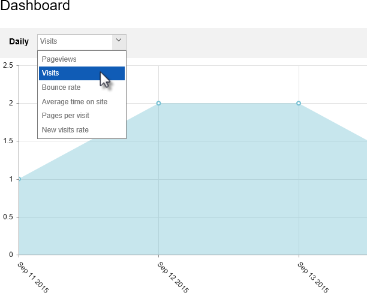{width="6.581944444444445in"
height="5.511805555555555in"}

71 \| ADMINISTRATORS

> On the right hand of the chart, the date selection down-arrow displays
> a dialog where you can dial in a date range.

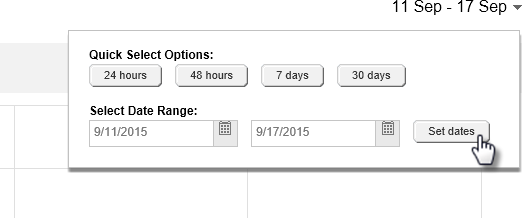{width="5.720138888888889in"
height="2.553472222222222in"}

> Below the date selection, a set of three buttons groups data by day,
> week or month. At the far right side of these buttons is the *Map /
> Chart* button that toggles between views.

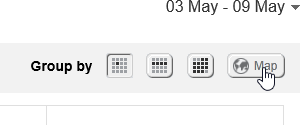{width="3.423611111111111in"
height="1.6118055555555555in"}

> 72 \| ADMINISTRATORS
>
> The Map view is handy for quickly spotting the relationships between
> the data and locations in the world. The Dashboard below shows a
> concentration of new visits coming from Mexico and the northern
> regions of South America. Both chart and map show a detailed breakdown
> below the main summary graphic.

{width="6.4118055555555555in"
height="5.655555555555556in"}

73 \| ADMINISTRATORS

> {width="2.375in"
> height="3.5816666666666666in"}Visitors
>
> The Visitors group of reports help explain the direction your site is
> going in. The Visitor trending reports reveal how many new unique
> visitors enter the site in one week compared to another, how long
> people stay on the site and how many pages do they visit.
>
> Devices include reports on operating systems, mobile devices,
> browsers, resolutions and screen colors being used.
>
> Network properties reports list the service providers that carry users
> to your site and the host sites that visits to your site originate
> from.
>
> 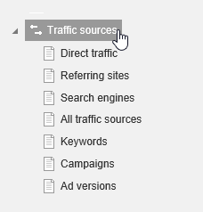{width="2.375in"
> height="2.4783333333333335in"}Traffic Sources
>
> Traffic sources detail what route visitors take to get to your site.
> That is, do people navigate to your site directly, are they redirected
> to your site from a partner's web site, or do they arrive via search
> engines? This view also helps determine if your marketing campaigns
> are effective.
>
> 74 \| ADMINISTRATORS
>
> {width="2.3333333333333335in"
> height="4.571666666666666in"}Content
>
> Content reports help rank the best pages and content. What pages do
> your visitors enter the site at? Do they use a Site search to find
> your site and if they do, what were they searching on? What page was
> the user on when they decided to leave your site?

75 \| ADMINISTRATORS

Alternative Publishing
----------------------

> Alternative publishing refers to funneling information from all kinds
> of sources such as events, blogs, email, or even external sources like
> Twitter feeds, and then publishing that data in a new format such as
> RSS (Really Simple Syndication), Sitefinity content (news, events,
> blogs, list items) or as a new Twitter feed. You can even mash
> together different sources of data.
>
> All this funneling collects the incoming data to an area called a
> publishing point. Often the data will have a large number of fields,
> and, depending on the source of the data, these fields will have
> different names. The process of mapping determines what fields are
> used and where the data for each field should go. Mapping occurs on
> the inbound trip to the publishing point and on the outbound journey
> to be published.
>
> Alternative publishing can be automatic, such as is the case for
> forums. When you create a new forum the Alternative Publishing area
> Generate RSS feed is enabled by default.

{width="5.811516841644794in"
height="1.5208333333333333in"}

> To see all the feeds configured for your site, click the
> *Administration \> Alternative Publishing* menu option. The screenshot
> shows feeds for ForumsRSS (created automatically for all forum posts)
> and Classic Car Parts (generated when the Classic Car Parts forum was
> created).

{width="6.513888888888889in"
height="1.9472222222222222in"}

> 76 \| ADMINISTRATORS
>
> Click the ForumsRSS item to see how the feed is configured and how to
> actually view the feed. The screenshot below shows the default
> configuration. Notice the *Publish as...* field has a URL that RSS
> readers and web browsers can use to view the feed.

{width="6.4582863079615045in"
height="7.354166666666667in"}

77 \| ADMINISTRATORS

> Try clicking the RSS feed link. Depending on your browser and how it's
> configured, the RSS will show up as a formatted list of articles. The
> screenshot below shows how RSS is displayed in Internet Explorer.
> Consult your browser's documentation for specifics on setting up the
> browser to read RSS feeds.

{width="7.016666666666667in"
height="1.9368055555555554in"}

> Create a new Feed Manually
>
> This next example describes creating a new custom feed. The example
> takes the RSS feed from an external blog site and funnels it into news
> content.
>
> The walk-through will require an external RSS feed URL. The example
> uses
> [[http://blog.falafel.com/feed/]{.underline}](http://blog.falafel.com/feed/)
> but any valid RSS feed URL will do. Save the RSS URL for upcoming
> steps.
>
> {width="0.148332239720035in"
> height="0.14833333333333334in"}**Note:** You can find RSS URLs at
> hundreds of sites. The link is usually marked with some variation of
> the RSS logo .

1.  Click the *Administration \> Alternative Publishing* menu option.
    This will bring you to the Feeds and Notifications page.

2.  Click the *Create a feed* button.

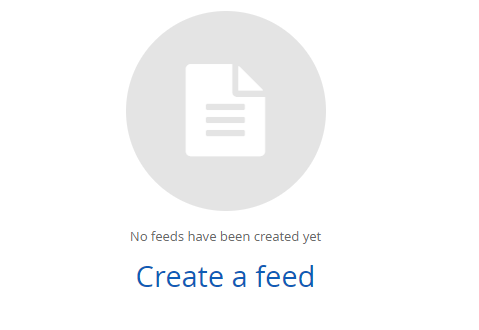{width="3.091666666666667in"
height="1.8736111111111111in"}

> 78 \| ADMINISTRATORS

3.  Enter a *Title* and *Description* for the feed.

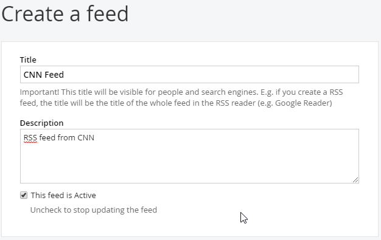{width="3.5008792650918634in"
height="2.2916666666666665in"}

4.  Click the *Add another content type* button.

5.  The *Content to Include* dialog displays. Select the *External
    RSS/Atom feed* radio button and enter the URL of the RSS feed into
    the Url name text box. From the *Schedule publication updates
    interval* drop down list, select *1 hour*. Click the *Done* button.

{width="4.073751093613298in"
height="4.33125in"}

79 \| ADMINISTRATORS

> The *Content to Include* section should now look something like the
> screenshot below that shows the RSS URL you're importing the data
> from.

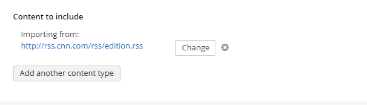{width="4.5519531933508315in"
height="1.59375in"}

6.  Click the *Publish As \> Add more* button to display the *Content to
    include* dialog. Select the *Sitefinity content* option. From the
    *Import data as* drop down list, select *News* items. Select the
    check box for the *Automatically publish imported data* option.
    Click the *Done* button.

{width="3.6976727909011373in"
height="3.0625in"}

> **Note**: By default, the imported data is not published
> automatically, giving you a chance to review each item before it goes
> out to the public.

7.  Click the *Save changes* button.

> 80 \| ADMINISTRATORS

8.  Select the *Run* option from the Actions drop down list. This action
    will import the data and push it to news content.

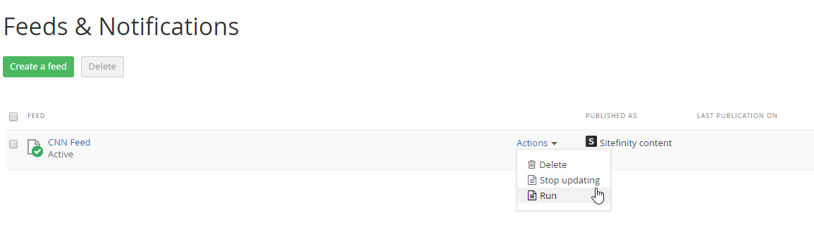{width="3.9475885826771653in"
height="1.2708333333333333in"}

9.  Select the *Content \> News* menu option.

> The imported items from the external blog are now news content. All of
> the items are published and visible from any page with a News widget.

{width="4.938888888888889in"
height="2.772222222222222in"}

81 \| ADMINISTRATORS

Multilingual Content
--------------------

> If you need to create a multilingual site, you will need to configure
> languages. You can find the languages settings under *Administration
> \> Settings \> Languages.*

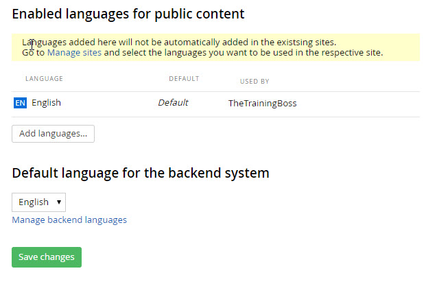{width="6.527083333333334in"
height="3.76875in"}

> 82 \| ADMINISTRATORS
>
> Click the *Add* button to start adding your languages. You can also
> add region specific languages by selecting the *Show Cultures* link in
> the modal window.

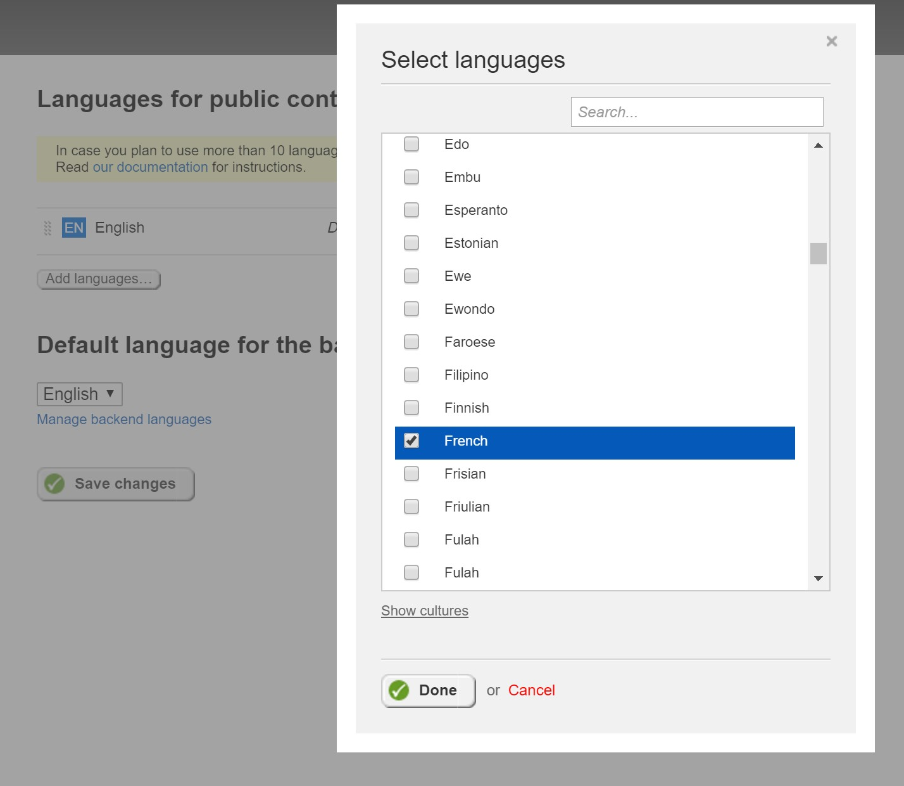{width="6.520138888888889in"
height="5.665277777777778in"}

83 \| ADMINISTRATORS

> In the *Multilingual URLs* section, you can define the strategy for
> your multilingual content URLs. Unless you absolutely want to have a
> subdomain defined for every language, the default option should work
> pretty well for you. The *Directories* strategy makes it a lot easier
> to manage languages without having to match languages with your sub
> domains.

{width="6.520138888888889in"
height="6.170138888888889in"}

> 84 \| ADMINISTRATORS
>
> Once you have defined the languages, now you can start adding
> multilingual content to your site. Sitefinity includes nice visual
> indicators for multilingual sites, to improve the editing experience.
>
> You will notice that now you have a language selector on the right
> hand of the screen that allows you to quickly navigate to another
> language.

{width="3.3534722222222224in"
height="2.11875in"}

> Multilingual Back End Pages
>
> Localizing back end pages use a similar mechanism used to localize
> front end pages. To change the back-end language:

1.  From the Administration menu select the *Settings \> Languages*
    option

2.  Click the *Manage backend languages* link to see the *Add
    languages\...* button.

3.  Click *Add languages\...* to display the *Select languages* dialog.

4.  Select one or more languages from the list and click the *Done*
    button.

85 \| ADMINISTRATORS

5.  Finally, click the *Save changes* button.

{width="3.9118963254593178in"
height="2.493333333333333in"}

> After clicking the *Close languages for the backend system* link, a
> drop down will allow you to choose the language for the backend
> system. Select a new language from the drop down list, then click the
> *Save changes* button.

{width="4.416666666666667in"
height="1.8569444444444445in"}

> There is no immediate change. You need to load translated [[Labels &
> Messages]{.underline}](#Labels_&_Messages) to see the effect.
>
> []{#Labels_&_Messages .anchor}Labels & Messages
>
> The *Administration \> Labels & Messages* menu item displays a page
> that lists all the labels, captions and other text in the system that
> can be localized. These labels populate all text in the system
> including the Administration menu text, widget text and even the
> column headings in grid widgets. Each label can be edited to define
> the Invariant language (the default language) and for each language
> you have configured from the *Administration \> Settings \>
> Languages*. You can create labels for user interface elements in the
> backend and then export those settings as an XLSX "Language Pack", or
> you can import a language pack that already has the translations.
>
> 86 \| ADMINISTRATORS
>
> Importing and Editing a Language Pack
>
> You can import \"language packs\" of translated labels and messages in
> .xlsx spreadsheet format. Sample language packs can be downloaded from
> the [Sitefinity
> marketplace](http://www.sitefinity.com/developer-network/marketplace)
> [online.](http://www.sitefinity.com/developer-network/marketplace)

{width="6.408482064741907in"
height="3.65625in"}

> To import a language pack, click the *Import language pack* button,
> select the language from the drop down list, and select the downloaded
> XLSX spreadsheet file. Click the *Import* button. It will take some
> time to import and update the system.

{width="4.079096675415573in" height="2.64in"}

87 \| ADMINISTRATORS

> Refresh the page to see all the resourced items in the system backend
> display in the corresponding language.

{width="6.513888888888889in"
height="2.7333333333333334in"}

> To edit any of the labels, click the item in the list and edit the
> Invariant (default) language, and each language you have defined.

{width="6.4970286526684164in"
height="2.5729166666666665in"}

> 88 \| ADMINISTRATORS

Image Libraries
---------------

> When an image library is first setup, the Root library settings may
> not get a lot of attention, but you will need to review this
> configuration to get the best performance and behavior out of the
> site. To edit image library settings, select the *Content \> Images*
> menu option. In the Actions menu for a library, select the *Edit
> properties* option, then open the Root library settings section.

{width="6.490821303587052in"
height="5.304166666666666in"}

> The top section allows you to automatically resize images as they are
> uploaded. You can keep the original dimensions or limit images a
> selected width.
>
> Browser caching defaults to the same settings as those used for the
> entire site: *No caching*, *Standard caching* with a duration of 90
> days, *Long caching* of 365 days, or *No explicit client caching*. To
> set the cache settings globally, navigate to *Administration \>
> Settings \> Advanced settings \> System \> Output Cache Settings*.

89 \| ADMINISTRATORS

> What if a page won't update and you think it may be cached? You can
> disable the cache to make sure caching is not part of the problem.
>
> **Note:** Consider turning off caching during initial development of
> your site, then turn it back on for production.
>
> The default album size is \"anything goes\", but you should make a
> decision on what the maximum image size should be. You don\'t want
> huge file uploads that take over the server hard disk. Limit the
> overall album size by setting *Max album size* in megabytes and *Max
> image size* in kilobytes.
>
> You can change the *Storage provider* to be *Database* or *File
> System*. By default, all the binary data for images, videos, documents
> and files are stored in the database, but you can use the file system
> to store all of this data.
>
> **Note:** Be aware that the saved data will still be unreadable when
> viewed in the file system. For example, you won't be able to find
> "logo.png" as separate file. Using the file system mechanism just
> shifts the load of where the binary data is stored.
>
> 90 \| ADMINISTRATORS
>
> Server caching options can default to the same as used for the entire
> site (set from *Administration \> Settings \> Advanced Settings \>
> System \> Output Cache Settings*). You could also elect the *No
> caching* option, *Standard Caching* with a 2-minute duration and *Long
> Caching* with a 20-minute duration.

1.  Caching is set to *As set for the whole site* as the default. Click
    the *Details* link to see the current settings. The details popup
    shows the caching options, the HTTP Header equivalent, and help on
    where to reconfigure these settings.

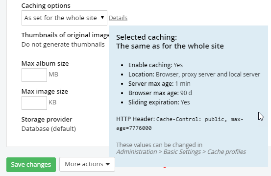{width="4.397222222222222in"
height="2.8784722222222223in"}

91 \| ADMINISTRATORS

Changing Backend Themes
-----------------------

> Sitefinity comes with an improved backend theme:

-   *Reduced top navigation*, to leave more room for the work area.

-   *Less graphics and color,* to remove unnecessary clutter and reduce
    distraction.

-   *More focus on content,* to improve the interaction with content and
    tasks.

-   *Increased emphasis on actions,* to make it faster and intuitive to
    complete user tasks.

{width="7.025in" height="3.64375in"}

> 92 \| ADMINISTRATORS
>
> To switch to the new theme, you need to login to Sitefinity CMS with
> Administrator privileges and:

1.  Go to *Settings\>Advanced\>Appearance.*

> In field *BackendTheme,* enter *Light*.

{width="6.025in" height="2.69375in"}

2.  Click on the *Save changes* button.

Ecommerce
---------

> Before a set of pages can be built that form a shopping experience for
> visitors, the site administrator must configure a minimal set of
> options. In particular, you must set up a store, shipping methods and
> payment methods. Also, most sales require tax rates be set up. If you
> want enable product reviews, you need to configure comment settings to
> allow it.

93 \| ADMINISTRATORS

> Configure a Store
>
> From the *Ecommerce \> Store* settings menu option you can configure
> online stores so they can accept customer orders.

1.  Select the *Ecommerce \> Store settings \> General link*.

2.  In the Store Details section, enter the Store Name, Address and
    Email.

{width="4.341666666666667in"
height="5.113888888888889in"}

> 94 \| ADMINISTRATORS

3.  The Advanced section has an option to Save credit card number in
    database. This only needs to be selected if credit cards are not
    processed immediately. The option to Bypass real-time payment
    processing allows you to skip setting up credit card authorization,
    just to test the system.

{width="5.3530304024496935in"
height="1.6354166666666667in"}

4.  Click the *Save* button.

95 \| ADMINISTRATORS

> Configure Tax
>
> Configuring taxes determines when and how taxes are added to orders.
> Click the Tax link. The default excludes the tax until checkout.
> Instead, you can include the tax in the price automatically or you can
> manually include the taxes in the price as the price is entered. Leave
> the defaults.

{width="4.195138888888889in"
height="4.270138888888889in"}

> Configure Measurement Units
>
> This section determines how product weight and dimensions are
> measured. Click the Measurement Units tab. Mass unit (weight) can be
> Pound, Kilogram or Gram. Length unit can be Inch, Meter, Centimeter,
> or Millimeter. Leave the defaults here.

{width="1.8520833333333333in" height="1.675in"}

> 96 \| ADMINISTRATORS
>
> Configure Currency
>
> This section determines the currencies your site will handle and the
> exchange rate for those currencies. Click the Currencies tab. A
> default currency will display. Click the Add currencies button and
> select one or more from the list of standard currencies, then click
> the Done button.

{width="2.9520833333333334in"
height="1.2152777777777777in"}

> Once new currencies are added, the Exchange rates section displays.
> While you can set the exchange rate manually, the Use external service
> option allows you to select a service from a drop down and populate
> the exchange rates automatically. Just click the Get rates button. To
> recalculate the rates daily, select the Automatically update daily
> check box.

{width="2.6560728346456695in"
height="2.0625in"}

> Shipping Methods
>
> Shipping methods describe how products will be delivered to the
> customer. You can either use a carrier, like Federal Express or you
> can handle the shipping arrangements yourself *offline*.
>
> If you decide to ship online using a carrier, you will need to setup
> an account. Typically, each carrier will have a developer site that
> allows you to sign up for a test account that you can use to verify
> your ecommerce system will work before going live.

97 \| ADMINISTRATORS

> Creating an Online Shipping Method
>
> To demonstrate creating a shipping method that uses an online carrier,
> this example uses a FedEx test account.

1.  Go to the FedEx developer site at <http://fedex.com/us/developer/>
    and create an account. Collect the account URL, Password, License
    Key, MeterID and Account number from the confirmation page and the
    follow up email sent by the developer site.

2.  Select the *Ecommerce \> Shipping* methods menu option.

3.  Click the *Create a shipping method* link.

4.  Enter a Name for the method. Select the Area you will ship to using
    this method. Leave the Standard (Shipping carriers). Select FedEx
    Shipping Carrier from the drop down list.

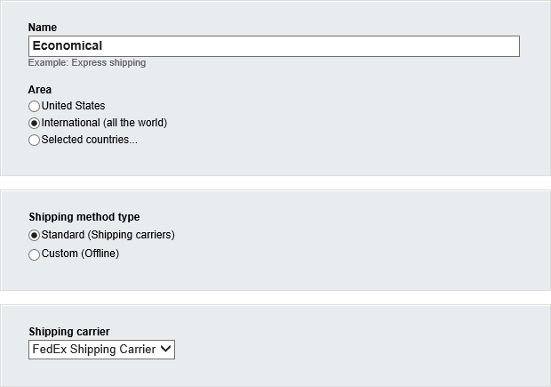{width="5.941912729658792in"
height="4.168748906386702in"}

> 98 \| ADMINISTRATORS

5.  Select the check boxes for all types of shipping that you want to
    include in this method.

{width="6.005831146106737in"
height="2.586561679790026in"}

6.  Using the information from the FedEx developer site, enter the Url,
    Password, License Key, MeterID and Account Number.

{width="6.004421478565179in"
height="2.82875in"}

7.  Click the *Create this shipping method* button.

99 \| ADMINISTRATORS

> Creating an Offline Shipping Method
>
> To ship offline:

1.  Select the *Ecommerce \> Shipping* methods menu option.

2.  Click the *Create a shipping* method link.

3.  Enter a Name for the method. The screenshot below uses *Slow Train*
    as an offline shipping method example. Select the Area you will ship
    to using this method.

{width="6.004564741907261in"
height="1.9181244531933508in"}

4.  Select the *Custom (Offline)* radio button.

{width="6.003996062992126in"
height="1.1043744531933508in"}

5.  Shipping offline requires that you set the shipping cost
    specifically. In the Shipping price area, you can base the price on
    Weight, Total price, Fixed price per order, Fixed percentage of the
    total price or Quantity. This example uses the Fixed percentage of
    total price option with Shipping price set to 10%.

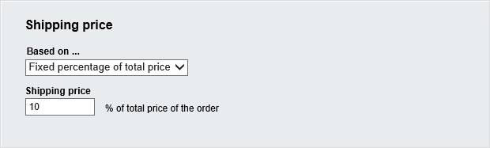{width="5.686784776902887in"
height="1.7141666666666666in"}

> 100 \| ADMINISTRATORS

6.  Click the *Create this Shipping method* button.

> Payment Methods
>
> Payment methods describe how orders will be paid for: online with a
> credit card or offline where you handle the payment arrangements.
>
> Creating an Online Payment Method
>
> Online payment methods describe how a commercial payment processor
> like PayPal or Authorize.Net AIM handle your site's credit card
> transactions. Online payment processing services typically have live
> accounts for production online ordering and test accounts to help
> verify that your processing will be correct.
>
> Each payment processor has its own set of information that must be
> entered in Sitefinity's payment type. Typically, the payment processor
> supplies you with a URL of a service that performs the processing and
> some kind of authentication such as login id or vendor name. The
> payment processor developer documentation may also supply test credit
> card numbers that will not charge an account but will pass validation.
>
> For example, you can sign up at the Authorize.Net developer center for
> a test account at
> [https://developer.authorize.net/testaccount/.](https://developer.authorize.net/testaccount/)
> Here's an example walk-through that uses Authorize.Net AIM to create
> an online payment type:

1.  Sign up for a new account at
    [[https://developer.authorize.net/testaccount/]{.underline}.](https://developer.authorize.net/testaccount/)
    Collect the login ID and Transaction key they provide.

2.  In Sitefinity, select the *Ecommerce \> Payment methods* menu
    option.

3.  Click the *Create a payment method* link.

4.  Enter a Name for the method, for example, Credit Card.

101 \| ADMINISTRATORS

5.  Select Authorize.Net AIM from the Payment processor drop down list.

{width="2.560416666666667in"
height="2.76875in"}

6.  The Payment processor drop down list selection cascades to set the
    allowed credit cards and required authentication settings.

7.  Select the check boxes for credit card types you will accept on your
    site. For now, leave the Mode radio button at Test. Set the URL to
    [[https://test.authorize.net/gateway/transact.dll]{.underline}.](https://test.authorize.net/gateway/transact.dll)
    Enter the Login ID and Transaction key supplied by the developer
    site.

{width="4.586255468066492in"
height="3.6165616797900264in"}

> 102 \| ADMINISTRATORS

8.  In this example, the Timeout is 30000 milliseconds (30 seconds), the
    Payment type is Sale and the API version at the time of this writing
    is 3.1.

{width="6.004730971128609in"
height="2.150624453193351in"}

9.  Click the *Create this payment method* button.

10. Once you test that the online payment methods work, you can change
    the URL to a live URL (you get this URL from the payment processor)
    and switch the Mode from Test to Live.

103 \| ADMINISTRATORS

> Creating an Offline Payment Method
>
> The offline payment method simply defines a Name. Once you enable the
> This payment method is active checkbox, you can use the method. This
> leaves the responsibility for collecting payment to you. To create an
> offline payment method:

1.  Select the *Ecommerce \> Payment methods* menu option.

2.  Click the *Create a payment method* link.

3.  Enter a Name for the method. The screenshot below uses Payment on
    delivery as an offline payment example.

4.  Make sure that the *This payment method is active* checkbox is
    enabled and click the *Create this payment method* button.

{width="5.942435476815398in"
height="3.689582239720035in"}

> 104 \| ADMINISTRATORS
>
> Taxes
>
> You don't want to lookup tax amounts for every purchase. Instead,
> Sitefinity allows you to define taxes based on the unique combination
> of shipping or billing location and the country where the product is
> to be delivered. Taxes are associated with products when the product
> is created. Tax amounts are calculated automatically during the
> checkout process based on the rates that you define. The screenshot
> below defines a tax named Standard VAT for shipping addresses where
> the country of delivery is the United Kingdom, the rate is defined as
> 20% and is not applied to shipping costs.

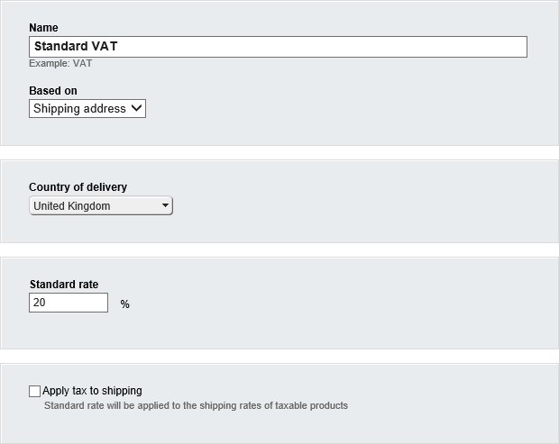{width="5.876008311461067in"
height="4.673228346456693in"}

> **Note**: You can import and export taxes as CSV (comma delimited)
> files from the
>
> *Ecommerce \> Taxes* page.

105 \| ADMINISTRATORS

> Tax Classes
>
> Tax classes allow you to subdivide a tax into different rates or to
> flag some products as tax exempt. For example, the United Kingdom
> Value Added Tax (VAT) might have a standard rate of 20%, a reduced
> rate of 5% for some items like home energy and a zero rate for certain
> goods and services like food and children's clothes.
>
> Select the *Ecommerce \> Tax Classes* menu item. Then click the
> *Create a tax class* button. Enter a name for the tax class (the
> actual rate is defined when creating or editing a tax). There is a
> single field to enter the Tax class name.

{width="5.57079615048119in"
height="1.3347911198600175in"}

> Once your tax rates are defined, return to *Ecommerce \> Taxes*. You
> can create a new tax or edit an existing tax. Below the Standard rate
> for the tax, you should see tax classes you have created. The
> screenshot below shows the standard 20% VAT rate, a 5% rate for home
> energy, a zero rate for children's clothes and a rate for postage.
> Notice that the postage tax class is flagged Tax exempt.

{width="2.4830785214348206in"
height="2.1553116797900262in"}

> 106 \| ADMINISTRATORS
>
> When content creators build a product catalog and define new products,
> they can select a Tax class from the list.

{width="4.338541119860017in" height="2.125in"}

> Discounts
>
> Discounts allow you to promote products by offering lower rates based
> on the customer belonging to a group. For example, the user may have
> attended a tradeshow where they received a coupon code. To create a
> discount:

1.  Navigate to *Ecommerce \> Discounts*.

2.  Click the *Create a Discount* button.

3.  Enter a Name for the discount and a Discount amount. The discount
    amount can be percentage or an absolute currency amount. If you want
    to limit the number of times the discount can be applied, enter a
    number in the *This discount can be used* text box.

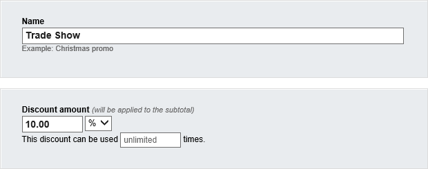{width="5.94409230096238in"
height="2.347916666666667in"}

107 \| ADMINISTRATORS

> The *Apply discount for...* section creates a group of customers based
> on a criterion. The discount can be for All customers, Existing
> customers, New Customers, customers that enter a coupon code (this
> shows up in the checkout process) or based on Sitefinity roles or
> particular users. This example applies the discount if the customer
> enters a coupon code.

{width="6.003464566929134in"
height="2.3153116797900264in"}

> You can limit the discount to be effective only between a Start date
> and End date.

{width="6.006914916885389in"
height="1.3853116797900262in"}

> You can also establish a threshold where the amount must be within a
> certain Minimum subtotal or Maximum subtotal.

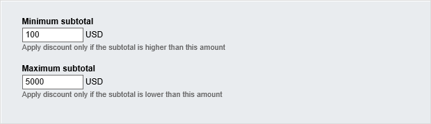{width="6.000856299212598in"
height="1.7340616797900263in"}

4.  Click the *Create this discount* button to add the discount.

> 108 \| DESIGNERS

Designers
=========

> As a designer, you're interested in creating a functional, attractive
> layout for the site. The major concern here is not how to create
> content, configure the site or perform heavy- duty programming tasks.
>
> This section shows how to create responsive web pages that display
> well in any device, design master pages customize the look and feel of
> the entire site and create templates for widgets and pages.
>
> The section ends with a look at the Sitefinity Feather Module, a
> modern, convention- based framework for creating clean,
> mobile-friendly layouts in a simplified manner.

109 \| DESIGNERS

Responsive Web Design
---------------------

> Your web design is expected to look good on standard desktop displays,
> iPhones, Androids, tablets or any device used during the life of your
> website. Sitefinity automatically arranges the layout of the screen
> based on the current screen characteristics (i.e. screen size, device
> to pixel ratio, orientation, etc.). If your large, browser-based
> layout takes up three columns from side to side, the iPhone can view
> the same content running in a single column. You can even customize
> font properties or swap images based on the current screen
> characteristics.
>
> Sitefinity implements responsive web design automatically, using rules
> to define the characteristics to look for (e.g. 240-320 pixels in
> width like the HTC Wildfire) and how your site should react (e.g.
> transform the layout, redirect to another site, or load a special
> CSS).
>
> Under the hood, Sitefinity uses CSS media queries to get information
> about the screen minimum width and orientation. For more background
> information, check out Ethan Marcotte\'s seminal blog [[Responsive Web
> Design]{.underline}.](http://www.alistapart.com/articles/responsive-web-design/)
>
> Creating Rules
>
> The first step is to create rules for the scenarios you expect to
> encounter. In our example, we\'ll create a small version of a simple
> website. You can make rules for as many detailed cases as you want.
> Typically, you\'ll want to cover small \"Smart phone\" screens,
> tablets and large notebook/desktop screens.
>
> To begin building a responsive web site, first create the group rules
> and the layout that should result.

1.  From the Sitefinity menu, select *Design \> Responsive & Mobile*
    design.

2.  Click the *Create a group of rules* button.

3.  Enter a *Name* for the group of rules.

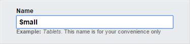{width="3.901240157480315in"
height="0.9166666666666666in"}

> 110 \| DESIGNERS

4.  Select device characteristics using the presets from the drop-down
    list. For this example, choose the *Smartphones* option.

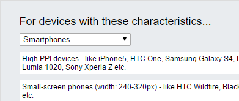{width="3.7555555555555555in"
height="1.5916666666666666in"}

5.  Leave the defaults for *Apply behavior to\...* and Specific CSS file
    options.

6.  In the *System settings* section, select the vertical arrangement of
    rows for each option. For example, where the default is *3 colum*ns,
    select *3 rows*.

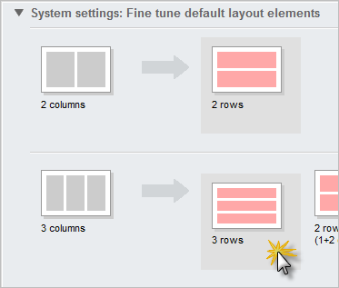{width="3.531169072615923in"
height="2.971874453193351in"}

111 \| DESIGNERS

7.  Leave the *This group of rules is active* checkbox selected and
    click the *Done*

> button.
>
> To test this, we can create a new page with a three-column layout,
> then look at the page preview and simply resizing the browser. First
> create a new page that uses the *3 Equal Columns, Header, Footer*
> template.

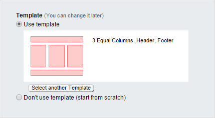{width="4.467420166229221in"
height="2.46875in"}

> Add three Image widgets, one for each column. Populate the Image
> widgets with any images you have available.

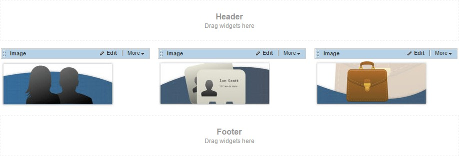{width="6.513888888888889in"
height="2.2284722222222224in"}

> 112 \| DESIGNERS
>
> You can test the responsive design simply by resizing the browser. The
> images display side-by-side, horizontally, as long as the browser is
> wide enough.

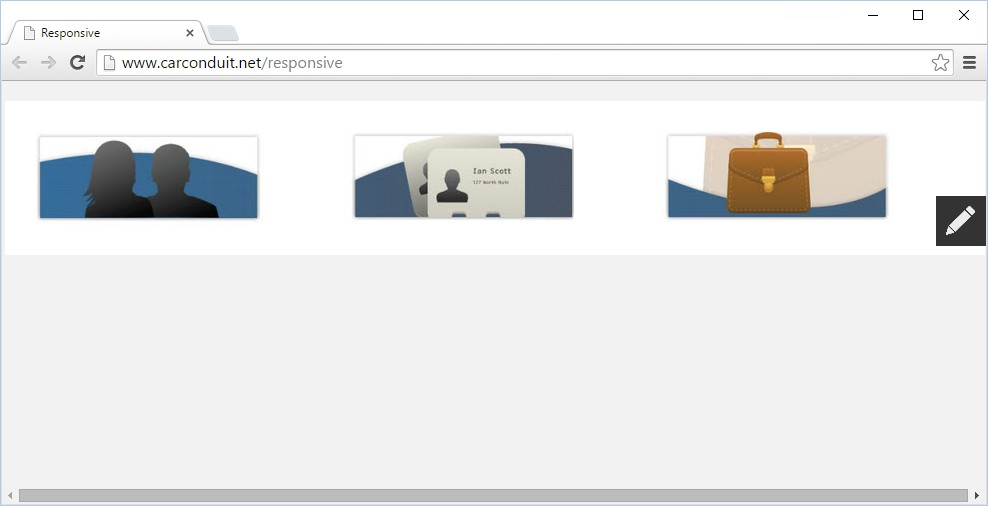{width="4.218233814523185in"
height="2.1610411198600175in"}

> Reduce the width of the browser, and the responsive rule for *Small*
> kicks in. *Small* is configured to transform the layout from 3 columns
> to 3 rows when the browser is narrower than a smart phone.

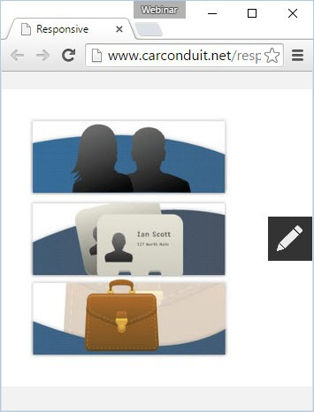{width="2.367299868766404in"
height="3.1066666666666665in"}

113 \| DESIGNERS

> To get a better feel for how your page will look in a phone or tablet,
> click the *More actions \> Preview for Smartphones & Tablets* option.

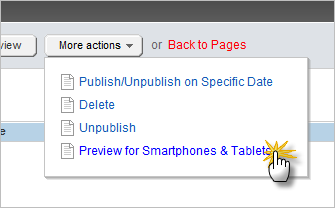{width="3.5308639545056866in"
height="2.1666666666666665in"}

> 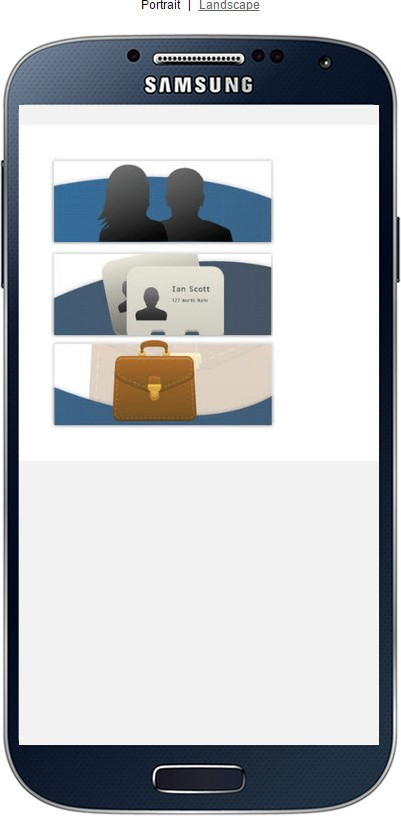{width="2.723333333333333in"
> height="5.541666666666667in"}The preview shows how the page appears in
> iPhone, iPad and Samsung, Blackberry, Nokia and an ever-growing list
> of devices as they come on the market. You can also toggle the view
> between portrait or landscape orientations.
>
> 114 \| DESIGNERS
>
> Device Characteristics
>
> Sitefinity predefines a set of device characteristics that will
> trigger layout changes. The likely suspects are listed there, but you
> can add your own custom rules to help \"future proof\" your site.

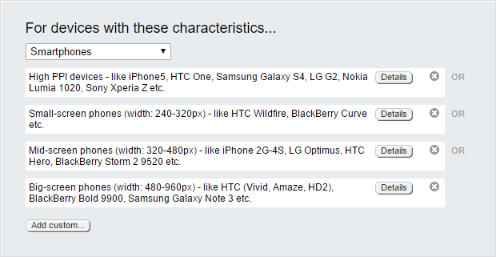{width="6.455754593175853in"
height="3.34375in"}

115 \| DESIGNERS

> Click the *Details* button next to the \"High PPI devices\" entry to
> configure the specifics that make up each rule. You can trigger rules
> based on the size or size range, orientation, aspect ratio and
> resolution. You can even trigger rules if the device is an old-school
> monochrome or grid-based device, e.g. teletypes, terminals or portable
> devices with limited display capabilities. As you change the settings,
> a CSS media query is built dynamically in the *Result* area at the
> base of the dialog.

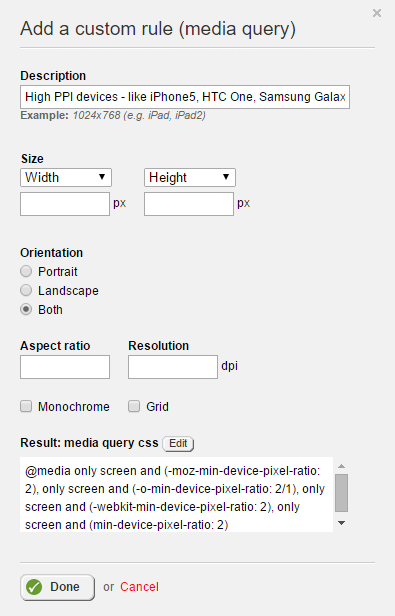{width="4.069570209973754in" height="6.3525in"}

> 116 \| DESIGNERS
>
> Adding New Behaviors
>
> Changing layout gets you part way there, but you may need to perform
> detailed styling of fonts, hide or show images, change margins or
> obscure elements that don\'t work with a particular device. There are
> two ways to handle these detailed changes, either transform the layout
> or navigate to an entirely different page.
>
> The *Open a specially prepared site* option (e.g. a mobile version of
> your site) is less flexible than using style sheets and may result in
> multiple sites being created as new device types come online. The
> advantage is that you can customize the site very specifically for
> each device type. To go this route, select the *Open a specially
> prepared site* option, then select the Root page of the specially
> prepared site.

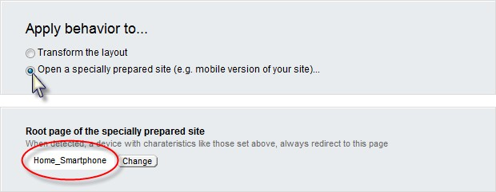{width="6.457738407699038in"
height="2.5104166666666665in"}

> If you select Transform the layout, you can choose a CSS file that
> will come into play when certain devices are detected.

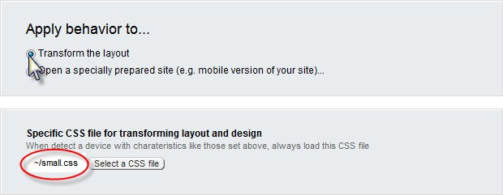{width="6.393160542432196in"
height="2.4853116797900263in"}

117 \| DESIGNERS

> Using a CSS file option, the page is still single source, but styles
> are applied to customize the page for each situation. The example
> below uses a style sheet to control the look of the full-sized web
> page. The screenshot shows a full-size banner graphic that stretches
> across all three columns.

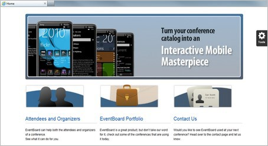{width="4.776162510936133in"
height="2.5833333333333335in"}

> When the browser size is reduced to trigger the \"Small\" set of
> rules, the small.css styling displays a smaller graphic at the top of
> the page and a different font than the larger version.

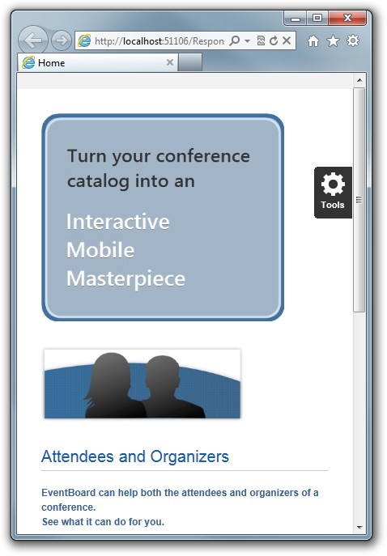{width="2.8379647856517933in"
height="4.079061679790026in"}

> 118 \| DESIGNERS
>
> Here\'s an example of the small.css file:
>
> .banner\_small {
>
> display: block !important;
>
> }
>
> .banner\_large {
>
> display: none !important;
>
> }
>
> .threeImage { margin-top: 30px;
>
> !important;
>
> margin-bottom: 0px !important; margin-left: 0px !important;
>
> }
>
> h3 {
>
> margin-top: 0px;
>
> !important;
>
> margin-bottom: 0px !important;
>
> }
>
> .blurb {
>
> color: \#3060A0 !important; font-weight: bold !important; margin-top:
> 0px !important; margin-bottom: 0px !important;
>
> }

119 \| DESIGNERS

Widget Templates
----------------

> What if you don\'t like the way a widget is arranged or the type of
> content it contains? Widgets template allow you to tailor the layout.
>
> Accessing Widget Templates
>
> You can access widget templates from the Administration menu and from
> the edit link of the widget.
>
> The Administration menu *Design \> Widget templates* option shows the
> name of the template and where the template is used. For example, the
> *List of threads* template is applied to the Forums threads list.
> Click the *Name* link to edit the template.

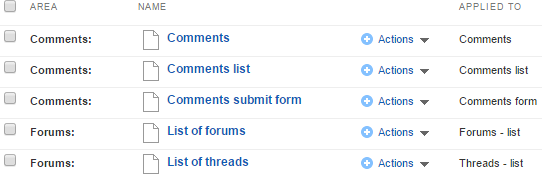{width="5.71875in"
height="1.9819444444444445in"}

> The *Edit* link of the allows you to select a template and then edit
> it, or create an entirely new template.

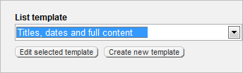{width="3.572785433070866in" height="1.0725in"}

> 120 \| DESIGNERS
>
> Changing a Template
>
> This next walk-through assumes you already have one or more blog posts
> created. The blogs should have Tags defined.

1.  Drag a *Blog Posts* widget to a page.

2.  Click the widget *Edit* button.

3.  Click the *List Settings* link.

4.  Select the *Titles and dates* template from the drop down list

5.  Click the *Edit selected template* button.

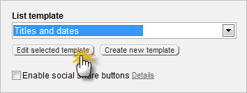{width="3.64867782152231in"
height="1.381874453193351in"}

121 \| DESIGNERS

> The Edit template page displays three areas: HTML markup, a right hand
> insert menu, and the bottom of the page edits for *Template name* and
> *Name for developers*.

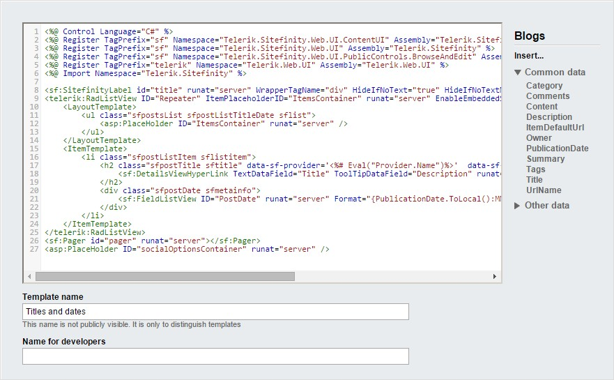{width="6.515676946631671in"
height="4.0307283464566925in"}

> The HTML markup uses ASP.NET syntax and has special tags that
> reference Sitefinity data fields. The *Blogs Insert\...* menu lists
> the data that can be dropped right into your widget. To make it easier
> to use, the list is divided into *Common data* fields you\'re likely
> to use and *Other data* that lists all possible fields. The *Template
> name* is used by Sitefinity to identify the template.
>
> 122 \| DESIGNERS
>
> To add new data to the template:

1.  Place your cursor in the HTML just below the PostDate field, as
    shown in the screenshot below.

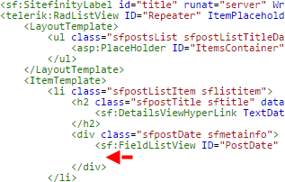{width="3.428472222222222in"
height="2.3354166666666667in"}

2.  From the *Blogs Insert\...* menu, click the *Tags* item. Sitefinity
    automatically creates the markup you need. Click the *Insert* button
    to place the markup at the cursor position.

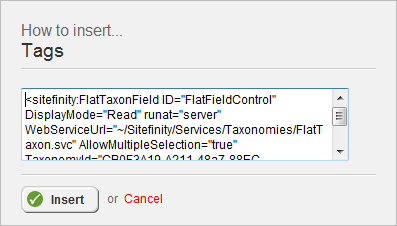{width="4.145536964129484in"
height="2.3306244531933507in"}

123 \| DESIGNERS

3.  Click the *Save* changes button.

4.  Click the *Save* button.

5.  Now the widget lists the tags below the title and publication date.

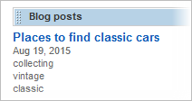{width="2.2066666666666666in"
height="1.1666666666666667in"}

> Creating a New Template
>
> What happens to your changed template when a new version of Sitefinity
> is installed? The template may be overwritten by the new installation.
> The recommended approach is to create a new template that will not
> conflict with built-in templates. You can copy all the HTML from
> another template and then add any fields that you want.

1.  Click the Blog Posts widget *Edit* button.

2.  Click the *List Settings* link.

3.  Select the *Titles and dates template*, then click the *Edit
    selected template* button.

4.  Click the *Restore template to default* button. This rolls back any
    changes you have made to the original definition stored in the
    database.

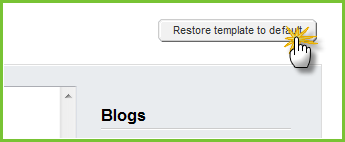{width="3.5289162292213474in"
height="1.4495833333333332in"}

> 124 \| DESIGNERS

5.  Click the confirmation *Yes, restore the default version\...*
    button.

6.  Select all the HTML in the editing window, right-click and select
    *Copy* from the context menu.

7.  Click the *Save changes* button.

8.  Click the *Create New Template* button.

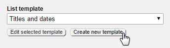{width="3.6034722222222224in"
height="1.0333333333333334in"}

9.  Place your cursor in the editing window and paste the HTML from the
    clipboard.

10. Enter a unique, descriptive template name.

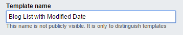{width="3.738888888888889in"
height="0.7305555555555555in"}

11. Click the *Save changes* button. The new template should appear in
    the list of templates where it can be assigned or edited.

12. Select your new template from the List template drop down.

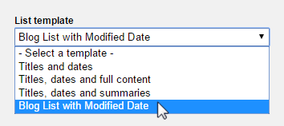{width="3.698611111111111in"
height="1.6583333333333334in"}

13. Click the *Edit* selected template button.

> **Note**: Why are we saving, then going back and editing? The
> right-hand menu is not populated with blog fields until after the
> save.

125 \| DESIGNERS

14. Place your cursor in the HTML just below the PostDate field.

15. From the Blogs Insert menu on the right side, open the *Other data*
    section and click the *LastModified* field. This step displays HTML
    markup that you can insert into your widget template.

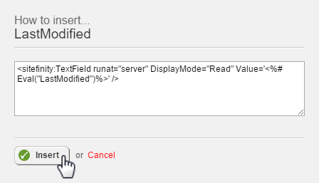{width="4.665726159230096in"
height="2.6770833333333335in"}

16. Click the *Insert* button to paste the generated code into the HTML
    window.

17. Click the *Save changes* button.

18. Click *Save*.

19. Click the *Save* button.

20. The widget with the new template shows the modified date below the
    publication date.

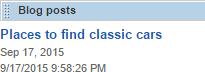{width="2.2083333333333335in"
height="0.8770833333333333in"}

> 126 \| DESIGNERS
>
> Using Custom Fields in Widgets
>
> Custom fields for pages and content types is listed in the widget
> editor, right along with the built-in Sitefinity fields. For example,
> custom fields can be added to blog posts, using the Custom Fields for
> posts link from the right-hand menu.
>
> For example, a "More Info" field could be added to each blog post that
> contains a URL pointing to information relating to the post. The
> settings for the custom "More Info" field might look something like
> this:

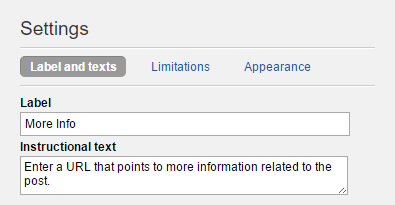{width="4.111175634295713in"
height="2.1354166666666665in"}

127 \| DESIGNERS

> Here's an example blog post that uses the "More Info" custom field, at
> the bottom of the page:

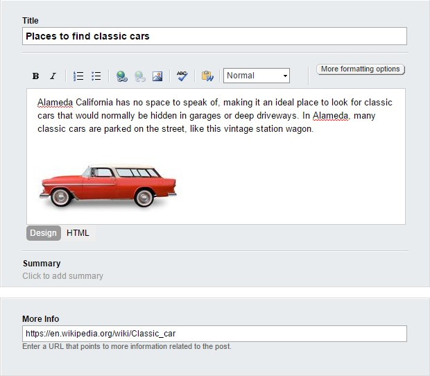{width="6.453805774278215in"
height="5.645833333333333in"}

> 128 \| DESIGNERS
>
> You can use the same procedure described in [[Creating a New
> Template]{.underline},](#_bookmark27) but instead of adding a
> PostDate, the new MoreInfo field shows up in the right-hand list of
> blog fields.

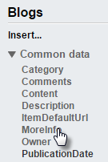{width="1.4055566491688538in"
height="2.1041666666666665in"}

> When you click the custom field, the *How to insert...* dialog pops up
> with markup to display the field as text:
>
> \<sitefinity:textfield runat=\"server\" displaymode=\"Read\"
>
> value=\'\<%\# Eval(\"MoreInfo\")%\>\' /\>
>
> We want to display this as a link so change the markup to use an HTML
> anchor \<a\> tag instead:
>
> \<a runat=\"server\" target=\"\_blank\" href=\'\<%\#
> Eval(\"MoreInfo\")%\>\'\>More Info\</a\>
>
> The rendered widget adds a new "More info" link. The URL for the link
> is defined in the custom field.

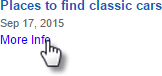{width="1.67332239720035in" height="0.78375in"}

129 \| DESIGNERS

> Managing Widget Templates
>
> Widget templates are managed from the *Design \> Widget Templates*
> menu option. You should be able to see your new widget in this list,
> with your login name listed in the *Owner* column. The widgets are
> grouped into *Area*. Also notice that the *Applied To* column
> indicates where the template is used. To open the widget template for
> editing, click the link in the *Name* column.

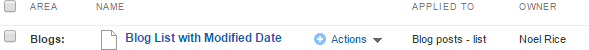{width="6.278472222222222in"
height="0.7722222222222223in"}

> 130 \| DESIGNERS

Page Templates
--------------

> Page templates allow you to have the same basic layout and content
> across multiple pages. For example, you may want certain pages to have
> the organization logo in the upper left hand corner and a copyright
> notice centered at the bottom of the page. You can build all of your
> page templates entirely in Sitefinity, using drag and drop, without
> having to use any other tool.
>
> **Note**: Page Templates can also be created [[from master
> pages]{.underline}](#Create_Templates_from_Master_Pages) and [[from
> MVC]{.underline}](#_bookmark33) [[layout
> files]{.underline}.](#_bookmark33)
>
> []{#_bookmark27 .anchor}Access page templates from the *Design \> Page
> Templates* menu option. The list shows built-in templates that can be
> used as starting points.

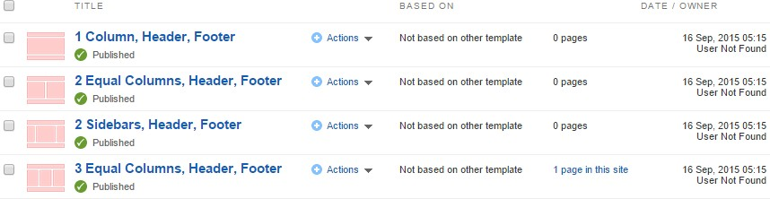{width="6.513888888888889in"
height="1.7618055555555556in"}

> The *Title* column opens the template for editing, bypassing the
> *Actions* menu.
>
> The *Actions* menu has options to delete the template, change the
> title, change the content (edit the template), change permissions and
> select a new base template (choose a template as a starting point).
>
> The *Based On* column shows if the template inherits from some other
> template or is completely new.
>
> To the right of Based On, a column shows the number of pages that use
> this particular template. You can click this link to see a list of
> pages that use the template and to preview those pages.

131 \| DESIGNERS

> []{#Creating_a_New_Template .anchor}Creating a New Template
>
> This walk-through demonstrates creating a new page template and
> applying the new template to a page. The template will include an
> organization logo, language selector drop-down, navigation menu and
> footer with a copyright.

1.  Click the *Create a template* button and enter information about the
    template

> Enter the Name of the template. The name should describe how the
> template is used.
>
> Optionally, you can specify a thumbnail image for the template. The
> recommended size is 105 x 80 pixels.

2.  Select the Use template option. Click the *Select another Template*
    button to choose the 1 Column, Header, Footer template.

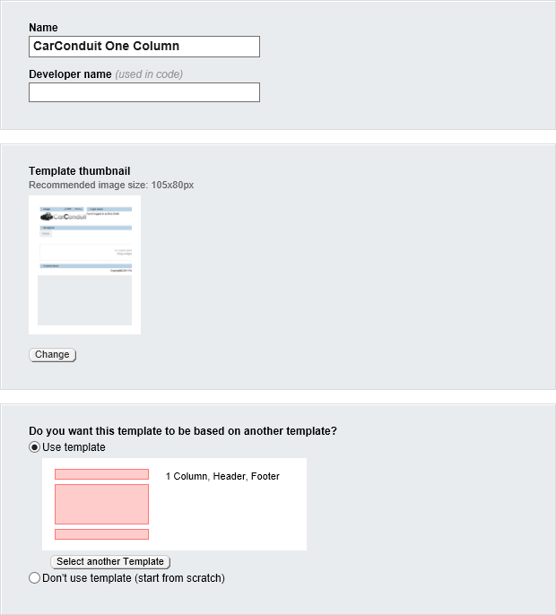{width="4.262446412948382in"
height="4.71625in"}

> 132 \| DESIGNERS

3.  Click the *Create and return to Templates* button. The new template
    shows up in the list and the Based On column shows that we\'re using
    the 1 Column Header, Footer template as a starting point.

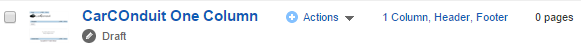{width="6.049290244969379in"
height="0.4479166666666667in"}

> Editing the Template Layout
>
> Now that the page template is created, you can fine-tune the template
> layout. This will create the zones that widgets can be dropped into,
> define proportions of areas within layout elements, and define
> "wrapper" names that can be referred to later in CSS.

1.  Click the *Actions \> Content* option (or click the title) to edit
    the template.

2.  Click the *Layout* button. You should see the layout elements from
    the template that this page template is based on.

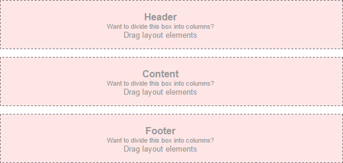{width="5.900570866141733in" height="2.805in"}

133 \| DESIGNERS

3.  From the *Drag layout elements* area of the right hand menu, drag
    the 25% + 75% element onto the top row of the layout. This should
    land right on top of the existing layout element.

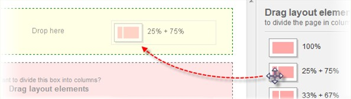{width="6.211805555555555in" height="1.775in"}

4.  Now the layout should look something like the screenshot below,
    where the top row is divided into proportions of 25% and 75%.

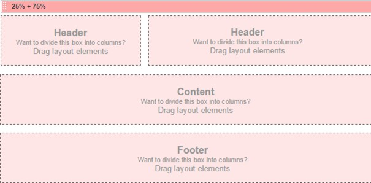{width="6.245382764654418in"
height="3.073124453193351in"}

> 134 \| DESIGNERS

5.  Click the *Edit* button, click on *Classes & Labels* and enter
    "Header" as the Wrapper name. Add "ccLogin" to Column 2. In the
    *Labels* area, enter "Logo" for Column 1 and "Login" for Column 2.

> Wrapper is used later to select the entire row in CSS. Column 2 is the
> CSS name for the second column that will contain a login name widget.
> Click the *Done* button to finish editing the layout element.

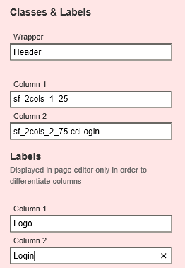{width="2.8930653980752408in"
height="4.184791119860018in"}

135 \| DESIGNERS

6.  Drag the 100% layout element to a point just between the top and
    second rows. This will create a new row in the Header area of the
    layout.

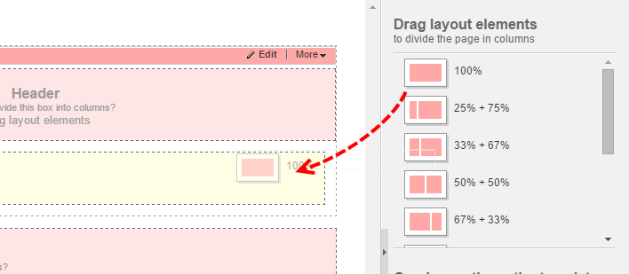{width="6.513888888888889in" height="2.85in"}

7.  Click the *Edit* button, click on *Classes & Labels* and enter
    "Menu" as the Wrapper name and "Menu" as the Column 1 label. Click
    the *Done* button.

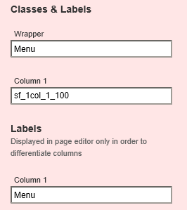{width="2.5701388888888888in"
height="2.8569444444444443in"}

> 136 \| DESIGNERS

8.  Drag a 100% layout element to the Content area below the menu.

9.  Click the *Edit* button, click on *Classes & Labels* and enter
    "Main" as the Wrapper name and "Main" as the Column 1 label. Click
    the *Done* button.

10. Drag a 100% layout element to the Footer area below the content.

11. Click the *Edit* button, click on *Classes & Label*s and enter
    "Footer" as the Wrapper name.

> The layout should look like the screenshot below. Notice that the
> layout elements have the custom labels that you defined.

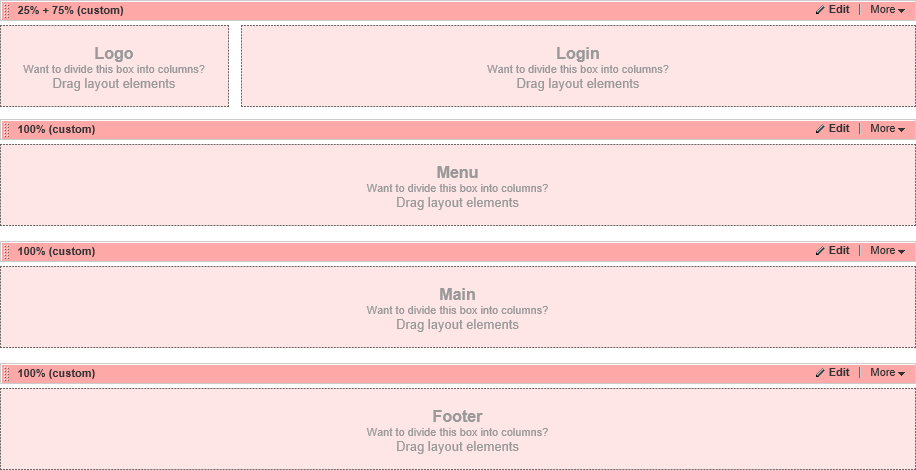{width="6.293479877515311in"
height="3.2312489063867016in"}

137 \| DESIGNERS

> Editing the Template Content
>
> Once the layout has been determined, you can add the widgets and
> content that will appear on any page that uses this page template.

1.  Click the *Content* button. Notice that the layout area layouts in
    this view.

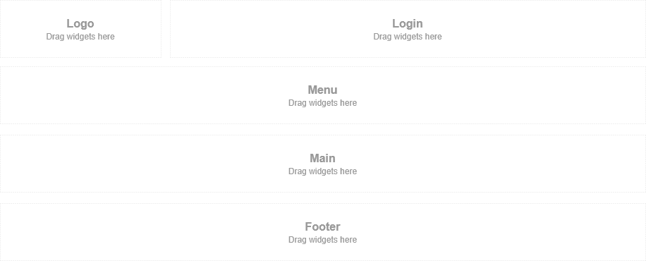{width="6.373611111111111in"
height="2.5819444444444444in"}

2.  Drag an Image widget to the Logo area.

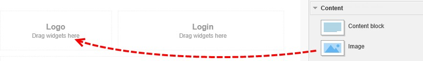{width="6.020138888888889in"
height="0.8888888888888888in"}

> 138 \| DESIGNERS

3.  Click the *Edit* link.

4.  In the Image dialog, click the *Select image* link, select a logo
    image and click the *Done* button. Click the *Settings* link. Select
    the *Image Size* drop down and select *Small: 240px width* from the
    list. Click the *Save* button.

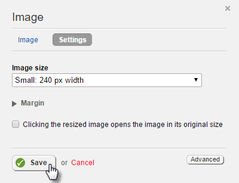{width="4.166628390201224in"
height="3.1979166666666665in"}

5.  Open the Login section of the right-hand menu and drag the *Login
    name* widget to the Login layout area.

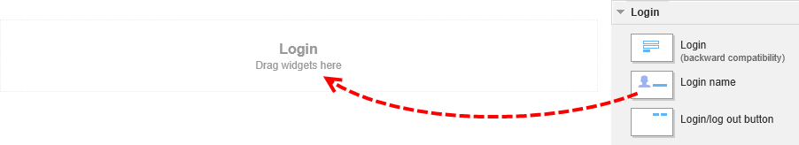{width="6.277083333333334in"
height="1.1520833333333333in"}

6.  Click the *Edit* link of the Login name widget. Scroll down to the
    FormatString property and change it to *You\'re logged in as
    {FirstName} {LastName}*. Click the *Save* button.

139 \| DESIGNERS

> The page now displays something like the screenshot below.

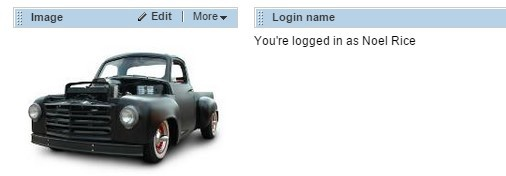{width="5.281944444444444in"
height="2.138888888888889in"}

> **Note**: The Login name should float to the right in this layout. See
> the [[Styling]{.underline}](#Styling) section for directions on how to
> use CSS styling.

7.  From Navigation area of the right-hand menu, drag a *Navigation*
    widget to the Menu layout element below the image and login.

8.  Click the *Edit* button of the Navigation widget. From the template
    drop down, select the *Horizontal with dropdown menus* option. Click
    the *Save* button to close the dialog.

> **Note**: What if you don\'t want to display the home page in the
> navigation, but only the pages that come under home? The Display
> section has an option to display all pages under a particular page.
> Also, you can limit the number of levels to show by setting Levels to
> include.
>
> 140 \| DESIGNERS

9.  Drag a *Content* block widget to the Footer layout area, at the
    bottom of the page.

10. Click the *Edit* link. Add a copyright notice for your organization,
    for example *Copyright 2016 Falafel Software*. Click the *More
    formatting* options button. Place your text cursor just after the
    word Copyright, drop down the list of symbols and select the
    copyright symbol as shown below.

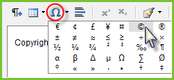{width="2.5795505249343833in"
height="1.2083333333333333in"}

> Select the text in the editor window, then click the Align Center
> button.

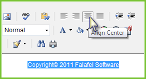{width="3.0175710848643917in"
height="1.6190616797900264in"}

> Click the *Save* button. The page should now look like the screenshot
> below:

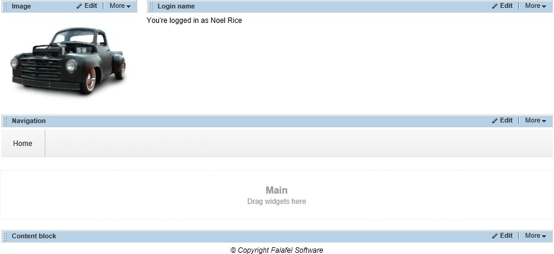{width="6.045138888888889in" height="2.875in"}

11. Click the *Publish* button.

141 \| DESIGNERS

> **Note**: Widgets in a page template can be marked as editable so that
> they can be tweaked later when they're on the page. For example, if
> you drop an Image widget on the page template, drop down the *More*
> menu and select the *Make editable on pages* option.

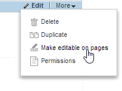{width="2.3020833333333335in"
height="1.9569444444444444in"}

> The widget title bar will display "EDITABLE ON PAGES" to flag the
> change.

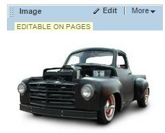{width="2.047222222222222in" height="1.7in"}

> Now you have access to the Edit link even when the widget is used on
> the page. You can change the image choice and the other settings for
> the widget. Be aware that the inheritance to the original widget will
> be broken so that changes to the original will not carry to the page
> where you edited the widget.
>
> 142 \| DESIGNERS
>
> Using the New Page Template
>
> Now that the page template is created and the layout designed, you can
> create a new page using the template.

1.  Select the *Pages* menu option.

2.  Create a new page. In the Template area, select *Use template*, then
    click the *Select another Template* button.

> **Note**: Be aware that changing the template after creating the page
> will \"pull the rug from underneath\" any current page design you
> already have in place.
>
> Changing the template will typically break the layout and you will be
> starting over for that page.

3.  Select the new custom template. Notice the warning that the template
    change may break the existing layout for the page. If this template
    will be used for most of your pages going forward, enable the *Use
    the selected template* as a default template\... option.

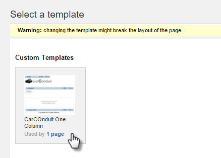{width="4.580555555555556in"
height="3.290277777777778in"}

4.  Click the *Done* button to close the dialog.

143 \| DESIGNERS

> **Note**: You can return to an earlier version of the page, before the
> template was changed by selecting the *Revision History* item from the
> Actions menu.
>
> When you edit the page content, the page appears with the template
> layout and items already showing. Notice that the login name,
> navigation menu and copyright notice all come from the template and
> cannot be changed here. The logo in the upper left corner has
> *Editable in pages* enabled, so the *Edit* link is visible for that
> template element only. You can add new items around the template
> items, but you can\'t delete or sub-divide the layout elements.

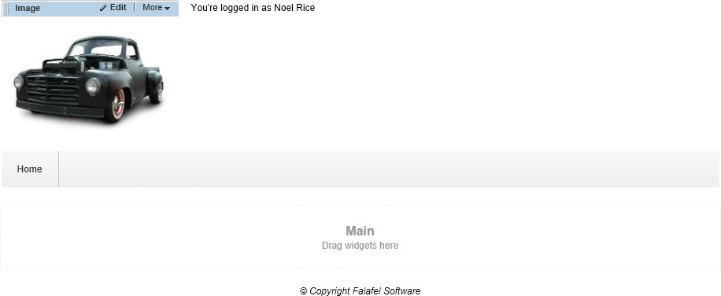{width="6.6in" height="2.95in"}

> 144 \| DESIGNERS
>
> Duplicating Page Templates
>
> 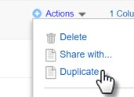{width="1.4299989063867016in"
> height="1.0299989063867017in"}To cut down on repeated work, you can
> duplicate existing page templates. Any changes to the original page
> template are inherited by the duplicate. You can setup hierarchies of
> templates so that page elements are defined one time only. For
> example, you could define a base page with an organization logo. By
> duplicating the
>
> page, you get the organization logo for free.
>
> To create a duplicate, start from *Design \> Page Templates*, then
> click the Actions menu *Duplicate* option. Give the template a new
> title and then select *Create and go to add content* or *Create and
> return to templates*.
>
> Be sure to think ahead about the page templates hierarchy. Try to keep
> the initial templates simple with the minimum number of elements
> needed. Think about the scenarios that might arise and try to design
> your template hierarchy to allow flexibility and maintenance with the
> least amount of upkeep.
>
> []{#Styling .anchor}Styling
>
> Custom changes to fonts, alignment, background and other appearance
> changes needs to be applied using styles. Styles can be added:

-   Using the CSS (Cascading Style Sheet) widget. Styles can be added to
    the widget directly as text or you can link to a CSS file.

-   Using themes. Themes define a set of colors, fonts and CSS for the
    site.

> You can use the CSS widget for quick, ad-hoc styling. You can have as
> many CSS widgets on the page as you like. The styles defined in the
> CSS widget are added automatically to the \<head\> tag of the page.

145 \| DESIGNERS

> The last example shows the Login name widget text aligned left, much
> too close to the logo graphic. The following walk-through demonstrates
> adding a text-align style to the page and using the style in a Content
> block widget.

1.  Select the *Design \> Page Templates* menu option.

2.  Open the CarConduit One Column template created in the previous
    [[Page]{.underline} [
    Templates]{.underline}](#Creating_a_New_Template) section.

3.  Drag a *CSS* widget to the page.

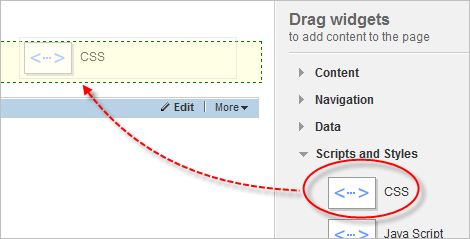{width="4.8909066054243215in"
height="2.4895833333333335in"}

> **Note**: Where you place the CSS widget is not critical to the
> functioning of the page. The styles in the CSS widget are always added
> to the page \<head\> tag. Multiple CSS widgets appear in the \<head\>
> tag in the order they\'re placed on the page.

4.  Click the CSS widget *Edit* link.

> Take a moment to explore the CSS dialog.
>
> If you choose the *Link to a CSS file* option, you can browse to a
> \*.css file within your project. In the Media section, you can select
> one or more media types that the styles will apply to. CSS files
> should be located in the \\App\_Themes folder.
>
> The *Write CSS* option allows you to add styles directly to the page.
> Styles can be added to the editor window, but be sure to leave out the
> \<style\> tag.
>
> 146 \| DESIGNERS

5.  Select the *Write CSS* option and enter the style below to the
    window:

> .Login
>
> {
>
> text-align:right;
>
> }

6.  Click the *Save* button.

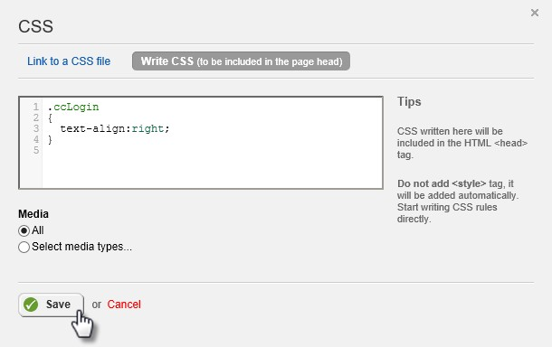{width="4.257849956255468in" height="2.68in"}

7.  Click the *Preview* button. The top row, right column text should
    align to the right side.

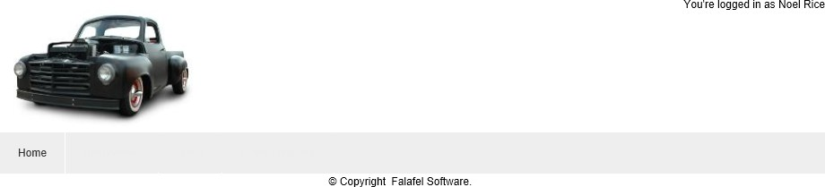{width="5.353472222222222in"
height="1.6166666666666667in"}

8.  Navigate back to editing the page and click the *Publish* button.

147 \| DESIGNERS

> []{#Create_Templates_from_Master_Pages .anchor}Create Templates from
> Master Pages
>
> Master pages are a file-based standard that ASP.NET uses for
> templating. Master pages also have C\# or VB.NET code-behind unlike
> the Sitefinity template counterpart. Another advantage to master pages
> is that you can reuse whatever frameworks the page is using, such as
> [Bootstrap,](http://getbootstrap.com/) without having to reconfigure
> the page.
>
> Here's a minimal example masterpage with content place holders for the
> top, middle and bottom:
>
> \<%@ Master Language=\"C\#\" AutoEventWireup=\"true\"
> CodeFile=\"MyBasePage.master.cs\" Inherits=\"App\_Master\_MyBasePage\"
> %\>
>
> \<!DOCTYPE html\>
>
> \<html xmlns=\"<http://www.w3.org/1999/xhtml>\"\>
>
> \<head runat=\"server\"\>
>
> \<title\>CarConduit Master Page\</title\>
>
> \</head\>
>
> \<body\>
>
> \<form id=\"form1\" runat=\"server\"\>
>
> \<asp:ScriptManager ID=\"ScriptManager1\"
> runat=\"server\"\>\</asp:ScriptManager\>
>
> \<div\>
>
> \<asp:ContentPlaceHolder ID=\"TheTop\" runat=\"server\" /\>
>
> \</div\>
>
> \<div\>
>
> \<asp:ContentPlaceHolder ID=\"TheMiddle\" runat=\"server\" /\>
>
> \</div\>
>
> \<div\>
>
> \<asp:ContentPlaceHolder ID=\"TheBottom\" runat=\"server\" /\>
>
> \</div\>
>
> \</form\>
>
> \</body\>
>
> \</html\>
>
> The master pages can be located in the *\\App\_Master* directory, a
> sibling of the
>
> *\\App\_Themes* directory. To run in Sitefinity, you must add a
> ScriptManager control inside the form. The ContentPlaceHolder controls
> show up in the Sitefinity page template editor as layout areas.
>
> 148 \| DESIGNERS
>
> To use a master page as a page template:

1.  Click the *Pages* menu option.

2.  Click the *Create a page* button, and provide a name for the page.

3.  In the Template section, click the *Select another Template* button.

4.  Click the *Use your own master file* button.

5.  Select the master page from out of the App\_Master directory, then
    click the *Use Selected* button.

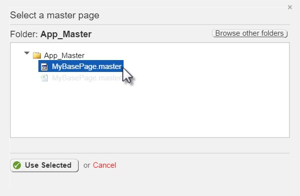{width="4.200474628171478in"
height="2.756770559930009in"}

6.  Click the *Create and go to add content* button. The
    ContentPlaceHolder areas are shown here with their IDs showing.

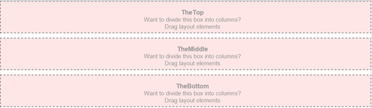{width="6.483548775153106in"
height="1.8885411198600175in"}

149 \| DESIGNERS

Themes
------

> Themes define a set of colors, fonts and CSS for your page templates
> and widgets. To add a theme to your page template:

-   Create a directory structure

-   Add CSS, images and JavaScript

-   Register the theme

-   Apply the theme to the template

> Create a Directory Structure
>
> The screenshot below shows a basic directory structure that will
> successfully contain themes. CarConduit is the root of the
> application, App\_Themes can contain any number of themes, and Global
> contains any CSS that should load automatically.

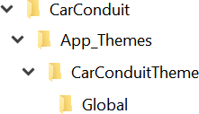{width="1.5201279527559055in"
height="0.8731244531933509in"}

> 150 \| DESIGNERS
>
> Add CSS
>
> Create a main.css file in the Global directory and add the styles
> below. Note that the you can name the CSS file anything you want, all
> CSS files in the Global directory will be loaded automatically.
>
> .sfPublicWrapper {
>
> font-family: \"Open Sans\", sans-serif; font-size: 12px;
>
> margin: 20px auto; width: 800px;
>
> }
>
> .Header {
>
> text-align: right;
>
> }
>
> .Footer {
>
> padding-top: 10px; background-color: \#ddd; border: 1px solid \#00f;
>
> }
>
> Register the Theme
>
> Select *Adminstration \> Settings \> Advanced \> Appearance \>
> Frontend themes*. Click the *Create new* button. Enter the name of the
> theme. Enter a path of the theme relative to the root of the website.
> Click the *Save changes* button to finish registering the theme.

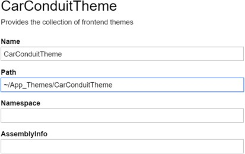{width="4.3902777777777775in"
height="2.9319444444444445in"}

151 \| DESIGNERS

> Apply the Theme
>
> The last step is to apply the theme to the page template. In the Page
> template editor, click the *Theme* button. If path structure and
> configuration are correct, the new theme name should appear in the Set
> Theme drop down list.

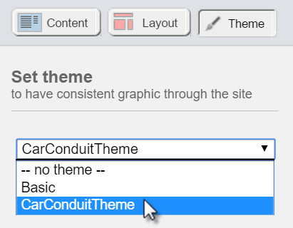{width="2.869992344706912in"
height="2.2333333333333334in"}

> After applying the theme, the styling changes reflect in the page
> appearance.

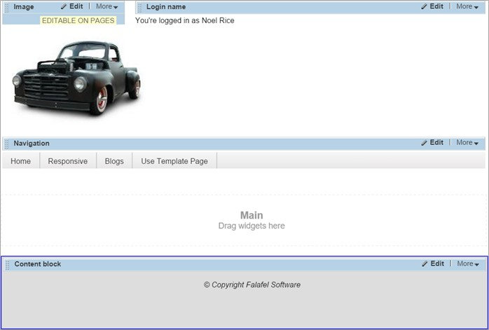{width="6.475130139982502in"
height="4.366561679790026in"}

> 152 \| DESIGNERS
>
> Tips for Using Master Pages
>
> You will need to perform some \"surgery\" to make the theme useful in
> Sitefinity. Using master pages inside a Sitefinity website involves
> three main pieces:

-   The master age itself. The master page file and its associated
    code-behind live in the App\_Master folder of the Visual Studio
    project.

-   The theme contains style related files, i.e. css, JavaScript and
    images.

-   The Sitefinity template is stored in the Sitefinity database. The
    template ties together the Master page and the Theme. The template
    is based on the master page and the theme is applied to the
    template. The CarConduit files are included with projects with this
    book.

> In Visual Studio, you will need to edit the master file to work with
> Sitefinity. Once the general areas are setup in the master page, use
> the template in Sitefinity to further subdivide layout elements and to
> add common content. Develop the layout to fit your requirements, then
> create areas for customization using the ContentPlaceHolder control.
>
> Here are some tips for performing "surgery" on the master page:

-   Remove everything from the inside of the \<head\> tag. Sitefinity
    will take care of meta tags and style sheet references for us, so
    the \<head\> tag elements are not needed. You will need the \<head\>
    tag itself, so do not remove it.

-   Add the attribute runat=\"server\" to the \<head\> tag. Sitefinity
    needs to access the head tag at the server and failing to do this
    will cause a \"yellow screen of death\" error.

-   Make sure there is only one \<form\> tag on the page, that it is
    just inside the

> \<body\> tag and that it has the runat="server" attribute and value.

-   Analyze the page looking for areas of the page that have hard-coded
    text. Replace areas of hard-coded text with ContentPlaceHolder
    controls. For example:

> \

>
> \<asp:contentplaceholder id=\"Navigation\" runat=\"server\" /\>
>
> \</div\>
>
> **Note**: Be sure to use *ContentPlaceHolder*, not *Placeholder*.
>
> To make the template general-purpose, add ContentPlaceHolder controls
> to any area of the master page you\'ll want to customize later. Try to
> remove any formatting markup

153 \| DESIGNERS

> that might limit you in the future. When you get done replacing
> various areas of the page, the master page becomes much smaller, only
> consisting of structural markup. You can also remove JavaScript from
> the master page because the widgets will supply script for things like
> menu hover behavior.
>
> 154 \| DESIGNERS
>
> The example below is a simplified example of a master page. Notice the
> areas where the ContentPlaceHolder has been introduced.
>
> \<!DOCTYPE html PUBLIC \"-//W3C//DTD XHTML 1.0 Transitional//EN\"
> [\"http://www.w3.org/TR/xhtml1/DTD/xhtml1-transitional.dtd](http://www.w3.org/TR/xhtml1/DTD/xhtml1-transitional.dtd)\"\>
>
> \<html xmlns=\"<http://www.w3.org/1999/xhtml>\"\>
>
> \<head runat=\"server\"\>
>
> \</head\>
>
> \<body\>
>
> \<form runat=\"server\" id=\"MyForm\"\>
>
> \

>
> \

>
> \<a class=\"logo\" href=\"\#\"\>Site Home\</a\>
>
> \

>
> \<asp:**ContentPlaceHolder** ID=\"MyNavigation\" runat=\"server\" /\>
>
> \</div\>
>
> \</div\>
>
> \

>
> \<asp:**ContentPlaceHolder** ID=\"MyContent\" runat=\"server\" /\>
>
> \</div\>
>
> \

>
> \

>
> \

>
> \<h3\>Testimonials\</h3\>
>
> \

>
> \<asp:**ContentPlaceHolder** ID=\"MyTestimonials\" runat=\"server\"
> /\>
>
> \</div\>
>
> \</div\>
>
> \</div\>
>
> \

>
> \

>
> \<h3\>Recent Comments\</h3\>
>
> \<asp:**ContentPlaceHolder** ID=\"MyComments\" runat=\"server\" /\>
>
> \</div\>
>
> \</div\>
>
> \

>
> \

>
> \<h3\>Recent Posts\</h3\>
>
> \<asp:**ContentPlaceHolder** ID=\"MyPosts\" runat=\"server\" /\>
>
> \</div\>
>
> \</div\>
>
> \

>
> \

>
> \<h3\>Categories\</h3\>
>
> \<asp:**ContentPlaceHolder** ID=\"MyCategories\" runat=\"server\" /\>
>
> \</div\>
>
> \</div\>
>
> \ 

155 \| DESIGNERS

> \

>
> \<asp:**ContentPlaceHolder** ID=\"MyCopyright\" runat=\"server\" /\>
>
> \</div\>
>
> \</div\>
>
> \</div\>
>
> \</form\>
>
> \</body\>
>
> \</html\>
>
> The output for this template might end up looking like the screenshot
> below. The master page ContentPlaceHolder controls supply areas for
> the upper right hand side navigation menu, a content area below that
> and sections for Testimonials, Recent Comments, Recent Posts and
> Categories. The area at the bottom of the page is intended as a space
> for the copyright notice but could hold other page footer content.

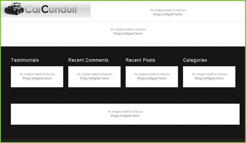{width="5.131423884514436in"
height="2.9895833333333335in"}

> The titles in the footer for Testimonials, Recent Comments, etc., have
> been hard-coded for this discussion. Just the same, you could swap out
> all those titles with more ContentPlaceHolder controls. Later, if
> Categories gets changed to Tags for example, someone without Visual
> Studio experience could still change the content using Sitefinity
> alone.
>
> 156 \| DESIGNERS
>
> Once your template holds a master page and theme, you can simply drop
> widgets into any page that uses the template. The screenshot below
> shows a sample welcome page. To show something of interest in the
> navigation menu, About Us, Blogs and News pages have been created
> underneath the new Welcome page. The logo image is directly from the
> master page markup, while the menu is a Navigation widget dropped into
> the page. Below those two items, the Image Gallery widget displays a
> list of images along with detail for one image. Below the Image
> Gallery, Testimonials and Recent Comments are placed using a simple
> Content block widget. Recent Posts uses a News widget and the Popular
> Tags area holds a Classification \> Tags widget.

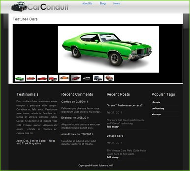{width="5.639814085739283in" height="5.075in"}

157 \| DESIGNERS

Sitefinity Feather
------------------

> The *Sitefinity Feather* module is a collection of resources and
> conventions to simplify the creation and management of widgets,
> layouts, and templates. Feather allows you to use convention-based,
> mobile-first UI frameworks with your Sitefinity site. The most popular
> of all these frontend frameworks is Bootstrap, but Feather also
> supports other frontend framework such as Semantic UI and Foundation.
>
> Feather is a free module, built into Sitefinity and is enabled by
> default on new Sitefinity installations. Feather adds a complete
> framework to take control the site's layout and markup. In this
> section we'll review a few of the features relevant to designers
> provided by Feather.
>
> **Note**: Although the technology behind Feather is the ASP.NET MVC
> development framework, the features available to designers involve
> little to no programming effort and can be leveraged by following the
> required conventions which we'll look at in the next section.
>
> 158 \| DESIGNERS
>
> MVC Stock Widgets
>
> Feather includes a collection of MVC versions of the stock Sitefinity
> widgets such as Blogs, News, Events, etc. These versions are
> lightweight, mobile-friendly, and load quickly with efficient, clean
> markup and can be differentiated from the default widgets in the
> toolbox by the MVC icon in the corner.

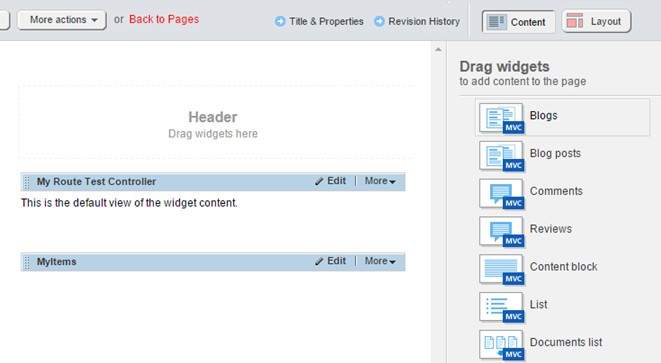{width="6.945138888888889in"
height="3.8270833333333334in"}

159 \| DESIGNERS

> On the backend, the widget designers for the MVC widgets are also
> driven by Feather, resulting in a faster, sleeker interface for your
> content editors.

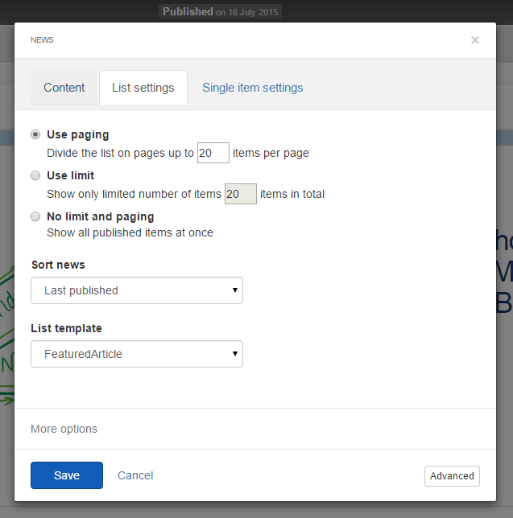{width="5.7750940507436574in"
height="5.83625in"}

> 160 \| DESIGNERS
>
> Feather isn't just limited to stock modules. Custom dynamic modules
> created by the module builder also get their own MVC Feather widgets,
> all of which are built with the same mobile-first, responsive design.

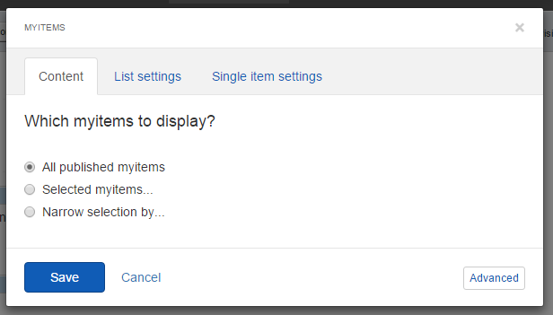{width="6.413421916010499in"
height="3.65625in"}

> Widget Designer Framework
>
> You can create custom widget designers using a brand new framework
> based on AngularJS. Included is a wide assortment of Angular
> Directives that make it simple to enable Sitefinity related field
> controls to your designer, including selectors for Pages, Images,
> Documents and even your custom module items.
>
> The extensibility of widget designers offered by Feather also enables
> you to tap into a rich style collection to simplify your design, and
> even allows you to add custom commands to your widget beyond the
> included Editor.

161 \| DESIGNERS

> Convention-based customization
>
> Feather offers an intuitive convention for customizing and creating
> widget and layout templates. Simply create a file in the proper
> location and the MVC widgets and designers will have immediate access
> to the new templates.
>
> The Bootstrap template package is included out of the box, and
> additional packages supporting Foundation and Semantic UI are also
> available via
> [GitHub.](https://github.com/Sitefinity/feather-packages) You can even
> create your own packages to reuse across multiple Sitefinity websites.
> Sitefinity Page Templates are created from these packages
> automatically, so you can immediately benefit from the new MVC layouts
> on your pages.
>
> Templating via Routing
>
> Feather uses a clever routing technique to make it easy to decide
> which templates to override and from where. Templates assigned from a
> Resource Package have the highest priority, then fall back to the root
> Mvc folder and finally back to the embedded resources, allowing you to
> override some or all templates by simply creating a file in the
> appropriate location.
>
> 162 \| DESIGNERS
>
> Layout Widget Templates
>
> Another feature enabled by the Feather module is the set of layout
> templates from the different UI Resource Packages (Bootstrap,
> Foundation, Semantic UI). These are found in the Template section of
> the sidebar of the page editor, and allow you to apply grids and
> columns to your pages, based on the framework of your choice.

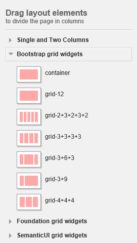{width="2.8319444444444444in"
height="5.002083333333333in"}

163 \| DESIGNERS

> Resource Packages
>
> Layout templates are actually sourced from a folder in the Sitefinity
> project root named ResourcePackages. Within each package folder is a
> collection of templates that can be automatically assigned to your
> pages, widgets, and designers associated with the pages created using
> the package.
>
> In addition to containing templates, ResourcePackages can also contain
> the styles, scripts, images and other content required to style your
> page. By following a simple naming convention, your page templates
> will automatically be enhanced by the appropriate package.
>
> 164 \| DESIGNERS

Creating Page Templates from MVC Layout Files
---------------------------------------------

> Feather allows you to create Page Templates in the backend based on an
> MVC layout file (instead of the usual Webforms Master Page). Simply
> place a layout file in the appropriate Mvc folder and Feather will
> automatically create the associated Sitefinity page template.
>
> You can then extend the template, adding new ContentPlaceHolders and
> other markup by modifying the appropriate backing layout file.
>
> To demonstrate this, we'll create a new template based on this example
> MVC layout file, named MyMvcTemplate.cshtml
>
> \@using Telerik.Sitefinity.Frontend.Mvc.Helpers
>
> \<!DOCTYPE html\>
>
> \<html xmlns=\"<http://www.w3.org/1999/xhtml>\"\>
>
> \<head\>
>
> \<title\>\</title\>
>
> \</head\>
>
> \<body\>
>
> \<h1\>Template based on Layout file by convention\</h1\>
>
> \

>
> \@Html.SfPlaceHolder(\"Contentplaceholder1\")
>
> \@Html.SfPlaceHolder(\"Contentplaceholder2\")
>
> \@Html.SfPlaceHolder(\"Contentplaceholder3\")
>
> \</div\>
>
> \</body\>
>
> \</html\>
>
> Notice that the layout template defines the full structure of the HTML
> page, and also includes placeholders via the \@Html.SfPlaceholder
> helper method. These placeholders correspond to the droppable widget
> areas on the Sitefinity template.
>
> First, in the project folder for your site navigate to the location
> \~/Mvc/Views and create a folder named Layouts. Then create a file
> named MyMvcTemplate.cshtml and place it in the Layouts folder, so that
> the full path to the file is
>
> \~/Mvc/Views/Layouts/MyMvcTemplate.cshtml.

165 \| DESIGNERS

> In the Sitefinity Administration Backend, navigate to *Design \> Page
> Templates*, revealing the new template in the list, automatically
> added and named to match the layout file.

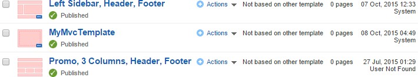{width="6.510219816272966in"
height="1.2008333333333334in"}

> Opening the template reveals the three content placeholders, into
> which you can place any of the Mvc Feather widgets. Since we're using
> a custom layout (and not a Resource Package), these widgets will use
> the default markup of the embedded Feather templates.

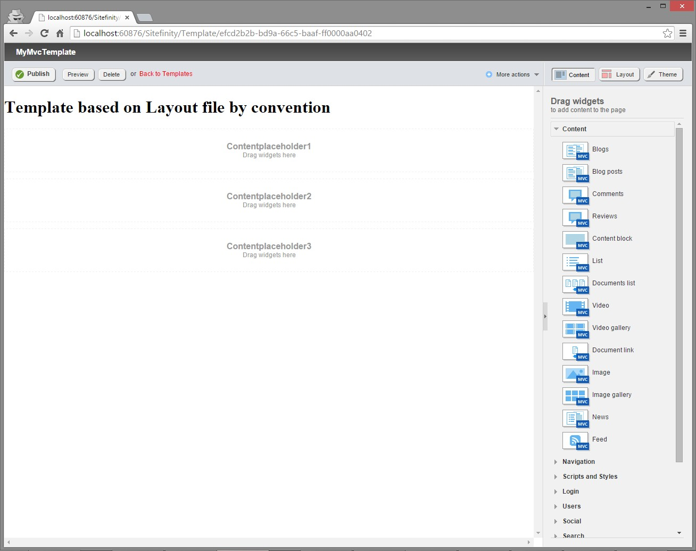{width="6.53994094488189in" height="5.185in"}

> These can then be customized by creating the appropriate template
> files in the Mvc folder. We demonstrate this in the section
> [[Customizing the Built-in Widget
> Templates]{.underline}.](#Customizing_the_Built_in_Widget_Template)
>
> 166 \| DESIGNERS
>
> Using Page Templates from Resource Package Layouts
>
> Within the included Bootstrap ResourcePackage is at least one MVC
> layout file, and these files also automatically generate a
> corresponding Sitefinity Page Template in the backend. When using the
> Bootstrap template (or any ResourcePackate template), all Feather MVC
> widgets placed on that template (or pages based on the template)
> automatically inherit the templates defined in that package instead of
> serving the default embedded ones in the Feather package.
>
> To demonstrate this, we'll create a new Sitefinity Page from the
> default Bootstrap template, located in the path
>
> *\~/ResourcePackages/Bootstrap/Mvc/Views/Layouts/default.cshtml.*

167 \| DESIGNERS

1.  In the Administration Backend, navigate to Pages.

2.  Click the *Create a Page* button.

3.  Name the page "My Bootstrap Page".

4.  In the section labeled "Template" click the *Select another
    Template* button.

5.  From the section of templates labeled with the header "Bootstrap"
    select the one named "default".

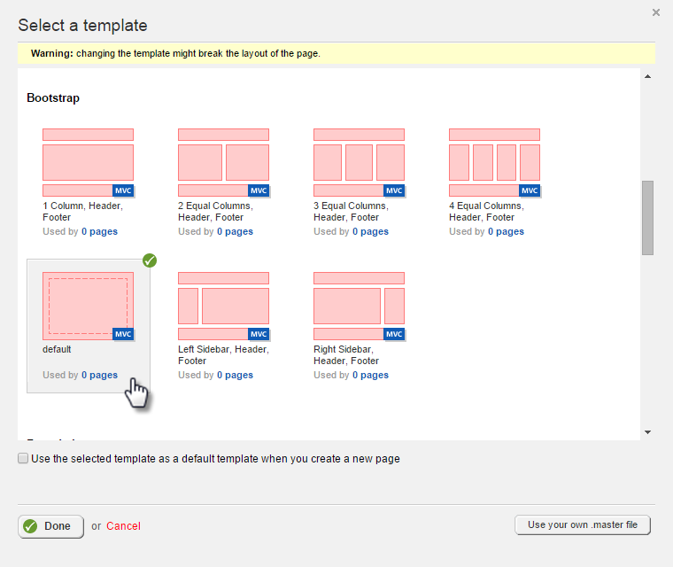{width="6.025in" height="5.0784722222222225in"}

6.  Click *Done,* then *Create and Go to Content* to create the page.

> 168 \| DESIGNERS
>
> 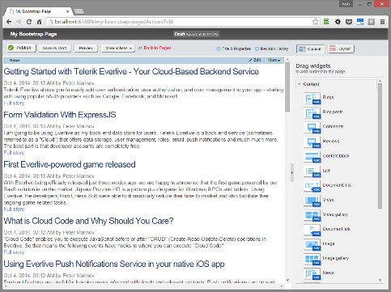{width="2.2in"
> height="1.6499989063867018in"}Since this layout is defined to use the
> Bootstrap resource package, any MVC widgets added will automatically
> load the templates from that folder, matching the look and feel of the
> bootstrap style and typography.
>
> You can further customize these by creating the appropriate template
> files in the Resource Package folder. This is demonstrated in the
> section [[Customizing the
> Built-in]{.underline}](#Customizing_the_Built_in_Widget_Template)
> [[Widget
> Templates]{.underline}.](#Customizing_the_Built_in_Widget_Template)
>
> Working with Feather Widgets
>
> We've already seen that enabling Feather adds a complete assortment of
> MVC widgets for the Sitefinity stock and dynamic modules. In this
> section we'll see how we can customize these using the file path
> conventions of Feather.
>
> **Note**: For information on creating your own widgets that leverage
> the MVC Framework, see the Sitefinity 9 for Developers book.

169 \| DESIGNERS

> []{#Customizing_the_Built_in_Widget_Template .anchor}Customizing the
> Built in Widget Templates
>
> If you are not using Resource Packages and have no custom templates
> for any widgets, Feather will default to serving the embedded
> templates in the Feather module library. The templates are presented
> for selection when you edit a widget in the page editor. If no custom
> templates exist, only the default one is available for selection.

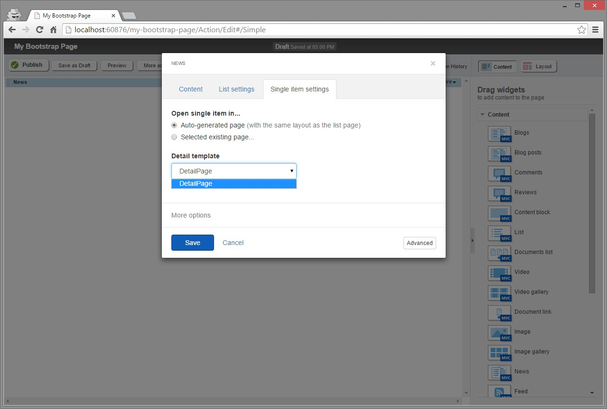{width="6.529491469816273in"
height="4.40489501312336in"}

> However, because these templates are served from the Feather library,
> they are static and cannot be modified. Instead, you can create your
> own custom templates, to be served instead of the defaults. There are
> two ways to manage these: either in the Sitefinity Widget Template
> editor in the Administration Backend, or by creating actual files that
> follow the Feather file path conventions.
>
> []{#Order_of_Virtual_Path_Resolution .anchor}Order of Virtual Path
> Resolution
>
> As previously mentioned, there are several locations from which widget
> templates can be served using Feather, with rules that prioritize some
> locations over others. Here is the list of possible places from the
> highest priority (served first) to the lowest (served when no other
> higher-priority templates exist):
>
> 170 \| DESIGNERS

-   **ResourcePackages**: If the backing Page or Page Template that
    contains the widget is based on an MVC template from a Resource
    Package, it will first search the Mvc folder of that package on the
    file system and serve the matching templates for each widget found
    in that location. If you are not using a Resource Package template,
    this area is skipped and not searched.

-   **Root Mvc folder**: If no matching templates are defined in the
    Resource Package Mvc folder (or if the template is not based on a
    Resource Package) Feather will attempt to locate views in the root
    \~/Mvc/Views folder of the web application.

-   **Sitefinity Widget Templates**: If no matching templates are
    defined in the file system, Feather will then search for a matching
    template in the backend list of templates (located under the
    Design \> Widget Templates menu).

-   **Embedded Resources**: Finally, if no custom templates are found in
    any of the custom locations, Feather will serve the default,
    embedded resources from the Feather module itself.

> Creating Templates in the Sitefinity Backend
>
> Sitefinity maintains a list of widget templates that are stored in the
> database so you can manage them from the backend. These are listed in
> the section found under [[Designers]{.underline}](#_bookmark25)
>
> [[\> Widget Templates]{.underline}.](#_bookmark25)
>
> By default, Sitefinity does not provide custom MVC templates for stock
> widgets, so the list is initially populated only with templates for
> the standard (Webform) widgets.
>
> Creating new templates for MVC widgets requires that you follow the
> naming convention for the widget, by prefixing the name of the
> template with the type of view to which it is assigned in the format
> {ViewType}.{TemplateName}.
>
> This name must also identify the type of view being shown, for example
> List.MyTemplate would represent a template for the list view, while
> Detail.MyTemplate would represent another template for the details
> page.
>
> We'll demonstrate this by creating new MVC templates for the News
> widget. For the markup we'll use a copy of the template files from the
> Bootstrap resource package (located in the folder
> \~/ResourcePackages/Bootstrap/MVC/Views/News).

171 \| DESIGNERS

> Here is the markup for the list view, modified with a custom title to
> differentiate from the default template.
>
> \@model Telerik.Sitefinity.Frontend.Mvc.Models.ContentListViewModel
>
> \@using Telerik.Sitefinity.Frontend.Mvc.Helpers;
>
> \@using Telerik.Sitefinity.Modules.Pages;
>
> \@using Telerik.Sitefinity.Web.DataResolving;
>
> \<h1\>My Custom List View\</h1\>
>
> \

>
> \<ul class=\"list-unstyled\"\>
>
> \@foreach (var item in Model.Items)
>
> {
>
> var navigateUrl = HyperLinkHelpers.GetDetailPageUrl(item,
> ViewBag.DetailsPageId, ViewBag.OpenInSamePage);
>
> \<li \@Html.InlineEditingAttributes(Model.ProviderName,
> del.ContentType.FullName, (Guid)item.Fields.Id)\>
>
> \<h3\>
>
> \<a \@Html.InlineEditingFieldAttributes(\"Title\", \"ShortText\")
> href=\"\@navigateUrl\"\>\@item.Fields.Title\</a\>
>
> \</h3\>
>
> \<div\>
>
> \
>
> \@item.GetDateTime(\"PublicationDate\", \"MMM d, yyyy, HH:mm tt\")
>
> \@Html.Resource(\"By\")
>
> \@DataResolver.Resolve(item.DataItem, \"Author\", null)
>
> \</span\>
>
> \@Html.CommentsCount((string)navigateUrl, item.DataItem)
>
> \</div\>
>
> \
 \"ShortText\")\>
>
> \@Html.Raw(item.Fields.Summary)
>
> \</div\>
>
> \<a href=\"\@navigateUrl\"\>\@Html.Resource(\"FullStory\")\</a\>
>
> \</li\>
>
> }
>
> \</ul\>
>
> 172 \| DESIGNERS
>
> \@if (Model.ShowPager)
>
> {
>
> \@Html.Action(\"Index\", \"ContentPager\", new
>
> {
>
> currentPage = Model.CurrentPage, totalPagesCount =
> Model.TotalPagesCount.Value,
>
> redirectUrlTemplate = ViewBag.RedirectPageUrlTemplate
>
> })
>
> }
>
> \</div\>
>
> And here is the markup for the details view, again slightly modified:
>
> \@model Telerik.Sitefinity.Frontend.Mvc.Models.ContentDetailsViewModel
>
> \@using Telerik.Sitefinity.Frontend.Mvc.Helpers;
>
> \@using Telerik.Sitefinity.Web.DataResolving;
>
> \<h1\>My Custom Detail View\</h1\>
>
> \

> \@Html.InlineEditingAttributes(Model.ProviderName,
> Model.ContentType.FullName, (Guid)Model.Item.Fields.Id)\>
>
> \<h3\>
>
> \
>
> \@Model.Item.Fields.Title
>
> \</span\>
>
> \</h3\>
>
> \<div\>
>
> \
>
> \@Model.Item.GetDateTime(\"PublicationDate\", \"MMM d, yyyy, HH:mm
> tt\")
>
> \@Html.Resource(\"By\")
>
> \@DataResolver.Resolve(\@Model.Item.DataItem, \"Author\", null)
>
> \</span\>
>
> \@Html.CommentsCount(\"\", \@Model.Item.DataItem)
>
> \</div\>
>
> \

>
> \@Html.Raw(Model.Item.Fields.Summary)
>
> \</div\>
>
> \

>
> \@Html.Raw(Model.Item.Fields.Content)
>
> \</div\>

173 \| DESIGNERS

> \@if (Model.EnableSocialSharing)
>
> {
>
> \@Html.SocialShareOptions()
>
> }
>
> \@Html.CommentsList(\@Model.Item.DataItem)
>
> \</div\>
>
> 174 \| DESIGNERS
>
> The following steps walk you through creation and assignment of the
> widget templates.

1.  Click the *Create a template* button.

2.  In the following screen select the option for *News (MVC)*.

3.  Copy and paste the markup from the above template into the editor.

4.  Make sure the name of the template is prefixed with "List." followed
    by a unique name.

5.  Leave the name for developers at its default value.

6.  Click *Create this template*.

7.  Repeat steps 1-6, using the prefix "Detail." in step 4.

8.  Open or create a page in the Page Editor to contain the news widget.

9.  From the toolbox, drag the News widget with the MVC icon into a
    placeholder.

10. Click *Edit* in the newly placed widget to open its property editor.

11. Click the header for List settings, revealing the custom template
    option.

12. Select this template.

13. Click the header for Single item settings, revealing the custom
    template option.

14. Select the custom template.

15. Click *Save*.

> Creating Templates in the File System
>
> While the widget templates section in the Sitefinity backend offers a
> quick and easy way to manage templates, it lacks Intellisense and the
> version control benefits offered by working with actual files.
> Fortunately, by following the Feather naming convention you can manage
> your templates as files in your project.
>
> The naming convention requires that you place the view in a folder
> that matches the name of the widget (such as "News", "Events",
> "VideoGallery", etc.) and name the file to match the type of view
> being served. For example, if you are creating a custom template for
> the News widget list view named "MyTemplate", you would name the file
> *List.MyTemplate.cshtml*.

175 \| DESIGNERS

> There are two locations into which you can place templates, depending
> on whether or not you are using ResourcePackage layouts. If the page
> on which you are adding the widget is based on a Sitefinity Page
> Template using a ResourcePackage layout, you would place your custom
> template in the subfolder of the ResourcesPackage that matches the
> package being used.
>
> **Note**: although you can edit the existing Resource Package
> templates, this is not recommended, as they may be overwritten when
> upgrading Sitefinity or Feather. It is recommended that you create
> custom templates instead of modifying the default ones.
>
> To demonstrate this, we'll create a custom template for the News
> widget list view for a page that is using the Bootstrap Resource
> Package by duplicating and renaming the existing template.

1.  In Visual Studio Solution explorer, navigate to the path

> *\~/ResourcePackages/Bootstrap/MVC/Views/News*.

2.  Right click the file named *List.NewsList.cshtml* and select *Copy*.

3.  Right-click the parent News folder and select Paste.

4.  Rename the file to *List.MyBootstrapTemplate.cshtml*.

5.  Open the newly created file and make changes to differentiate it
    from the default template.

6.  Create or open a Sitefinity page which uses a Bootstrap template,
    and add the MVC News widget.

7.  Click *Edit* on the widget to open the property page.

8.  Click the *List Settings* header, revealing your new template in the
    *List template*

> dropdown.

9.  Select the new template and click *Save*.

> 176 \| DESIGNERS
>
> If your site is not using a Resource Package for layout, you can still
> create custom templates for MVC widgets. Instead of placing the files
> in the ResourcePackages folder, place them in the root MVC folder.
>
> We'll demonstrate this by creating a custom template for the NewsList
> template for a regular Sitefinity page. We'll use the same file from
> the Bootstrap package as a starting point.

1.  In Visual Studio Solution explorer, navigate to the path

> *\~/ResourcePackages/Bootstrap/MVC/Views/News*.

2.  Right click the file named *List.NewsList.cshtml* and select *Copy*.

3.  Navigate to the folder *\~/MVC/Views* and create a new folder named
    *News*.

4.  Right click this folder and select *Paste*.

5.  Rename the file to *List.MyCustomTemplate.cshtml*.

6.  Open the newly created file and make changes to differentiate it
    from the default template.

7.  Create or open a Sitefinity page which does not use a Resource
    Package template, and add the MVC News widget.

8.  Click *Edit* on the widget to open the property page.

9.  Click the *List Settings* header, revealing your new template in the
    *List template*

> dropdown.

10. Select the new template and click *Save*.

> Notice that in this case we did not see the Bootstrap version of the
> template in the list. The Resource Package templates are only revealed
> by Feather if the host template is assigned to a layout file from the
> same package. In this case, we were working with a standard blank
> template, so the naming convention will check the root MVC folder
> instead (see [[Order of Virtual Path
> Resolution]{.underline}](#Order_of_Virtual_Path_Resolution) for more
> details).

177 \| DESIGNERS

> Feather Widgets for Custom Modules
>
> Sitefinity Feather also supports custom modules built with the Module
> Builder. When Feather is installed, it automatically generates an MVC
> widget in the page editor toolbox for any new modules you create.
>
> In this screenshot, I've created a new module called *MyItems*.
> Feather automatically created a matching section in the toolbox,
> allowing me to drag the content widget for this module onto the page.

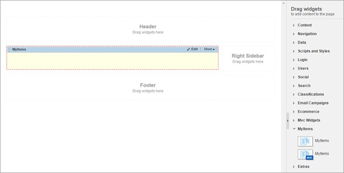{width="6.438709536307962in"
height="3.2391666666666667in"}

> 178 \| DESIGNERS
>
> The generated widget has properties similar to all the standard
> Sitefinity widgets, which you can manage by opening the widget
> properties editor. This allows you to specify the standard properties
> you expect, such as filtering items, as well as styling both the list
> and details views for displaying items from the module.

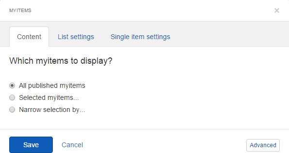{width="5.377083333333333in"
height="2.9833333333333334in"}

> Editing Custom Module Widget Templates
>
> In addition to creating a widget specific for your module, Feather
> also generates default templates for List and Detail views. You can
> view and edit these templates in the Sitefinity backend by navigating
> to *Design \> Widget Templates*.

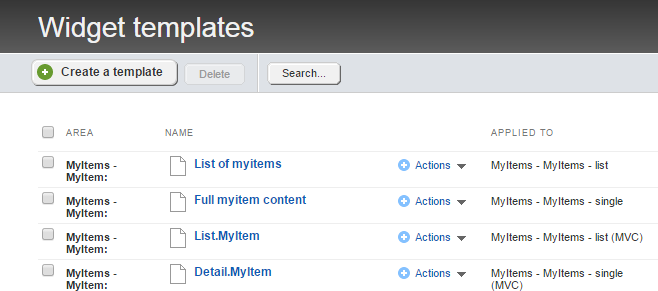{width="6.865277777777778in"
height="3.0868055555555554in"}

179 \| DESIGNERS

> Notice that you get both the standard WebForms version as well as the
> new Feather- friendly MVC templates. Also, the naming of the templates
> must match the expected convention (List.MyItems and Detail.Myitems)
> so that they are presented appropriately for selection in the widget
> properties.
>
> Click to open the *List.MyItem* template, revealing the markup for
> that view. You can manage the markup here, accessing the properties of
> the content item using the pattern *item.Fields.\<FieldName\>* where
> FieldName matches exactly the name of the custom field you wish to
> show. For example, *\@item.Fields.Title* in the screenshot below.

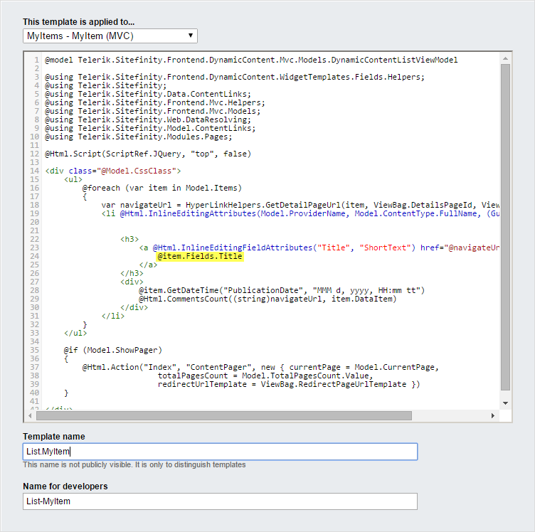{width="6.422099737532808in"
height="6.389166666666667in"}

> 180 \| DESIGNERS
>
> If the default widget templates are not sufficient to meet your needs
> you can create additional ones with this editor, as well as in your
> Visual Studio solution, by following the same naming and path
> conventions as discussed in the previous section.

Widget Designers
----------------

> When building custom widgets, you likely have a set of properties that
> need to be set by editing the properties of the widget on the page.
> Sitefinity does provide a default editor interface for your widgets,
> exposing any public properties for edit. However, this editor is a
> simple one, showing only a textbox input for all fields, regardless
> their underlying type.

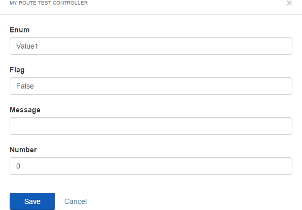{width="6.281944444444444in"
height="4.683333333333334in"}

> Previous to Feather, Sitefinity Thunder attempted to improve things by
> generating designers based on existing widgets, creating the code
> files and templates necessary to render more interactive inputs and
> selectors. However, the components required were numerous and
> cumbersome, and the generated code was verbose and error prone.

181 \| DESIGNERS

> Fortunately, all of this is alleviated with the introduction of
> Feather, which adds a complete framework for creating designers for
> your widgets. Like most of the customization provided by Feather, it
> relies on conventions for naming and placing your designer templates
> in the right location.
>
> Widget Designers Naming Convention
>
> The naming convention for widget designers is similar to the frontend
> portion of the widget template we've already seen, but the prefix for
> the view is "DesignerView". To demonstrate this, we'll create a very
> simple MVC widget designer for the news widget.
>
> Now that we have a widget with some properties, let's proceed to
> create a designer.

1.  Navigate to the path *\~/Mvc/Views*.

2.  Create a new folder called *News*.

3.  Create a file in the folder named *DesignerView.MyDesigner.cshtml*.

4.  Add the following markup to the file's contents:

> *\<p\>Hello from my custom designer!\</p\>*
>
> To see the custom designer in action, open a page which contains the
> news widget and click *Edit* to manage its properties. This action
> reveals the standard designer, but at the bottom of the default
> designer will be a new button pointing to your custom template.

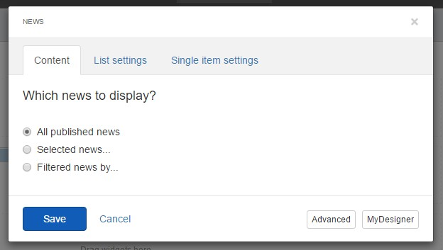{width="6.436996937882765in"
height="3.640311679790026in"}

> 182 \| DESIGNERS
>
> Clicking it will load that designer into the editor.

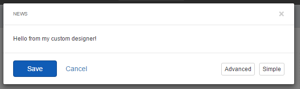{width="6.430591644794401in"
height="1.9166666666666667in"}

> **Note**: Although this sample reveals how simple it is to create and
> modify a custom designer, it obviously lacks all the operation
> necessary to service the backing widget, which is a developer task.
> For more details on how to create a full-featured designer for
> existing and custom widgets, see the Sitefinity for Developers book.
>
> Prioritizing the Custom Designer
>
> Instead of making your designer an option, you can configure
> Sitefinity to load your designer by default. To do this, simply create
> a file alongside the template, named to match exactly except using the
> extension .json, and add the following contents:
>
> {
>
> \"priority\": 1
>
> }
>
> For our example, we would create the file
> *DesignerView.MyDesigner.json* and place it in the same folder. Next
> time we load the editor we'll automatically see our custom designer
> template.

Index
=====

> A
>
> Add a characteristic 8
>
> Add
> languages\...\...\...\...\...\...\...\...\...\...\...\...\...\...\...\...\...\...\...\....38,
> 84
>
> Add languages 84
>
> Allow administrators to skip the workflow *28*
>
> Alternative publishing 75
>
> Alternative
> Publishing\...\...\...\...\...\...\...\...\...\...\...\...\...\...\...\....75,
> 77
>
> AngularJS 160
>
> App\...\...\...\...\...\...\...\...\...\...\...\...\...\...\...\...\...\...\...\...\...\...\...\.....145,
> 152
>
> Apply Behavior to Transform the layout 116
>
> Approval before publishing *26*
>
> Automatically publish imported data 79
>
> B
>
> Based
> On\...\...\...\...\...\...\...\...\...\...\...\...\...\...\...\...\...\...\...\...\.....130,
> 132
>
> Blog
> Posts\...\...\...\...\...\...\...\...\...\...\...\...\...\...\...\...\...\...\....
> 34, 120, 123
>
> BlogPost 20
>
> Blogs \...\...\...\...\...\...\...\...\...\...\...\.... 20, 24, 34,
> 121, 122, 125, 156
>
> Bootstrap .147, 157, 161, 162, 166, 167, 168, 170, 175, 176
>
> bounce 5
>
> C
>
> Categories 155
>
> Content
> block\...\...\...\...\...\...\...\...\...\...\...\...\...\...\...\.....
> 140, 145, 156
>
> Content block widget\...\...\...\...\...\...\...\...\...\...\...\.....
> 140, 145, 156
>
> ContentPlaceHolder\...\...\...\...\...\...\...\...\...\...\...\...\...\...\...\...152,
> 155
>
> ContentPlaceHolders 164
>
> Create a feed 77
>
> Create a group of rules 109
>
> Create a role 19
>
> Create a site 37
>
> Create a template 131
>
> Create a user 22
>
> Create New Template 124
>
> Credit Card 100
>
> CSS widget
> \...\...\...\...\...\...\...\...\...\...\...\...\...\...\...\...\...\...\...\.....144,
> 145
>
> D
>
> Dashboard 24
>
> Do not start 17
>
> Documents & Files 39
>
> Drag layout elements 133
>
> Duplicate pages and settings 37

E

> Editors
> \...\...\...\...\...\...\...\...\...\...\...\...\...\...\...\...\...\...\...\...\...\...\...\...
> 27, 28
>
> Email Campaigns
> \...\...\...\...\...\...\...\...\...\...\...\...\...\...\...\...\...\...\...\...
> 4, 5

F

> Feather \... 157, 158, 159, 160, 161, 162, 164, 165, 166, 168,
>
> 169, 170, 174, 175, 176, 177, 178, 179, 180, 181
>
> Feeds and Notifications 77
>
> FormatString 138
>
> Foundation
> \...\...\...\...\...\...\...\...\...\...\...\...\...\...\...\...\.....
> 157, 161, 162

H

> HTC Incredible 113
>
> HTC Wildfire 109
>
> HTTP 90

I

> IIS 31
>
> Image Gallery 156
>
> Image Gallery widget 156
>
> Image widget 137
>
> Import *79*
>
> Install a module 17
>
> iPad 113
>
> iPhone
> \...\...\...\...\...\...\...\...\...\...\...\...\...\...\...\...\...\...\...\...\...\.....
> 109, 113

J

> JavaScript 152

L

> Landing URL 9
>
> Languages\...\...\...\...\...\...\...\...\...\...\...\...\...\...\...\...\...\...\...\....
> *38*, 84, 85
>
> Layouts
> \...\...\...\...\...\...\...\...\...\...\...\...\...\...\...\...\...\...\...\...\...\....
> 164, 166
>
> Levels to include 139
>
> Libraries 39
>
> Link to a CSS file 145
>
> Localizing 84
>
> Location *9*

INDEX

> M
>
> Manage backend languages 84
>
> Manage
> sites\...\...\...\...\...\...\...\...\...\...\...\...\...\...\...\...\...\...\...\...\...36,
> 37
>
> mapping 75
>
> Mapping 75
>
> Master
> \...\...\...\...\...\...\...\...\...\...\...\...\...\...\...\...\...\...\...\...\...\.....147,
> 152
>
> Master pages 147
>
> masterpage
> \...\...\...\...\...\...\...\...\...\...\...\...\...\...\... 152, 154,
> 155, 156
>
> Max album size *89*
>
> Max image size *89*
>
> media queries 109
>
> meta 152
>
> Modify blog and manage posts 21
>
> Module Builder 177
>
> More formatting options 140
>
> Multisite 36
>
> Multisite management 36
>
> MVC 158, 160, 161, 164, 166, 168, 170, 174, 175, 176, 177,
>
> 179, 181
>
> N
>
> Navigation widget
> \...\...\...\...\...\...\...\...\...\...\...\...\...\...\...\...\...139,
> 156
>
> News widget
> \...\...\...\...\...\...\...\...\...\...\...\...\...\...\...\...\...\...\...\....80,
> 156
>
> Notify users by email 28
>
> Notify users by email 28
>
> P
>
> Page
> Templates\...\...\...\...\...\...\...\...\...\...\...\...\...\...\...\...\...\....130,
> 145
>
> Permissions\...\...\...\...\...\...\...\...\...\...\...\...\...\...\...\...\...\...\...\...\.....20,
> 29
>
> Personalization 6
>
> Personalize 12
>
> Personalized 13
>
> Posts
> \...\...\...\...\...\...\...\...\...\...\...\...\...\...\...\...\...\...\...\...\...\...\.....155,
> 156
>
> Preview Console 6
>
> Preview for Smartphones & Tablets 113
>
> Project Manager 30
>
> publishing point 75
>
> R
>
> Really Simple Syndication 75
>
> Resource Package \...\...\...\...\...\.... 161, 165, 168, 170, 175,
> 176
>
> ResourcePackages \...\...\...\...\...\...\...\..... 163, 166, 170,
> 175, 176
>
> Restore template to default 123
>
> Revision History 143
>
> Roles 19
>
> RSS
> \...\...\...\...\...\...\...\...\...\...\...\...\...\...\...\...\...\...\...\...
> 75, 76, 77, 78, *79*
>
> S
>
> Schedule publication updates interval *78*
>
> Schedule sync *35*
>
> Select another Template 131
>
> Select roles or users *27*
>
> Semantic UI
> \...\...\...\...\...\...\...\...\...\...\...\...\...\...\...\...\....
> 157, 161, 162
>
> Set approvers
> \...\...\...\...\...\...\...\...\...\...\...\...\...\...\...\...\...\...\...\....
> *27*, 28
>
> Sitefinity 3.7 30
>
> SMTP
> \...\...\...\...\...\...\...\...\...\...\...\...\...\...\...\...\...\...\...\...\...\...\...\...\....
> 4, *28*
>
> Staging and Synchronization 33
>
> Staging and Syncing 32
>
> Sync now
> \...\...\...\...\...\...\...\...\...\...\...\...\...\...\...\...\...\...\...\...\...\.....
> 34, 35
>
> Synchronization Settings 32
>
> T
>
> tablets 109
>
> tags\...\...\...\...\...\...\...\...\...\...\...\...\...\...\...\...\...\...\...\...\.....
> 121, 123, 152
>
> Tags
> \...\...\...\...\...\...\...\...\...\...\...\...\...\...\...\...\...\...\...120,
> 122, 155, 156
>
> Taxes
> \...\...\...\...\...\...\...\...\...\...\...\...\...\...\...\...\...\...\...\...\...\...\....
> 104, 105
>
> Test connection 34
>
> Testing domain 38
>
> This site is in offline mode 38
>
> This site is in the process of development 38
>
> This user can access site backend 23
>
> Time of day 9
>
> Track bounced messaged 5
>
> Twitter feed 75
>
> Twitter feeds 75
>
> U
>
> Url name 78
>
> user segment 10
>
> user segments
> \...\...\...\...\...\...\...\...\...\...\...\...\...\...\...\...\...\...\...\.....
> 6, 14
>
> V
>
> View blog 21
>
> Visual
> Studio\...\...\...\...\...\...\...\...\...\...\...\...\...\...\...\...\.....
> 30, 152, 155
>
> W
>
> What do you want to sync? 34
>
> Widget
> templates\...\...\...\...\...\...\...\...\...\...\...\...\...\...\...\...\...
> 119, 129
>
> workflow
> \...\...\...\...\...\...\...\...\...\...\...\...\...\...\...\...\...\...\...\.....
> 26, *27*, 28
>
> Write
> CSS\...\...\...\...\...\...\...\...\...\...\...\...\...\...\...\...\...\...\...\...\....
> 145, 146
>
> SITEFINITY 11 FOR ADMINS AND DESIGNERS COPYRIGHT © 2018 BY ALAIN
> TADROS
