Sitefinity© Admins Workshop
========================================

*©2019 Alain "Lino" Tadros*
>
> All rights reserved. No parts of this work may be reproduced in any
> form or by any means - graphic, electronic, or mechanical, including
> photocopying, recording, taping, or information storage and retrieval
> systems - without the written permission of the publisher.
>
> Products that are referred to in this document may be either
> trademarks and/or registered trademarks of the respective owners. The
> publisher and the author make no claim to these trademarks.
>
> While every precaution has been taken in the preparation of this
> document, the publisher and the author assume no responsibility for
> errors or omissions, or for damages resulting from the use of
> information contained in this document or from the use of programs and
> source code that may accompany it. In no event shall the publisher and
> the author be liable for any loss of profit or any other commercial
> damage caused or alleged to have been caused directly or indirectly by
> this document

Table of Content
================

[Administrators](#administrators)

[Email and Notification Configuration](#email-and-notification-configuration)

[Campaign Email](#campaign-email)

[Personalization](#personalization)

[Modules](#modules)

[Workflow](#workflow)

[Azure Deployment](#azure-deployment)

[Alternative Publishing](#alternative-publishing)

[Multilingual Content](#multilingual-content)

[Image Libraries](#image-libraries)

[Changing Backend Themes](#changing-backend-themes)

[Ecommerce](#ecommerce)

Administrators
==============

> As an administrator, you will be configuring the Sitefinity website
> environment for content authors, designers and developers to work in.
> You want to give everyone the tools they need while still protecting
> security and resources. The sections that follow explain setup of key
> areas of the site like Ecommerce, email setup, modules, security and
> site management.

Email and Notification Configuration
------------------------------------

> Emails can be triggered by:

-   An administration action such as a password reset or signup email.

-   User action on content such as making a comment, creating an order
    or email from a campaign. These emails are *notifications*.

> Both administrative emails and notifications from content can use the
> exact same settings, but both should be filled out.
>
> Administrator generated emails are configured through Administration
> \> Settings \> Advanced. Select the System \> SMTP (Email Settings)
> node. Make sure that the SMTP server is entered in the Host text box
> and that the Port is correct for your server. Also enter the UserName
> and Password credentials for the server. Depending on the SMTP server
> requirements, you may need enter settings for *Domain*,
> *DeliveryMethod*, and *Enable SSL*.
>
> The SMTP server configuration is set at *Administration \> Settings \>
> Advanced \> Notifications \> Profiles \> Default*.
>
> 4 \| ADMINISTRATORS

{width="4.435201224846894in"
height="4.334061679790026in"}

Campaign Email
--------------

> To configure campaign email, such as newsletters and A/B campaigns,
> first add your SMTP server details to *Administration \> Settings \>
> Advanced \> Notifications \> Profiles \> Default*. See the [Email and
> Notification Configuration](#_bookmark1) section for more information.
>
> Under *Administration \> Settings \> Email Campaigns* you can send an
> email message to verify that the SMTP server is configured correctly.

{width="2.9055555555555554in"
height="2.0104166666666665in"}

5 \| ADMINISTRATORS

> Bounced Messages
>
> Invalid email addresses "bounce" or fail to deliver. Under
> *Administration \> Settings \> Email Campaigns*, enable the *Track
> bounced* messaged check box to manage bounced messages. You will need
> address and authentication info for the POP3 server that will retrieve
> bounced messages.

{width="2.917777777777778in" height="3.28125in"}

> The POP3 server can optionally respond to the temporary and permanent
> email delivery problems using *Soft bounce* and *Hard bounce* options.
> The Soft bounce options handle temporary problems such as when the
> recipient's mailbox is full, the email server is offline or the email
> is too large. Hard bounce responds to permanent delivery problems like
> incorrect email addresses, a bad domain name or if the recipient's
> server blocks email delivery.
>
> 6 \| ADMINISTRATORS
>
> In the screenshot below, if the email server is offline, the server
> will retry. If the recipients' server blocks email delivery, the
> subscriber will be suspending.

{width="1.7703521434820648in" height="2.09375in"}

Personalization
---------------

> Using a combination of [user segments,](#User_Segments) [personalized
> pages,](#Creating_Personalized_Pages) and the
> [Personalization](#Previewing_Personalized_Pages) [Preview
> Console,](#Previewing_Personalized_Pages) you can create customized
> experiences for every visitor to your website.
>
> Personalization allows tailoring pages to specific groups of users.
> These groups or *segments*, can be identified by their location, the
> time of day, and even the length of their stay on the site.
>
> []{#User_Segments .anchor}User Segments
>
> The key to content personalization lies in defining user segments from
> the Sitefinity administration menu under Marketing \> Personalization.

{width="3.8787773403324586in"
height="1.0828116797900262in"}

7 \| ADMINISTRATORS

> Click the *Create a User Segment* link to define the characteristics
> for that segment.

{width="5.157672790901137in"
height="4.4859372265966755in"}

> 8 \| ADMINISTRATORS
>
> Click *Add a characteristic* to create one or more of these
> characteristics to define as broad or detailed a segment you wish to
> target. You can add as many characteristics as you need to pinpoint
> your target audience.

{width="5.14573053368329in"
height="6.177187226596676in"}

9 \| ADMINISTRATORS

> For example, selecting *Location* presents an input to define one or
> more geographical regions (cities, states, countries, etc.) that will
> identify users of the segment.

{width="4.76875in" height="3.8833333333333333in"}

> Here is a partial listing of some commonly used characteristics:

-   *Landing URL*: any user who enters your website from the page you
    define here will be identified as a user of that segment, even if
    they navigate to other pages later.

-   *Location*: uses geocoding to identify a city, state, or country
    where a user is located.

-   *Time of day*: defines an interval of time during which visitors are
    considered to be users of the segment.

-   *Role*: the role of the user in the Sitefinity system.

-   *Profile Fields*: Fields that define the user such as name,
    nickname, preferred language or number of posts can be used to
    identify characteristics.

-   Purchases by Department, price range, type of product and so on.

-   *Marketo* data fields if the Sitefinity site is connected to the
    [Marketo](http://www.marketo.com/%C3%A2%E2%82%AC%C5%BD) product.

> 10 \| ADMINISTRATORS
>
> Each selection will be added to the user segment definition. To enable
> the segment, select the *This user segment is active* check box and
> save your changes.

{width="5.103305993000875in"
height="6.0127077865266845in"}

11 \| ADMINISTRATORS

> AND/OR Logic
>
> You can create flexible criteria using AND and OR sections within the
> editor. For example, the user visited the Home page AND the location
> is Texas OR the time is between 8 and 10 AM OR the visit was between 0
> and 180 seconds.

{width="5.103266622922135in"
height="5.0633333333333335in"}

> Users that match all criteria of a segment will be identified as
> members of that segment. Users can belong to several different
> segments simultaneously.
>
> 12 \| ADMINISTRATORS
>
> Segment Priority
>
> Users segments are displayed in priority order, from top to bottom.
> The topmost matched segment determines the [personalized
> content](#Creating_Personalized_Pages) a user will see.

{width="6.968318022747156in" height="0.96875in"}

> To reset priority, use the *Up* and *Down* options from the Actions
> menu.

{width="2.1866666666666665in" height="2.0in"}

> []{#Creating_Personalized_Pages .anchor}Creating Personalized Pages
>
> Your initial, "original" pages are served to everyone that isn't part
> of a segment. To personalize Sitefinity pages, create alternate
> versions for specific users.
>
> From the list of Pages, open the Actions menu for the page and select
> *Personalize*.

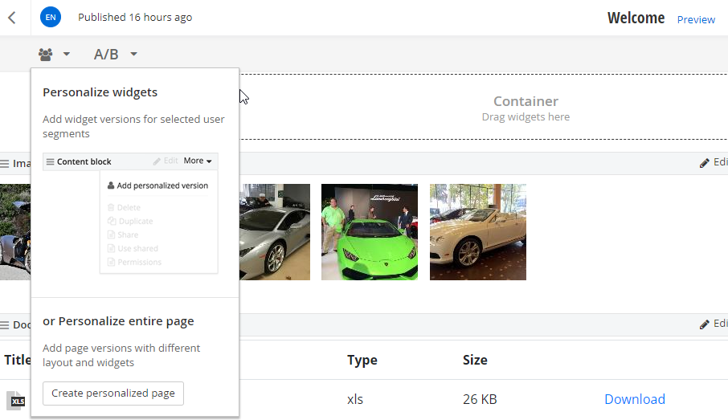{width="1.925in" height="2.2368055555555557in"}

13 \| ADMINISTRATORS

> Sitefinity will prompt you to select a segment. Click the *Create and
> go to edit content* button. A copy of the original page is created.
> You can edit the copied page just like you would with any other
> Sitefinity page and publish your changes.

{width="4.131944444444445in"
height="1.8020833333333333in"}

> Reloading the pages list reveals a new Personalized link next to the
> page.

{width="4.914376640419947in"
height="0.9270833333333334in"}

> Clicking the link will list personalized versions, allowing you to
> open and modify them, or to delete them by clicking the trash can
> icon.

{width="4.148611111111111in"
height="2.678472222222222in"}

> 14 \| ADMINISTRATORS
>
> []{#Previewing_Personalized_Pages .anchor}Previewing Personalized
> Pages
>
> To test that segment criteria and personalized pages work as expected,
> open the preview console from *Marketing \> Personalization*, then
> click *View site as...* button.

{width="3.4279166666666665in"
height="0.9791666666666666in"}

> The personalization console sidebar lets you view the page as if you
> were part of a segment.

{width="6.611158136482939in"
height="3.711353893263342in"}

15 \| ADMINISTRATORS

> To define an ad-hoc set of characteristics, click the *Custom* link.

{width="4.3853094925634295in"
height="3.8958333333333335in"}

> The Device preview drop down switches between views of the page
> displayed on various smart devices like iPhone, Android and tablets.

{width="6.575in" height="2.6416666666666666in"}

> 16 \| ADMINISTRATORS

Modules
-------

> Content and features are supplied through Sitefinity's plug-in
> modules. Using modules, you can install new features as they become
> available. Sitefinity ships with a full complement of modules that
> support the features for your Sitefinity. Sitefinity modules are
> managed from *Administration \> Modules & Services*.

{width="3.26875in" height="4.155555555555556in"}

> Selecting this item reveals a list of registered modules and their
> installation status. The screenshot below shows a small sample.

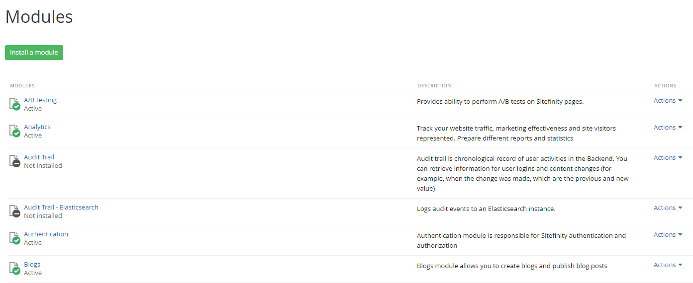{width="6.461589020122485in"
height="1.489478346456693in"}

> A green checkbox indicates that a module is installed and active, a
> grey x shows a module that is installed but not activated, and finally
> a grey dash (-) represents a module that is registered but not
> installed.

17 \| ADMINISTRATORS

> Installing a Module
>
> To install a new module, click, click the *Install a module* button.
> Sitefinity prompts you for the details of the module to be installed.
> These details correspond to the name and description columns of the
> Modules and Services list.

{width="4.0098490813648295in"
height="3.1922911198600175in"}

> The Type value is the fully-qualified name of the module class
> including the assembly.
>
> Selecting the *Do not start* option will install, but not activate the
> module. You will need to manually activate the module before it will
> be available. If you wish to both install and activate your module
> simultaneously, select the option labeled *When the whole application
> is opened for the first time*.
>
> Disabling an Installed Module
>
> Each module in Sitefinity can be disabled to save resources by
> reducing the memory footprint. This is especially helpful in shared
> hosting scenarios, where resources are limited. To disable an active
> module, open the Actions menu to the right of the module description
> and select *Deactivate*.

{width="2.2270833333333333in"
height="0.9986111111111111in"}

> 18 \| ADMINISTRATORS
>
> A disabled module is not loaded into memory by Sitefinity, but retains
> any information and settings previously entered when it was active.
> Any backend pages and associated widgets are also hidden, but not
> deleted.
>
> Activating a Disabled Module
>
> Disabled modules are shown in the list with the label Inactive. To
> enable a module, select the *Activate* option from the Actions menu.
> Activating a disabled module restores its functionality and
> configuration settings along with any associated pages and widgets.

{width="1.8416666666666666in"
height="1.395138888888889in"}

> Uninstalling a Disabled Module
>
> Once a module is disabled, it can be safely uninstalled by selecting
> Uninstall from the Actions menu of a disabled module. Uninstalling a
> module does *not* delete any data or database tables that are used by
> the module. Reinstalling a module will restore the previous data, but
> reset all configuration settings, pages, and widgets.

{width="1.8416666666666666in"
height="1.39375in"}

> Deleting an Uninstalled Module
>
> Once a module is uninstalled, it can be deleted safely. Newly
> installed modules that have not been activated can also be deleted
> safely. This is done by selecting Delete from the Actions menu of an
> uninstalled module. Deleting a module will remove it from the list of
> modules and services and require reinstallation (see the [Installing a
> Module](#_bookmark8) section) to restore its functionality.

19 \| ADMINISTRATORS

> Security Permissions
>
> Use permissions to get fine-grain control over your Sitefinity assets.
> A Permission allows a user to perform actions, such as edit pages,
> delete blog posts or make comments. A Role is a collection of
> permissions. A user is assigned one or more roles to obtain the
> permissions for those roles.
>
> To view the built-in roles that come with Sitefinity, click the
> *Administration \> Roles* menu item. For example, users with the
> Authors role have permission to create content but not delete it.
>
> Creating a Role
>
> The following steps show how to create a new role for bloggers that
> has permissions to view, modify and manage blog posts.

1.  Click the *Create a role* button. In the Role text box that appears,
    enter *Bloggers*

> and click the *Create* button.

{width="4.781718066491688in"
height="1.3474989063867016in"}

> 20 \| ADMINISTRATORS

2.  Click the *Permissions* link for the Bloggers role.

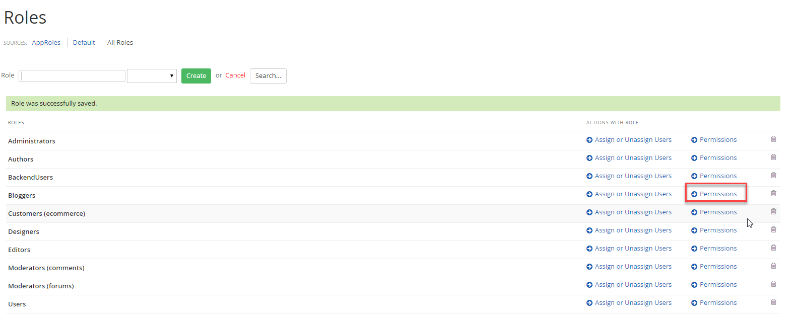{width="4.453692038495188in"
height="0.925832239720035in"}

> The extensive list of permissions covers all possible capabilities of
> a user in Sitefinity. Scroll through the list and notice that, by
> default, the role has no permissions. Without enabling some
> permissions, users with this role will not be able create, modify or
> delete anything in the system.

{width="4.2662784339457565in"
height="3.34375in"}

3.  Locate *Blogs \> BlogPost* section of the list.

21 \| ADMINISTRATORS

4.  Click the *Change* button. Enable the *View blog post* and *Modify
    blog and manage posts* check boxes.

{width="3.9227865266841646in"
height="2.9895833333333335in"}

5.  Click the *Done* button to close the dialog.

6.  Click the *Back* to all items link.

> 22 \| ADMINISTRATORS
>
> []{#Creating_a_User .anchor}Creating a User
>
> These next steps show how to create a single user and assign the new
> Bloggers role to the user.

1.  Select the Administration \> Users menu item.

2.  Click the Create a user button. This will display the Create a user
    page.

3.  All fields in the first section of the Create a user page are
    required except for Photo and Nickname.

{width="4.427495625546807in"
height="5.870311679790026in"}

23 \| ADMINISTRATORS

4.  By default, the This user can access site backend option is checked.
    The option includes the Backenduser role for this user
    automatically. Leave the option checked. Also select the new
    Bloggers role.

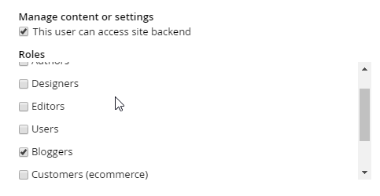{width="5.237659667541557in"
height="3.0628116797900264in"}

5.  Click the Create this user button.

6.  The new user shows up in the users list.

{width="6.424201662292213in"
height="1.489478346456693in"}

> 24 \| ADMINISTRATORS
>
> To test that the new user can login and has the permissions that come
> with the Bloggers role, Click the *Logout* link found in the upper
> right corner of the page, then login as the new user. Now the
> administration menu should include both the Dashboard and Content menu
> items. You should be able to select the *Content \> Blogs* menu item,
> add blog posts and edit blog posts.

{width="3.743325678040245in"
height="1.3715616797900263in"}

25 \| ADMINISTRATORS

> "Someone is already using this username"
>
> When logging in for the second time under the same user name, the
> dialog below appears:

{width="3.8345603674540683in"
height="2.2083333333333335in"}

> You can eliminate this message using the *Administration \> Settings
> \> Advanced \> Security* option. Check the *Automatically logout
> backend users from other HTTP clients on login* so that logins from a
> new location automatically logout of the old location.
>
> The *Disable the limit of active simultaneous backend users* checkbox
> can be selected, assuming the site is licensed for unlimited users or
> has Security Token Service with windows authentication.

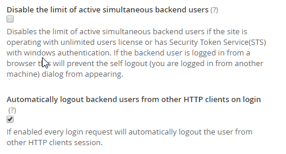{width="4.311805555555556in"
height="2.9902777777777776in"}

> 26 \| ADMINISTRATORS

Workflow
--------

> A workflow is an approval process for publishing documents. By
> default, there are no workflows, so you can publish a document
> directly without additional steps. A simple workflow might have just
> two steps, one to approve the document (perhaps a manager must review
> before the document is published) and the publishing step itself. At
> the other end of the spectrum, government organizations have strict
> protocols for publishing with many steps in their approval process.
>
> Workflows can include notification so that a manager receives an email
> when a document is waiting approval.
>
> Defining a Workflow
>
> To define a custom workflow:

1.  In the administration menu, click the *System \> Workflow* item.

2.  No workflow has been created yet, so click the *Define a workflow*
    link.

3.  When the *Select a type* page shows, leave the default *Approval
    before publishing*

> selection.
>
> Approval before publishing is a single level of approval before the
> content is published and becomes available on the website. *2 levels
> of approval* before publishing is for organizations that need multiple
> levels of approval. If you select this option, you need to define the
> two roles that need to approve the content. The *No approval workflow*
> option allows the author to publish immediately without approval.

{width="5.21038823272091in"
height="2.3333333333333335in"}

4.  Click the *Continue* button.

27 \| ADMINISTRATORS

5.  Now the *Properties* page of the workflow definition displays. Enter
    a *Name* for the workflow.

{width="5.511280621172354in" height="1.84375in"}

6.  In the *Set approvers* area, select the role that will approve
    items. First click the *Add roles or users* button, then, in the
    *Select roles or users* dialog, select the check box next to one or
    more roles. In this example we check the *Editors* role. Finally,
    click the *Done* selecting button to close the dialog.

{width="4.846458880139982in"
height="4.877811679790026in"}

> 28 \| ADMINISTRATORS

7.  Back in the *Set approvers* area, the *Editors* role is now
    included. Verify that the *Notify users by email* when an item is
    waiting for their approval checkbox is enabled. Now, whenever an
    item has to be approved, everyone who has the *Editors* role will
    automatically get an email.

{width="5.207702318460193in" height="2.09375in"}

> The *Scope* section defines where the workflow will apply. Leave the
> default *All content and pages* selected. This means that the workflow
> will be triggered anytime the save button is clicked for any page or
> content. The remaining workflow options can be left with default
> values.

{width="5.208109142607174in"
height="1.3958333333333333in"}

8.  Click the *Save workflow* button.

> **Note**: The *Allow administrators to skip the workflow* option is
> recommended so that you don\'t have to slog through the approval
> process when you\'re making a lot of changes to the backend.
>
> **Note**: You must [set up an SMTP email server](#_bookmark1) for the
> *Notify users by email when an item is waiting for their approval*
> option to work.

29 \| ADMINISTRATORS

> Testing the Workflow

1.  Log out, then log back in as the [user you created for the previous
    permissions](#Creating_a_User) example.

2.  Edit one of the existing blog posts.

3.  Click the *Save Draft* button (notice that there is no *Publish*
    button).

4.  Click the new *Send for Approval* button. Now the list of blog posts
    shows a new status indicating the content is waiting on approval. A
    user with an editor or administrator role can publish the content.

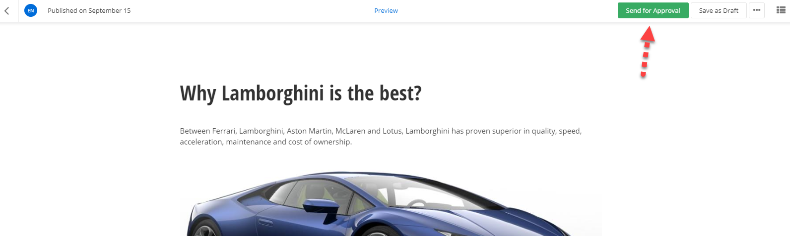{width="2.98083552055993in" height="0.94875in"}

> 30 \| ADMINISTRATORS
>
> Site Management Notes on Upgrading
>
> The [Sitefinity documentation on
> upgrading](http://www.sitefinity.com/documentation/documentationarticles/installation-and-administration-guide/upgrade)
> details how to upgrade from Sitefinity 3.7 (and even earlier) to the
> present release of Sitefinity. Many of these instructions center on
> the Upgrade option on the right-click menu of the Project Manager. The
> catch is that the upgrade option will wipe out the Visual Studio
> project file to the default settings and the web configuration file
> also gets set back to its "vanilla" settings. If there is the
> slightest customization, non-standard references, or web configuration
> file changes in your Sitefinity project, these customizations can get
> lost by taking the upgrade menu option.
>
> You can manually merge the Visual Studio project file (.csproj) web
> configuration (web.config) by comparing the files located in the
> Sitefinity installation directory under
>
> \_EmptyProject against your site. The \_EmptyProject files are used to
> create new sites. By comparing your site with the \_EmptyProject you
> can see how the site has been customized since it was created. You can
> use any source comparison tool to compare the project and web config
> files.
>
> Notes on Deployment
>
> The [Sitefinity documentation on
> deployment](http://www.sitefinity.com/documentation/documentationarticles/installation-and-administration-guide/deployment)
> details how to move your Sitefinity application to a production
> server. In addition, be sure not to overwrite the app\_data folder or
> the database in production. These are live and constantly changing.
> With changes happening every second, overwriting the database can
> cause the database to become corrupt. Even when deploying code files
> to the app\_data folder, the database is being updated.
>
> When deploying, zip the project except for the app\_data folder and
> then overwrite the production files. You should merge the web.config
> manually, just as you would with any
>
> .NET application[]{#_bookmark12 .anchor}.
>
> Continuous Delivery
>
> *Continuous delivery* is an approach of automating development changes
> to production frequently and reliably, usually on a regular schedule.
> Continuous delivery isn't about moving content, but deploying elements
> that require development, like new modules or widget modifications.

31 \| ADMINISTRATORS

> Earlier versions of Sitefinity weren't suited for continuous delivery.

-   Sitefinity configuration was tightly bound to the database. Guids in
    the database had to stay in sync with the XML configuration files.
    Moving a configuration file directly to production was likely to
    break the site.

-   You couldn't export dynamic modules that didn't already exist on the
    production server.

-   You couldn't transfer custom fields using Site Sync. You had to
    manually create custom fields on the target site.

> Now, Sitefinity configuration files are cleanly implemented, without
> tight coupling between database and configuration files. Sitefinity is
> able to pick up dynamic module changes automatically. You no longer
> have to manually create custom fields on the production server, you
> can export custom fields on the development server and Sitefinity on
> the production server will automatically detect and apply the changes.
>
> Site Synchronization
>
> The Site Sync module automatically copies content from one site to
> another. For example, if you have a live server and staging server you
> can refresh the staging server with live data. Both servers should be
> running the same version of Sitefinity with the same licensing.
>
> In the example that follows we have two sites named Site1 and Site2
> configured to run in IIS. There is an administrative user in each
> project called SiteSyncIUser1 and SiteSyncUser2, respectively. You can
> setup both sites side-by-side. Site1 will be configured to send data
> to Site2.
>
> To enable site synchronization:

1.  The projects should be hosted in IIS. Configure the Sitefinity
    projects to work in your version of IIS using the steps in the
    documentation foun[d
    here.](http://www.sitefinity.com/documentation/documentationarticles/installation-and-administration-guide/install-sitefinity/configuring-the-iis-to-host-sitefinity-projects)

2.  Run both sites and login to the backend of each.

> 32 \| ADMINISTRATORS

3.  By default, site synchronization is not installed or active so your
    first step will be to select the Administration \> Modules &
    Services menu option. Click the Install option in the Actions menu
    of the Staging and Syncing item. Do this for both sites.

{width="6.51875in"
height="1.4402777777777778in"}

4.  [Create a new user](#Creating_a_User) from the *Administration \>
    Users* menu option. This user will only be used for site
    synchronization and will never be logged in. The user should have
    the Administrator role. Do this for both sites and make the name
    unique for each site, e.g. SiteSyncIUser1 and SiteSyncUser2.

5.  Now select the new menu item *Administration \> Staging and Syncing*
    for both sites.

{width="1.5303991688538932in"
height="1.59375in"}

6.  Click the Synchronization Settings for each site.

{width="3.0416863517060366in"
height="1.7015616797900261in"}

33 \| ADMINISTRATORS

7.  Select the *Allow content from other sites to be published to this
    site* checkbox on both sites. In the Site key text box, enter 1 for
    the first site and 2 for the second site. Click the Save changes
    button.

8.  In Site1, click the *Add a server button*. In the dialog that
    displays, enter the URL for Site2. Use the administrative username
    and password to the server. Click the *Add this server* button.

{width="4.11436789151356in" height="3.3125in"}

> The Staging and Synchronization screen for the first site now looks
> like this:

{width="4.906944444444444in"
height="3.338888888888889in"}

> 34 \| ADMINISTRATORS

9.  In the first site, click the *Go to sync* link.

10. Click the *Test connection* button.

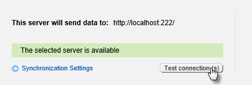{width="4.467899168853894in"
height="1.5104166666666667in"}

11. In the What do you want to sync? Area, you can select all kinds of
    Sitefinity content, but for now just select Blogs and Blog Posts.

{width="5.236805555555556in"
height="2.2583333333333333in"}

12. Click the *Sync now* button. You will be warned that related data
    may be synced. Click the *OK* button.

{width="5.225in" height="1.3319444444444444in"}

35 \| ADMINISTRATORS

> A progress bar will display briefly, depending on the amount of data
> being transferred. A summary screen will display the results of the
> sync operation.

{width="6.51875in"
height="3.4118055555555555in"}

> Synchronizing on a schedule
>
> Instead of clicking the *Sync now* button, you can choose the
> *Schedule sync* button and set the sync to run at a regular time,
> every Sunday at 1am for example. Choose the schedule frequency using
> the drop down lists and then click the *Schedule* button. You can run
> the schedule Today or Tomorrow, Every day, or on a specific day or
> date.

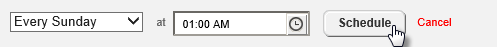{width="5.188888888888889in"
height="0.5083333333333333in"}

> 36 \| ADMINISTRATORS
>
> Multisite
>
> Multisite capability allows you to have multiple sub sites within a
> single Sitefinity instance. This means that you can share your
> content, users, and permissions and so on, while still managing all
> sites from a single user interface. You can even duplicate pages
> between sites and share forms. This works particularly well for a
> series of sites that have a similar purpose but serve different sets
> of customers, for example a series of banks for different groups of
> depositors, a group of stores located in different geographical areas
> or even businesses located in different countries. If your site needs
> an international presence, each individual sub site can even have its
> own language.
>
> **Note**: Sites can be created within multi-site management as shown
> below, or existing sites can be migrated to multi-site using [Site
> Synchronization.](#_bookmark12)
>
> Multisite management requires an Enterprise license. See the
> [Sitefinity Editions](http://www.sitefinity.com/editions) page for a
> list of features included with each edition of Sitefinity.
>
> Verify that the multisite feature is active using the Administration
> \> Modules & Services option.

{width="6.519886264216973in"
height="0.95625in"}

> A drop down list in the upper left corner of the back-end
> administration pages shows the name of the site you're currently
> working on (named MultiSiteDemo in this example). Opening the list
> allows you to manage sites or navigate to global settings (the
> *Administration \> Settings* page).

{width="3.39375in" height="1.51875in"}

37 \| ADMINISTRATORS

> Let's create a second site:

1.  From the drop down list click the *Manage sites* link. This brings
    you to a list of sites that will initially contain only the one
    site.

2.  Click the *Create a site* button.

{width="4.538888888888889in" height="2.34375in"}

3.  Enter the *Name* and *Domain* of the new site. The radio buttons at
    the bottom of the area allow you to create an empty site from
    scratch or duplicate pages and settings from existing site. This
    second option can be a great timesaver if the sites have similar
    structure and content.

{width="4.705555555555556in"
height="3.2270833333333333in"}

> 38 \| ADMINISTRATORS
>
> **Note**: If you're developing the site and want to add a second
> domain that can be used for preview, check the This site is in the
> process of development checkbox and enter a Testing domain.

4.  The *Languages for public content* area will have a default
    language. In this example, click the *Add languages...* button,
    select *French* from the list and finally, click the *Done* button.
    Next to the *French* entry, click the *Set as default* link.

{width="4.705555555555556in"
height="1.7805555555555554in"}

5.  Leave *This site is in offline mode* option unchecked.

> **Note**: If you check this option you'll be prompted to either show a
> message such as "The page is not accessible" or redirect the visitor
> to another page when they try to open a page on the site.

6.  Click the *Continue* button.

39 \| ADMINISTRATORS

7.  Next, identify where the content for the site will come from. Notice
    in the screenshot below that, by default, all modules use only data
    from this site. Also, only the Libraries entry is checked, meaning
    that the Content menu for this site will have only Images, Videos,
    Documents & Files, and Forms.

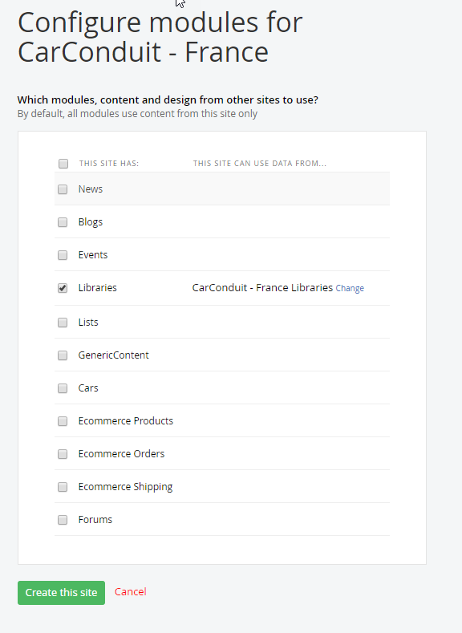{width="4.696137357830271in"
height="3.6979166666666665in"}

8.  Select the *News* checkbox.

{width="2.3in" height="1.988888888888889in"}

> 40 \| ADMINISTRATORS

9.  Click the *Change* link for the *News* item.

{width="4.777083333333334in"
height="1.5402777777777779in"}

10. Select the *Default News* checkbox. This will allow the new site to
    use news created on the site and also from the original site. Click
    the *Done* button.

{width="4.302325021872266in" height="2.71875in"}

11. Click the *Create this site* button. It will take a little time
    while the new site is built.

12. Now the dropdown list in the upper left lists both the original site
    and the new site. The dropdown allows you to select which site
    you're working with at any one time. Select *CarConduit -- France*
    from the list.

{width="3.2472222222222222in"
height="1.7805555555555554in"}

41 \| ADMINISTRATORS

13. With the *CarConduit -- France* site selected from the list, try
    creating a page, it will already be setup for localization:

{width="3.402083333333333in"
height="1.0819444444444444in"}

14. Using the multisite dropdown list, switch back to the default site.

15. Select the *Content \> News* menu item.

16. Create a news item.

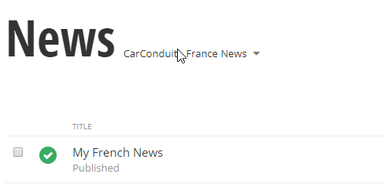{width="2.9868055555555557in"
height="2.238888888888889in"}

17. Using the multisite dropdown list, switch to the *CarConduit --
    France* site.

18. Notice that you have access to two news sources, one for the
    *CarConduit -- France* site that is currently active and *Default
    News* from the default site. Select *Default News*.

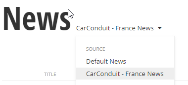{width="3.673611111111111in"
height="1.4270833333333333in"}

> 42 \| ADMINISTRATORS
>
> The news item from the default site is available here and, because
> this site is set to use the French language setting, the translation
> buttons are already available.

{width="6.516666666666667in"
height="1.5604166666666666in"}

43 \| ADMINISTRATORS

Azure Deployment
----------------

> Publishing to the cloud makes your site instantly more scalable and
> reliable. Need failover capability or to suddenly expand capacity? You
> can take your Sitefinity site as it is now and push it up to Azure.

{width="6.527083333333334in" height="1.725in"}

> The technologies used in this example are Sitefinity 9, Visual Studio
> 2015 Update 2, SQL Server Management Studio 2014 and the [[Azure
> portal]{.underline}.](https://portal.azure.com/) The Sitefinity
> website and Sitefinity database are already created on the development
> server. We'll be creating the following elements in Azure during this
> walk-through: Resource Group, SQL Server, SQL Database, a Storage
> account and the App Service for the Sitefinity website.

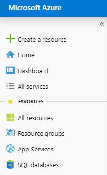{width="1.8660433070866143in"
height="3.05625in"}

> Prepare the Sitefinity Website and Database
>
> On your local development machine, if you haven't already, create a
> new Sitefinity website, and use MS SQL as the database. You should be
> able to login to the Sitefinity backend.
>
> 44 \| ADMINISTRATORS
>
> []{#Create_the_Azure_SQL_Server .anchor}Create the Azure SQL Server
>
> In the Azure portal, create a new SQL Server. Make a note of the
> server path, the user name and password. Create a new Resource group
> to contain all the elements of your website. Be sure that the *Allow
> Azure Services to Access the Server* checkbox is enabled.

{width="3.227759186351706in"
height="7.404374453193351in"}

45 \| ADMINISTRATORS

> **Note**: If you use the resource group for everything related to the
> site, you can move the entire site to another account later if the
> website changes hands or is bought.
>
> Open the SQL Server *Settings* blade, select *Firewall*, and click the
> *Add client IP* link. Make sure the *Allow access to Azure services*
> switch is turned on. Save the Firewall settings.

{width="6.025in" height="3.4319444444444445in"}

> This should work fine in Enterprise environments with static IPs. If
> you're experimenting with this at home with dynamic IPs, you'll have
> to add new entries whenever your IP expires.
>
> 46 \| ADMINISTRATORS
>
> Create the Azure SQL Database
>
> Next, create a SQL database that will hold the Sitefinity data. You
> can leave the source as *Blank database* -- it will be populated later
> from imported data.

{width="2.9520833333333334in"
height="6.108333333333333in"}

47 \| ADMINISTRATORS

> Publish the Database
>
> The simplest way to publish the database is from Microsoft SQL Server
> Management Studio 2014 cumulative update 6 or later. This route allows
> you to use the *Deploy Database to Microsoft Azure SQL Database...*
> option directly to an Azure Database.

{width="6.51875in"
height="4.947222222222222in"}

> Click through the Introduction page to reach the Deployment Settings.

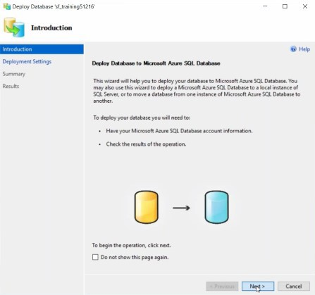{width="2.265277777777778in"
height="2.127083333333333in"}

> 48 \| ADMINISTRATORS
>
> In Deployment Settings, click the *Connect* button.

{width="6.527083333333334in"
height="6.110416666666667in"}

49 \| ADMINISTRATORS

> In the Connect to Server dialog, enter the Server name, Login and
> Password you saved when you [[created the Azure
> server]{.underline}.](#Create_the_Azure_SQL_Server) Click the
> *Connect* button to return to Deployment settings.

{width="6.191666666666666in"
height="4.088888888888889in"}

> 50 \| ADMINISTRATORS
>
> The database name will carry over from your original database
> instance. Use the *Microsoft Azure SQL Database Settings* to adjust to
> resources for the target database. We're using the Standard edition
> here, with a maximum database size of 250 GB. The Temporary file name
> points to a location that stores a "bacpac" file, but, other than
> making sure we have space at that location, we don't need to worry
> about it. Clicking the *Next* button, navigates you to a summary page.

{width="6.527083333333334in"
height="5.340277777777778in"}

51 \| ADMINISTRATORS

> At the Summary, click the *Finish* button.

{width="6.527083333333334in"
height="5.340277777777778in"}

> 52 \| ADMINISTRATORS
>
> Depending on the size of the database, connection speed and Azure
> resources, the import will process. This example Sitefinity database
> took about 4 or 5 minutes to complete.

{width="6.527083333333334in"
height="6.138888888888889in"}

53 \| ADMINISTRATORS

> Prepare the Sitefinity Application for Publication
>
> On your local development machine, open the Sitefinity site in Visual
> Studio. In the Solution Explorer, click the *Show All Files* button,
> then open *App\_Data\\Sitefinity\\*. Find your *Sitefinity.lic* file,
> right-click and select *Include in Project* from the context menu.
>
> Move down to the *App\_Data\\Sitefinity\\Configuration* directory and
> add any config files you want included in the project.

{width="4.548515966754156in"
height="6.72375in"}

> 54 \| ADMINISTRATORS
>
> Open the *DataConfig.config* file and copy the connection string for
> the Azure database into the *connectionString* attribute. Also, change
> the value of the *dbType* attribute to *SqlAzure*.

{width="6.527083333333334in"
height="1.4152777777777779in"}

> Open the project's *web.config* file for editing. Locate the
> *\<sectionGroup name="telerik"*
>
> *...\>* tag and ***uncomment*** the section. Then find the
> *\<telerik\>* tag and uncomment that section as well.

{width="4.356944444444444in"
height="1.7138888888888888in"}

> Database storage is the suggested way to go for configuration files.
> It allows scaling out more easily, as opposed to copying config files
> across multiple instances. If you think you might need to scale-out,
> go with the database storage up-front.
>
> At the time of this writing, the 2.7 version of the Azure SDK is
> required, even if you're on a later version of the Azure SDK. In the
> web.config *\<runtime\>\<assemblyBinding\>* section, add a
> *dependentAssembly* entry to ensure that the 2.7 version of Azure is
> used.
>
> \<dependentAssembly\>
>
> \<assemblyIdentity name=\"Microsoft.WindowsAzure.ServiceRuntime\"
> publicKeyToken=\"31bf3856ad364e35\"/\>
>
> \<bindingRedirect oldVersion=\"0.0.0.0-2.6.0.0\"
> newVersion=\"2.7.0.0\"/\>
>
> \</dependentAssembly\>

55 \| ADMINISTRATORS

> Here is a listing of the entire \<runtime\> tag in our running example
> for reference.
>
> \<runtime\>
>
> \<assemblyBinding xmlns=\"urn:schemas-microsoft-com:asm.v1\"\>
>
> \<dependentAssembly\>
>
> \<assemblyIdentity name=\"Newtonsoft.Json\"
> publicKeyToken=\"30ad4fe6b2a6aeed\" culture=\"neutral\" /\>
>
> \<bindingRedirect oldVersion=\"0.0.0.0-6.0.0.0\"
> newVersion=\"6.0.0.0\" /\>
>
> \</dependentAssembly\>
>
> \<dependentAssembly\>
>
> \<assemblyIdentity name=\"System.Web.Helpers\"
> publicKeyToken=\"31bf3856ad364e35\"
>
> /\>
>
> \<bindingRedirect oldVersion=\"1.0.0.0-3.0.0.0\"
> newVersion=\"3.0.0.0\" /\>
>
> \</dependentAssembly\>
>
> \<dependentAssembly\>
>
> \<assemblyIdentity name=\"System.Web.WebPages\"
> publicKeyToken=\"31bf3856ad364e35\" /\>
>
> \<bindingRedirect oldVersion=\"0.0.0.0-3.0.0.0\"
> newVersion=\"3.0.0.0\" /\>
>
> \</dependentAssembly\>
>
> \<dependentAssembly\>
>
> \<assemblyIdentity name=\"System.Web.Mvc\"
> publicKeyToken=\"31bf3856ad364e35\" /\>
>
> \<bindingRedirect oldVersion=\"0.0.0.0-5.2.3.0\"
> newVersion=\"5.2.3.0\" /\>
>
> \</dependentAssembly\>
>
> \<dependentAssembly\>
>
> \<assemblyIdentity name=\"System.Web.Razor\"
> publicKeyToken=\"31bf3856ad364e35\" culture=\"neutral\" /\>
>
> \<bindingRedirect oldVersion=\"0.0.0.0-3.0.0.0\"
> newVersion=\"3.0.0.0\" /\>
>
> \</dependentAssembly\>
>
> \<dependentAssembly\>
>
> \<assemblyIdentity name=\"System.Web.WebPages.Razor\"
> publicKeyToken=\"31bf3856ad364e35\" culture=\"neutral\" /\>
>
> \<bindingRedirect oldVersion=\"0.0.0.0-3.0.0.0\"
> newVersion=\"3.0.0.0\" /\>
>
> \</dependentAssembly\>
>
> \<dependentAssembly\>
>
> \<assemblyIdentity name=\"Telerik.Sitefinity.Mvc\"
> publicKeyToken=\"b28c218413bdf563\" culture=\"neutral\" /\>
>
> \<bindingRedirect oldVersion=\"1.3.350.0\" newVersion=\"1.4.360.0\"
> /\>
>
> \</dependentAssembly\>
>
> \<dependentAssembly\>
>
> \<assemblyIdentity name=\"System.Threading.Tasks\"
> publicKeyToken=\"b03f5f7f11d50a3a\" culture=\"neutral\" /\>
>
> \<bindingRedirect oldVersion=\"0.0.0.0-2.6.8.0\"
> newVersion=\"2.6.8.0\" /\>
>
> \</dependentAssembly\>
>
> \<dependentAssembly\>
>
> \<assemblyIdentity name=\"Microsoft.WindowsAzure.ServiceRuntime\"
> publicKeyToken=\"31bf3856ad364e35\"/\>
>
> \<bindingRedirect oldVersion=\"0.0.0.0-2.6.0.0\"
> newVersion=\"2.7.0.0\"/\>
>
> \</dependentAssembly\>
>
> 56 \| ADMINISTRATORS
>
> \<dependentAssembly\>
>
> \<assemblyIdentity name=\"System.Web.Cors\"
> publicKeyToken=\"31bf3856ad364e35\" /\>
>
> \<bindingRedirect oldVersion=\"1.0.0.0-5.2.0.0\"
> newVersion=\"5.2.0.0\" /\>
>
> \</dependentAssembly\>
>
> \</assemblyBinding\>
>
> \</runtime\>
>
> Publish to Azure
>
> In the Solution Explorer, right-click the Visual Studio project and
> select *Publish* from the context menu. In the Publish Web dialog,
> select Microsoft Azure App Service.

{width="5.452083333333333in"
height="3.172222222222222in"}

> **Note**: You will need to have the Azure SDK installed to get the
> Microsoft Azure App Service publish target.

57 \| ADMINISTRATORS

> Click the *New...* button to create a new App Service.

{width="6.5in" height="4.875in"}

> 58 \| ADMINISTRATORS
>
> Enter a Web App Name or leave the automatic defaults. Use the Resource
> Group created earlier to keep all the website elements in one
> container. The App Service plan is defined by your Resource Group, so
> you can leave the default. Click the *Create* button.

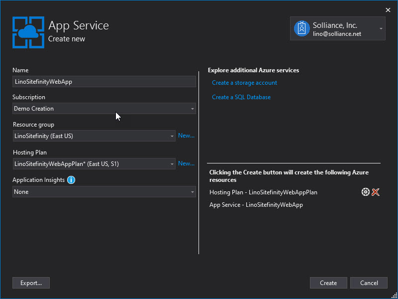{width="6.527083333333334in"
height="4.8805555555555555in"}

59 \| ADMINISTRATORS

> Your deploy settings should download automatically. You can do a quick
> verification using the *Validate Connection* button, then click the
> *Publish* button.

{width="6.527083333333334in"
height="5.155555555555556in"}

> 60 \| ADMINISTRATORS
>
> The Visual Studio Output window will show the build progress. Then
> Visual Studio will kick off a browser to display the Sitefinity --
> Azure website.

{width="4.9222222222222225in"
height="4.213888888888889in"}

> And finally, the backend screen at its new Azure web address:

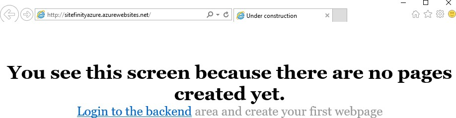{width="6.527083333333334in"
height="2.2354166666666666in"}

61 \| ADMINISTRATORS

> Analytics Setup
>
> To get started with Google Analytics, select the *Marketing \>
> Analytics* menu option. Then click the *Configure Analytics* link.

{width="2.59671697287839in" height="2.09375in"}

> By setting up a project on the Google API site you will receive a
> *Client id* and *Secret*. You will register the domain you want
> tracked and finally, you will receive a *Tracking* code snippet that
> uniquely identifies your site. That snippet is pasted into a widget
> that is dropped on every page on your site that you want tracked.
> Later, you can access and modify this data from the *Marketing \>
> Analytics* page.
>
> []{#Google_API_Configuration .anchor}Google API Configuration
>
> The first thing you'll need is a Google login, either an existing
> Gmail account or a new account just for this purpose.
>
> Then navigate to the Google API console. You can use the [Google API
> console](https://console.developers.google.com/project) link at the
> top of the Sitefinity Analytics page to get there. The following steps
> obtain a client ID and client secret that you can use to configure
> Analytics in Sitefinity.
>
> **Note:** At the time of writing, the screenshots and steps were
> valid, but the API setup may change at any time.
>
> 62 \| ADMINISTRATORS

1.  Click the *Create Project* button.

2.  In the *New Project* dialog, enter a readable *Project Name* to
    display in the console. A project ID is created for you
    automatically. If you agree with the terms of service, click the *I
    agree* checkbox. Click the *Create* button.

{width="5.073462379702537in"
height="3.53125in"}

> It will take a little time while Google creates the project and it
> appears in the list.

{width="6.1101826334208225in" height="1.0in"}

3.  Click the link for your new project.

4.  From the menu on the left, click the *APIs & auth \> APIs* option.
    The APIs that your project can use will be listed.

5.  Click the *Analytics API*.

63 \| ADMINISTRATORS

6.  Click the *Enable API* button.

{width="5.999687226596675in"
height="1.8454166666666667in"}

7.  Click the *Credentials* link on the left hand menu.

8.  Click *Add credentials*, then *Oauth 2.0 client ID*.

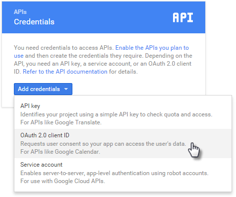{width="4.955575240594926in" height="4.125in"}

> 64 \| ADMINISTRATORS

9.  In the Create client ID page, select the *Web application* type, and
    provide a unique *Name* for the client ID. The *Authorized
    JavaScript origins* needs a public URI, that is, it should end with
    .com, .net, .org, etc. For the *Authorized redirect URIs*, you can
    take the URI you used for Authorized Javascript origins and append

> */Sitefinity/marketing/Analytics* (use the exact upper and lower
> case). See the screenshot below for a working example.

{width="5.170138888888889in"
height="4.0784722222222225in"}

> **Note**: If you're testing on a local machine, you can edit your
> [Hosts](https://en.wikipedia.org/wiki/Hosts_(file)) file to create a
> mock public URI, by adding a line similar to the example below:
>
> *192.168.56.1* [*www.carconduit.net*](http://www.carconduit.net/)

65 \| ADMINISTRATORS

10. Click the *Create* button. A dialog will pop up with your new client
    ID and client secret.

{width="5.188888888888889in"
height="2.4604166666666667in"}

> Sitefinity Analytics Configuration
>
> Select the *Marketing \> Analytics* menu item.
>
> Enter the Client Id and Client Secret you obtained from [the Google
> API Configuration](#Google_API_Configuration) topic steps, and then
> click the *Login to Google* button.

{width="6.088888888888889in"
height="3.9604166666666667in"}

> 66 \| ADMINISTRATORS
>
> If you see a popup from Google to have access, click the *Allow*
> button to continue.

{width="4.625in" height="2.3125in"}

> The actions you've taken so far will bring you to the second step of
> the process, selecting a Google Analytics account. Select from the
> list of *Available accounts*, enter the domain you want to have
> tracked and click the *Save settings* button.

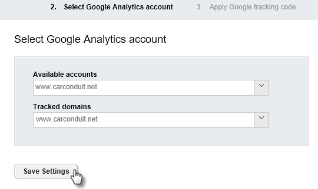{width="5.636805555555555in"
height="3.3666666666666667in"}

67 \| ADMINISTRATORS

> The third and last step presents you with the take-away from the whole
> process \-- the Google tracking code. Copy the JavaScript code from
> the dialog and save it for later use in the pages that you want to
> track. To look at the Dashboard and available reports, click the *Go
> to Analytics* button.

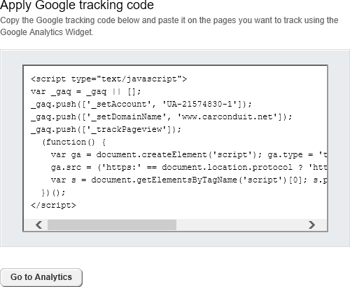{width="5.865277777777778in" height="4.825in"}

> 68 \| ADMINISTRATORS
>
> Tracking Pages
>
> To allow Google Analytics to hook into your pages and start collecting
> information, drag the Google Analytics widget from the Script and
> Styles group onto pages that should be tracked.

{width="6.423611111111111in"
height="2.2784722222222222in"}

> **Note**: For easier maintenance, consider adding the widget to a page
> template so entire groups of pages are tracked automatically.
>
> Click the Google Analytics widget *Edit* button and paste the Google
> Analytics code that you copied during setup. Then click the *Save*
> button. The code will be included with the page but will not be
> visible.

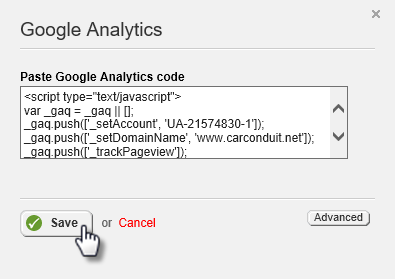{width="4.073951224846894in"
height="2.8771872265966754in"}

69 \| ADMINISTRATORS

> Analytics Dashboard and Reports
>
> As users navigate the site, they leave valuable information about
> their interests. For example, how many new visitors are there? What
> culture and languages do they expect? What are the capabilities of the
> devices they are using? What web browsers are they using? What content
> interest them? What terms are they searching on?
>
> All this information and more are found on the *Marketing \>
> Analytics* page. The left hand panel has top-level links for a
> Dashboard, and reports for Visitors, Traffic sources and Content.
>
> 70 \| ADMINISTRATORS
>
> Dashboard
>
> The Dashboard provides an at-a-glance overview of your site's success.
> The drop down allows you to switch views that examine daily Visits,
> Pageviews, Bounce rate (the number users that enter the site and then
> leave), Average time on the site, Average Pages per visit and New
> visits rate. The scale for the left-hand axis of the chart shows
> quantity of visits, etc. while the bottom of the chart shows the day
> each data point was recorded.

{width="6.581944444444445in"
height="5.511805555555555in"}

71 \| ADMINISTRATORS

> On the right hand of the chart, the date selection down-arrow displays
> a dialog where you can dial in a date range.

{width="5.720138888888889in"
height="2.553472222222222in"}

> Below the date selection, a set of three buttons groups data by day,
> week or month. At the far right side of these buttons is the *Map /
> Chart* button that toggles between views.

{width="3.423611111111111in"
height="1.6118055555555555in"}

> 72 \| ADMINISTRATORS
>
> The Map view is handy for quickly spotting the relationships between
> the data and locations in the world. The Dashboard below shows a
> concentration of new visits coming from Mexico and the northern
> regions of South America. Both chart and map show a detailed breakdown
> below the main summary graphic.

{width="6.4118055555555555in"
height="5.655555555555556in"}

73 \| ADMINISTRATORS

> {width="2.375in"
> height="3.5816666666666666in"}Visitors
>
> The Visitors group of reports help explain the direction your site is
> going in. The Visitor trending reports reveal how many new unique
> visitors enter the site in one week compared to another, how long
> people stay on the site and how many pages do they visit.
>
> Devices include reports on operating systems, mobile devices,
> browsers, resolutions and screen colors being used.
>
> Network properties reports list the service providers that carry users
> to your site and the host sites that visits to your site originate
> from.
>
> {width="2.375in"
> height="2.4783333333333335in"}Traffic Sources
>
> Traffic sources detail what route visitors take to get to your site.
> That is, do people navigate to your site directly, are they redirected
> to your site from a partner's web site, or do they arrive via search
> engines? This view also helps determine if your marketing campaigns
> are effective.
>
> 74 \| ADMINISTRATORS
>
> 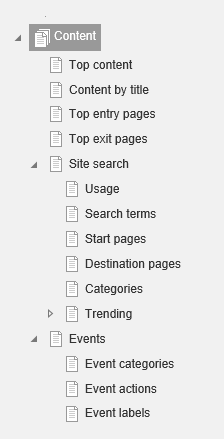{width="2.3333333333333335in"
> height="4.571666666666666in"}Content
>
> Content reports help rank the best pages and content. What pages do
> your visitors enter the site at? Do they use a Site search to find
> your site and if they do, what were they searching on? What page was
> the user on when they decided to leave your site?

75 \| ADMINISTRATORS

Alternative Publishing
----------------------

> Alternative publishing refers to funneling information from all kinds
> of sources such as events, blogs, email, or even external sources like
> Twitter feeds, and then publishing that data in a new format such as
> RSS (Really Simple Syndication), Sitefinity content (news, events,
> blogs, list items) or as a new Twitter feed. You can even mash
> together different sources of data.
>
> All this funneling collects the incoming data to an area called a
> publishing point. Often the data will have a large number of fields,
> and, depending on the source of the data, these fields will have
> different names. The process of mapping determines what fields are
> used and where the data for each field should go. Mapping occurs on
> the inbound trip to the publishing point and on the outbound journey
> to be published.
>
> Alternative publishing can be automatic, such as is the case for
> forums. When you create a new forum the Alternative Publishing area
> Generate RSS feed is enabled by default.

{width="5.811516841644794in"
height="1.5208333333333333in"}

> To see all the feeds configured for your site, click the
> *Administration \> Alternative Publishing* menu option. The screenshot
> shows feeds for ForumsRSS (created automatically for all forum posts)
> and Classic Car Parts (generated when the Classic Car Parts forum was
> created).

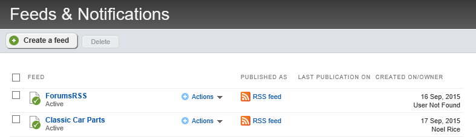{width="6.513888888888889in"
height="1.9472222222222222in"}

> 76 \| ADMINISTRATORS
>
> Click the ForumsRSS item to see how the feed is configured and how to
> actually view the feed. The screenshot below shows the default
> configuration. Notice the *Publish as...* field has a URL that RSS
> readers and web browsers can use to view the feed.

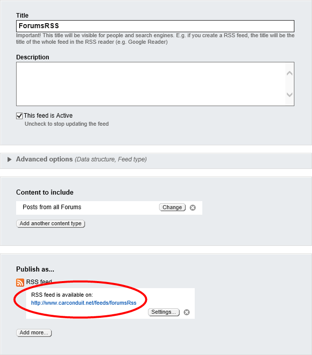{width="6.4582863079615045in"
height="7.354166666666667in"}

77 \| ADMINISTRATORS

> Try clicking the RSS feed link. Depending on your browser and how it's
> configured, the RSS will show up as a formatted list of articles. The
> screenshot below shows how RSS is displayed in Internet Explorer.
> Consult your browser's documentation for specifics on setting up the
> browser to read RSS feeds.

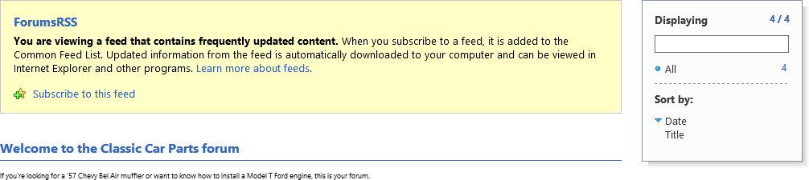{width="7.016666666666667in"
height="1.9368055555555554in"}

> Create a new Feed Manually
>
> This next example describes creating a new custom feed. The example
> takes the RSS feed from an external blog site and funnels it into news
> content.
>
> The walk-through will require an external RSS feed URL. The example
> uses
> [[http://blog.falafel.com/feed/]{.underline}](http://blog.falafel.com/feed/)
> but any valid RSS feed URL will do. Save the RSS URL for upcoming
> steps.
>
> {width="0.148332239720035in"
> height="0.14833333333333334in"}**Note:** You can find RSS URLs at
> hundreds of sites. The link is usually marked with some variation of
> the RSS logo .

1.  Click the *Administration \> Alternative Publishing* menu option.
    This will bring you to the Feeds and Notifications page.

2.  Click the *Create a feed* button.

{width="3.091666666666667in"
height="1.8736111111111111in"}

> 78 \| ADMINISTRATORS

3.  Enter a *Title* and *Description* for the feed.

{width="3.5008792650918634in"
height="2.2916666666666665in"}

4.  Click the *Add another content type* button.

5.  The *Content to Include* dialog displays. Select the *External
    RSS/Atom feed* radio button and enter the URL of the RSS feed into
    the Url name text box. From the *Schedule publication updates
    interval* drop down list, select *1 hour*. Click the *Done* button.

{width="4.073751093613298in"
height="4.33125in"}

79 \| ADMINISTRATORS

> The *Content to Include* section should now look something like the
> screenshot below that shows the RSS URL you're importing the data
> from.

{width="4.5519531933508315in"
height="1.59375in"}

6.  Click the *Publish As \> Add more* button to display the *Content to
    include* dialog. Select the *Sitefinity content* option. From the
    *Import data as* drop down list, select *News* items. Select the
    check box for the *Automatically publish imported data* option.
    Click the *Done* button.

{width="3.6976727909011373in"
height="3.0625in"}

> **Note**: By default, the imported data is not published
> automatically, giving you a chance to review each item before it goes
> out to the public.

7.  Click the *Save changes* button.

> 80 \| ADMINISTRATORS

8.  Select the *Run* option from the Actions drop down list. This action
    will import the data and push it to news content.

{width="3.9475885826771653in"
height="1.2708333333333333in"}

9.  Select the *Content \> News* menu option.

> The imported items from the external blog are now news content. All of
> the items are published and visible from any page with a News widget.

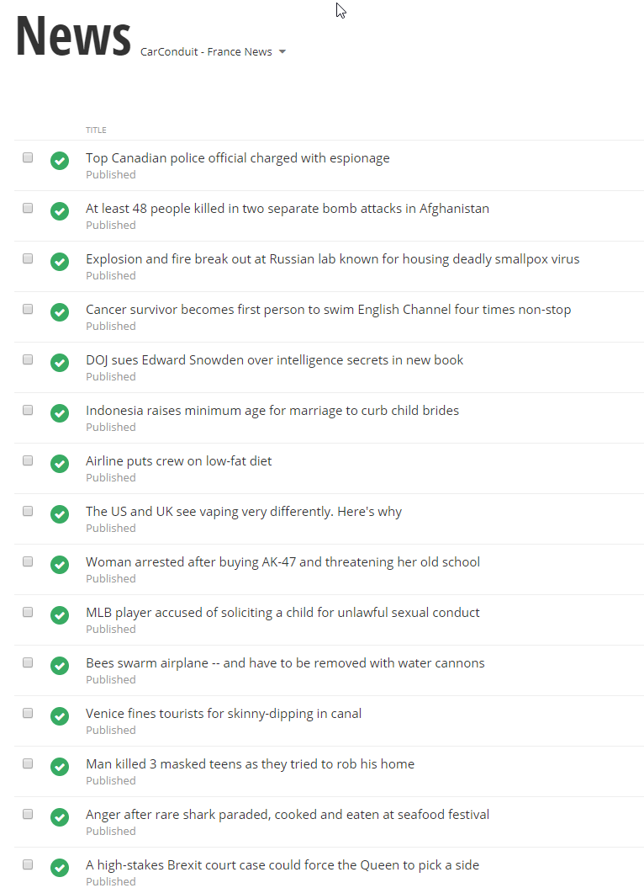{width="4.938888888888889in"
height="2.772222222222222in"}

81 \| ADMINISTRATORS

Multilingual Content
--------------------

> If you need to create a multilingual site, you will need to configure
> languages. You can find the languages settings under *Administration
> \> Settings \> Languages.*

{width="6.527083333333334in"
height="3.76875in"}

> 82 \| ADMINISTRATORS
>
> Click the *Add* button to start adding your languages. You can also
> add region specific languages by selecting the *Show Cultures* link in
> the modal window.

{width="6.520138888888889in"
height="5.665277777777778in"}

83 \| ADMINISTRATORS

> In the *Multilingual URLs* section, you can define the strategy for
> your multilingual content URLs. Unless you absolutely want to have a
> subdomain defined for every language, the default option should work
> pretty well for you. The *Directories* strategy makes it a lot easier
> to manage languages without having to match languages with your sub
> domains.

{width="6.520138888888889in"
height="6.170138888888889in"}

> 84 \| ADMINISTRATORS
>
> Once you have defined the languages, now you can start adding
> multilingual content to your site. Sitefinity includes nice visual
> indicators for multilingual sites, to improve the editing experience.
>
> You will notice that now you have a language selector on the right
> hand of the screen that allows you to quickly navigate to another
> language.

{width="3.3534722222222224in"
height="2.11875in"}

> Multilingual Back End Pages
>
> Localizing back end pages use a similar mechanism used to localize
> front end pages. To change the back-end language:

1.  From the Administration menu select the *Settings \> Languages*
    option

2.  Click the *Manage backend languages* link to see the *Add
    languages\...* button.

3.  Click *Add languages\...* to display the *Select languages* dialog.

4.  Select one or more languages from the list and click the *Done*
    button.

85 \| ADMINISTRATORS

5.  Finally, click the *Save changes* button.

{width="3.9118963254593178in"
height="2.493333333333333in"}

> After clicking the *Close languages for the backend system* link, a
> drop down will allow you to choose the language for the backend
> system. Select a new language from the drop down list, then click the
> *Save changes* button.

{width="4.416666666666667in"
height="1.8569444444444445in"}

> There is no immediate change. You need to load translated [[Labels &
> Messages]{.underline}](#Labels_&_Messages) to see the effect.
>
> []{#Labels_&_Messages .anchor}Labels & Messages
>
> The *Administration \> Labels & Messages* menu item displays a page
> that lists all the labels, captions and other text in the system that
> can be localized. These labels populate all text in the system
> including the Administration menu text, widget text and even the
> column headings in grid widgets. Each label can be edited to define
> the Invariant language (the default language) and for each language
> you have configured from the *Administration \> Settings \>
> Languages*. You can create labels for user interface elements in the
> backend and then export those settings as an XLSX "Language Pack", or
> you can import a language pack that already has the translations.
>
> 86 \| ADMINISTRATORS
>
> Importing and Editing a Language Pack
>
> You can import \"language packs\" of translated labels and messages in
> .xlsx spreadsheet format. Sample language packs can be downloaded from
> the [Sitefinity
> marketplace](http://www.sitefinity.com/developer-network/marketplace)
> [online.](http://www.sitefinity.com/developer-network/marketplace)

{width="6.408482064741907in"
height="3.65625in"}

> To import a language pack, click the *Import language pack* button,
> select the language from the drop down list, and select the downloaded
> XLSX spreadsheet file. Click the *Import* button. It will take some
> time to import and update the system.

{width="4.079096675415573in" height="2.64in"}

87 \| ADMINISTRATORS

> Refresh the page to see all the resourced items in the system backend
> display in the corresponding language.

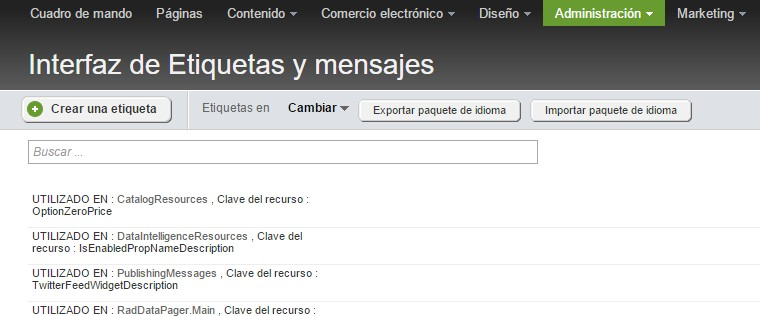{width="6.513888888888889in"
height="2.7333333333333334in"}

> To edit any of the labels, click the item in the list and edit the
> Invariant (default) language, and each language you have defined.

{width="6.4970286526684164in"
height="2.5729166666666665in"}

> 88 \| ADMINISTRATORS

Image Libraries
---------------

> When an image library is first setup, the Root library settings may
> not get a lot of attention, but you will need to review this
> configuration to get the best performance and behavior out of the
> site. To edit image library settings, select the *Content \> Images*
> menu option. In the Actions menu for a library, select the *Edit
> properties* option, then open the Root library settings section.

{width="6.490821303587052in"
height="5.304166666666666in"}

> The top section allows you to automatically resize images as they are
> uploaded. You can keep the original dimensions or limit images a
> selected width.
>
> Browser caching defaults to the same settings as those used for the
> entire site: *No caching*, *Standard caching* with a duration of 90
> days, *Long caching* of 365 days, or *No explicit client caching*. To
> set the cache settings globally, navigate to *Administration \>
> Settings \> Advanced settings \> System \> Output Cache Settings*.

89 \| ADMINISTRATORS

> What if a page won't update and you think it may be cached? You can
> disable the cache to make sure caching is not part of the problem.
>
> **Note:** Consider turning off caching during initial development of
> your site, then turn it back on for production.
>
> The default album size is \"anything goes\", but you should make a
> decision on what the maximum image size should be. You don\'t want
> huge file uploads that take over the server hard disk. Limit the
> overall album size by setting *Max album size* in megabytes and *Max
> image size* in kilobytes.
>
> You can change the *Storage provider* to be *Database* or *File
> System*. By default, all the binary data for images, videos, documents
> and files are stored in the database, but you can use the file system
> to store all of this data.
>
> **Note:** Be aware that the saved data will still be unreadable when
> viewed in the file system. For example, you won't be able to find
> "logo.png" as separate file. Using the file system mechanism just
> shifts the load of where the binary data is stored.
>
> 90 \| ADMINISTRATORS
>
> Server caching options can default to the same as used for the entire
> site (set from *Administration \> Settings \> Advanced Settings \>
> System \> Output Cache Settings*). You could also elect the *No
> caching* option, *Standard Caching* with a 2-minute duration and *Long
> Caching* with a 20-minute duration.

1.  Caching is set to *As set for the whole site* as the default. Click
    the *Details* link to see the current settings. The details popup
    shows the caching options, the HTTP Header equivalent, and help on
    where to reconfigure these settings.

{width="4.397222222222222in"
height="2.8784722222222223in"}

91 \| ADMINISTRATORS

Changing Backend Themes
-----------------------

> Sitefinity comes with an improved backend theme:

-   *Reduced top navigation*, to leave more room for the work area.

-   *Less graphics and color,* to remove unnecessary clutter and reduce
    distraction.

-   *More focus on content,* to improve the interaction with content and
    tasks.

-   *Increased emphasis on actions,* to make it faster and intuitive to
    complete user tasks.

{width="7.025in" height="3.64375in"}

> 92 \| ADMINISTRATORS
>
> To switch to the new theme, you need to login to Sitefinity CMS with
> Administrator privileges and:

1.  Go to *Settings\>Advanced\>Appearance.*

> In field *BackendTheme,* enter *Light*.

{width="6.025in" height="2.69375in"}

2.  Click on the *Save changes* button.

Ecommerce
---------

> Before a set of pages can be built that form a shopping experience for
> visitors, the site administrator must configure a minimal set of
> options. In particular, you must set up a store, shipping methods and
> payment methods. Also, most sales require tax rates be set up. If you
> want enable product reviews, you need to configure comment settings to
> allow it.

93 \| ADMINISTRATORS

> Configure a Store
>
> From the *Ecommerce \> Store* settings menu option you can configure
> online stores so they can accept customer orders.

1.  Select the *Ecommerce \> Store settings \> General link*.

2.  In the Store Details section, enter the Store Name, Address and
    Email.

{width="4.341666666666667in"
height="5.113888888888889in"}

> 94 \| ADMINISTRATORS

3.  The Advanced section has an option to Save credit card number in
    database. This only needs to be selected if credit cards are not
    processed immediately. The option to Bypass real-time payment
    processing allows you to skip setting up credit card authorization,
    just to test the system.

{width="5.3530304024496935in"
height="1.6354166666666667in"}

4.  Click the *Save* button.

95 \| ADMINISTRATORS

> Configure Tax
>
> Configuring taxes determines when and how taxes are added to orders.
> Click the Tax link. The default excludes the tax until checkout.
> Instead, you can include the tax in the price automatically or you can
> manually include the taxes in the price as the price is entered. Leave
> the defaults.

{width="4.195138888888889in"
height="4.270138888888889in"}

> Configure Measurement Units
>
> This section determines how product weight and dimensions are
> measured. Click the Measurement Units tab. Mass unit (weight) can be
> Pound, Kilogram or Gram. Length unit can be Inch, Meter, Centimeter,
> or Millimeter. Leave the defaults here.

{width="1.8520833333333333in" height="1.675in"}

> 96 \| ADMINISTRATORS
>
> Configure Currency
>
> This section determines the currencies your site will handle and the
> exchange rate for those currencies. Click the Currencies tab. A
> default currency will display. Click the Add currencies button and
> select one or more from the list of standard currencies, then click
> the Done button.

{width="2.9520833333333334in"
height="1.2152777777777777in"}

> Once new currencies are added, the Exchange rates section displays.
> While you can set the exchange rate manually, the Use external service
> option allows you to select a service from a drop down and populate
> the exchange rates automatically. Just click the Get rates button. To
> recalculate the rates daily, select the Automatically update daily
> check box.

{width="2.6560728346456695in"
height="2.0625in"}

> Shipping Methods
>
> Shipping methods describe how products will be delivered to the
> customer. You can either use a carrier, like Federal Express or you
> can handle the shipping arrangements yourself *offline*.
>
> If you decide to ship online using a carrier, you will need to setup
> an account. Typically, each carrier will have a developer site that
> allows you to sign up for a test account that you can use to verify
> your ecommerce system will work before going live.

97 \| ADMINISTRATORS

> Creating an Online Shipping Method
>
> To demonstrate creating a shipping method that uses an online carrier,
> this example uses a FedEx test account.

1.  Go to the FedEx developer site at <http://fedex.com/us/developer/>
    and create an account. Collect the account URL, Password, License
    Key, MeterID and Account number from the confirmation page and the
    follow up email sent by the developer site.

2.  Select the *Ecommerce \> Shipping* methods menu option.

3.  Click the *Create a shipping method* link.

4.  Enter a Name for the method. Select the Area you will ship to using
    this method. Leave the Standard (Shipping carriers). Select FedEx
    Shipping Carrier from the drop down list.

{width="5.941912729658792in"
height="4.168748906386702in"}

> 98 \| ADMINISTRATORS

5.  Select the check boxes for all types of shipping that you want to
    include in this method.

{width="6.005831146106737in"
height="2.586561679790026in"}

6.  Using the information from the FedEx developer site, enter the Url,
    Password, License Key, MeterID and Account Number.

{width="6.004421478565179in"
height="2.82875in"}

7.  Click the *Create this shipping method* button.

99 \| ADMINISTRATORS

> Creating an Offline Shipping Method
>
> To ship offline:

1.  Select the *Ecommerce \> Shipping* methods menu option.

2.  Click the *Create a shipping* method link.

3.  Enter a Name for the method. The screenshot below uses *Slow Train*
    as an offline shipping method example. Select the Area you will ship
    to using this method.

{width="6.004564741907261in"
height="1.9181244531933508in"}

4.  Select the *Custom (Offline)* radio button.

{width="6.003996062992126in"
height="1.1043744531933508in"}

5.  Shipping offline requires that you set the shipping cost
    specifically. In the Shipping price area, you can base the price on
    Weight, Total price, Fixed price per order, Fixed percentage of the
    total price or Quantity. This example uses the Fixed percentage of
    total price option with Shipping price set to 10%.

{width="5.686784776902887in"
height="1.7141666666666666in"}

> 100 \| ADMINISTRATORS

6.  Click the *Create this Shipping method* button.

> Payment Methods
>
> Payment methods describe how orders will be paid for: online with a
> credit card or offline where you handle the payment arrangements.
>
> Creating an Online Payment Method
>
> Online payment methods describe how a commercial payment processor
> like PayPal or Authorize.Net AIM handle your site's credit card
> transactions. Online payment processing services typically have live
> accounts for production online ordering and test accounts to help
> verify that your processing will be correct.
>
> Each payment processor has its own set of information that must be
> entered in Sitefinity's payment type. Typically, the payment processor
> supplies you with a URL of a service that performs the processing and
> some kind of authentication such as login id or vendor name. The
> payment processor developer documentation may also supply test credit
> card numbers that will not charge an account but will pass validation.
>
> For example, you can sign up at the Authorize.Net developer center for
> a test account at
> [https://developer.authorize.net/testaccount/.](https://developer.authorize.net/testaccount/)
> Here's an example walk-through that uses Authorize.Net AIM to create
> an online payment type:

1.  Sign up for a new account at
    [[https://developer.authorize.net/testaccount/]{.underline}.](https://developer.authorize.net/testaccount/)
    Collect the login ID and Transaction key they provide.

2.  In Sitefinity, select the *Ecommerce \> Payment methods* menu
    option.

3.  Click the *Create a payment method* link.

4.  Enter a Name for the method, for example, Credit Card.

101 \| ADMINISTRATORS

5.  Select Authorize.Net AIM from the Payment processor drop down list.

{width="2.560416666666667in"
height="2.76875in"}

6.  The Payment processor drop down list selection cascades to set the
    allowed credit cards and required authentication settings.

7.  Select the check boxes for credit card types you will accept on your
    site. For now, leave the Mode radio button at Test. Set the URL to
    [[https://test.authorize.net/gateway/transact.dll]{.underline}.](https://test.authorize.net/gateway/transact.dll)
    Enter the Login ID and Transaction key supplied by the developer
    site.

{width="4.586255468066492in"
height="3.6165616797900264in"}

> 102 \| ADMINISTRATORS

8.  In this example, the Timeout is 30000 milliseconds (30 seconds), the
    Payment type is Sale and the API version at the time of this writing
    is 3.1.

{width="6.004730971128609in"
height="2.150624453193351in"}

9.  Click the *Create this payment method* button.

10. Once you test that the online payment methods work, you can change
    the URL to a live URL (you get this URL from the payment processor)
    and switch the Mode from Test to Live.

103 \| ADMINISTRATORS

> Creating an Offline Payment Method
>
> The offline payment method simply defines a Name. Once you enable the
> This payment method is active checkbox, you can use the method. This
> leaves the responsibility for collecting payment to you. To create an
> offline payment method:

1.  Select the *Ecommerce \> Payment methods* menu option.

2.  Click the *Create a payment method* link.

3.  Enter a Name for the method. The screenshot below uses Payment on
    delivery as an offline payment example.

4.  Make sure that the *This payment method is active* checkbox is
    enabled and click the *Create this payment method* button.

{width="5.942435476815398in"
height="3.689582239720035in"}

> 104 \| ADMINISTRATORS
>
> Taxes
>
> You don't want to lookup tax amounts for every purchase. Instead,
> Sitefinity allows you to define taxes based on the unique combination
> of shipping or billing location and the country where the product is
> to be delivered. Taxes are associated with products when the product
> is created. Tax amounts are calculated automatically during the
> checkout process based on the rates that you define. The screenshot
> below defines a tax named Standard VAT for shipping addresses where
> the country of delivery is the United Kingdom, the rate is defined as
> 20% and is not applied to shipping costs.

{width="5.876008311461067in"
height="4.673228346456693in"}

> **Note**: You can import and export taxes as CSV (comma delimited)
> files from the
>
> *Ecommerce \> Taxes* page.

105 \| ADMINISTRATORS

> Tax Classes
>
> Tax classes allow you to subdivide a tax into different rates or to
> flag some products as tax exempt. For example, the United Kingdom
> Value Added Tax (VAT) might have a standard rate of 20%, a reduced
> rate of 5% for some items like home energy and a zero rate for certain
> goods and services like food and children's clothes.
>
> Select the *Ecommerce \> Tax Classes* menu item. Then click the
> *Create a tax class* button. Enter a name for the tax class (the
> actual rate is defined when creating or editing a tax). There is a
> single field to enter the Tax class name.

{width="5.57079615048119in"
height="1.3347911198600175in"}

> Once your tax rates are defined, return to *Ecommerce \> Taxes*. You
> can create a new tax or edit an existing tax. Below the Standard rate
> for the tax, you should see tax classes you have created. The
> screenshot below shows the standard 20% VAT rate, a 5% rate for home
> energy, a zero rate for children's clothes and a rate for postage.
> Notice that the postage tax class is flagged Tax exempt.

{width="2.4830785214348206in"
height="2.1553116797900262in"}

> 106 \| ADMINISTRATORS
>
> When content creators build a product catalog and define new products,
> they can select a Tax class from the list.

{width="4.338541119860017in" height="2.125in"}

> Discounts
>
> Discounts allow you to promote products by offering lower rates based
> on the customer belonging to a group. For example, the user may have
> attended a tradeshow where they received a coupon code. To create a
> discount:

1.  Navigate to *Ecommerce \> Discounts*.

2.  Click the *Create a Discount* button.

3.  Enter a Name for the discount and a Discount amount. The discount
    amount can be percentage or an absolute currency amount. If you want
    to limit the number of times the discount can be applied, enter a
    number in the *This discount can be used* text box.

{width="5.94409230096238in"
height="2.347916666666667in"}

107 \| ADMINISTRATORS

> The *Apply discount for...* section creates a group of customers based
> on a criterion. The discount can be for All customers, Existing
> customers, New Customers, customers that enter a coupon code (this
> shows up in the checkout process) or based on Sitefinity roles or
> particular users. This example applies the discount if the customer
> enters a coupon code.

{width="6.003464566929134in"
height="2.3153116797900264in"}

> You can limit the discount to be effective only between a Start date
> and End date.

{width="6.006914916885389in"
height="1.3853116797900262in"}

> You can also establish a threshold where the amount must be within a
> certain Minimum subtotal or Maximum subtotal.

{width="6.000856299212598in"
height="1.7340616797900263in"}

4.  Click the *Create this discount* button to add the discount.