Administrators
==============

As an administrator, you will be configuring the Sitefinity website
environment for content authors, designers and developers to work in.
You want to give everyone the tools they need while still protecting
security and resources. The sections that follow explain setup of key
areas of the site like email setup, modules, security and site management.

Email and Notification Configuration
------------------------------------

Emails can be triggered by:

-   An administration action such as a password reset or signup email.

-   User action on content such as making a comment, creating an order
    or email from a campaign. These emails are *notifications*.

Emails setup in Sitefinity is configured through *Administration \> Settings \>Basic Settings \> Email Settings* 
Make sure that the SMTP server is entered in the Host text box
and that the Port is correct for your server. Also enter the UserName
and Password credentials for the server. Depending on the SMTP server
requirements, you may need to enter additional settings like **Use SSL**

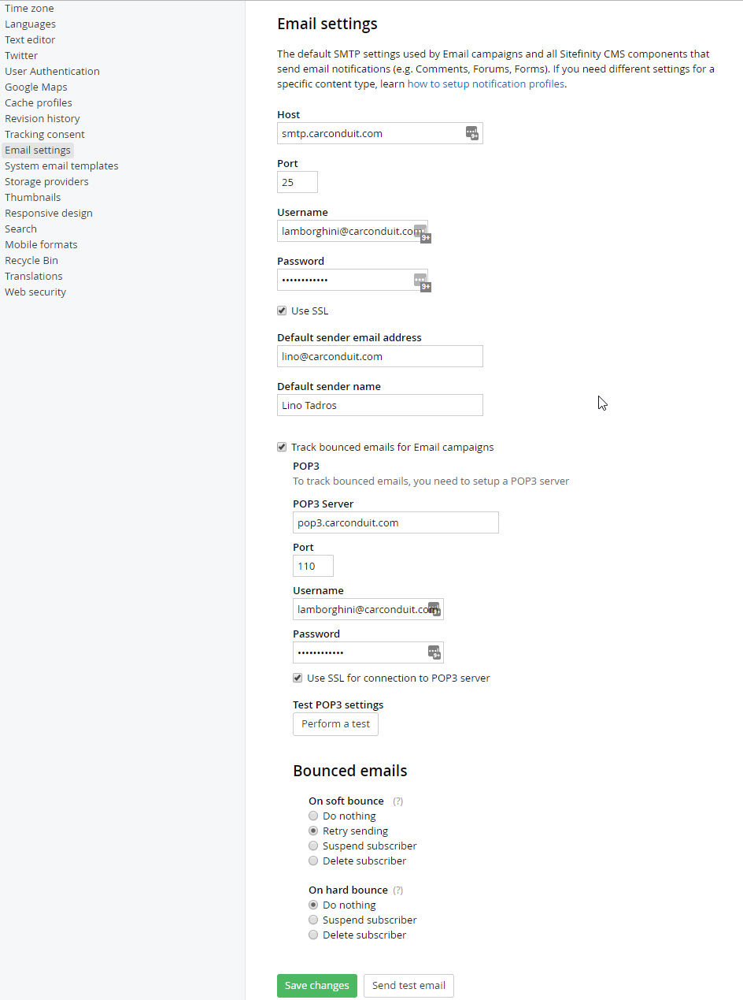

Invalid email addresses "bounce" or fail to deliver can be tracked by enabling the *Track bounced emails for email campaigns* messaged check box to manage bounced messages. You will need
address and authentication info for the POP3 server that will retrieve bounced messages.

The POP3 server can optionally respond to the temporary and permanent
email delivery problems using *Soft bounce* and *Hard bounce* options.
The Soft bounce options handle temporary problems such as when the
recipient's mailbox is full, the email server is offline or the email
is too large. Hard bounce responds to permanent delivery problems like
incorrect email addresses, a bad domain name or if the recipient's
server blocks email delivery.

Personalization
---------------

Using a combination of user segments, personalized
pages, and the Personalization Preview Console, you can create customized
experiences for every visitor to your website.

Personalization allows tailoring pages to specific groups of users.
These groups or *segments*, can be identified by their location, the
time of day, and even the length of their stay on the site.

#### User Segments

The key to content personalization lies in defining user segments from
the Sitefinity administration menu under Marketing \> Personalization.

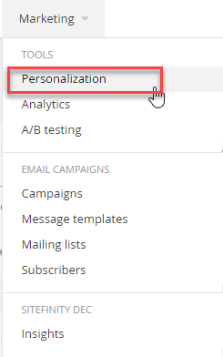

Click the *Create a User Segment* link to define the characteristics
for that segment.

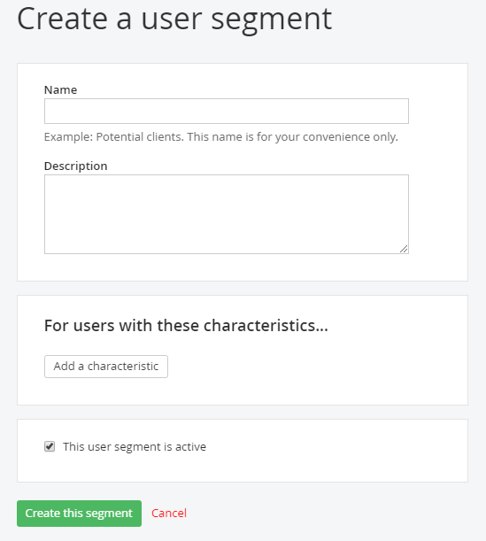

Click *Add a characteristic* to create one or more of these
characteristics to define as broad or detailed a segment you wish to
target. You can add as many characteristics as you need to pinpoint
your target audience.

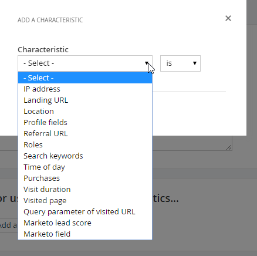

For example, selecting *Location* presents an input to define one or
more geographical regions (cities, states, countries, etc.) that will
identify users of the segment.

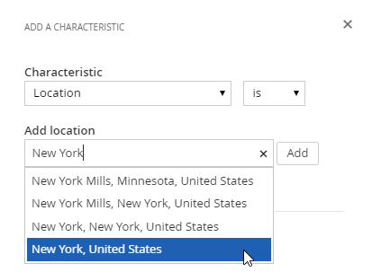

Here is a partial listing of some commonly used characteristics:

-   *Landing URL*: any user who enters your website from the page you
    define here will be identified as a user of that segment, even if
    they navigate to other pages later.

-   *Location*: uses geocoding to identify a city, state, or country
    where a user is located.

-   *Time of day*: defines an interval of time during which visitors are
    considered to be users of the segment.

-   *Role*: the role of the user in the Sitefinity system.

-   *Profile Fields*: Fields that define the user such as name,
    nickname, preferred language or number of posts can be used to
    identify characteristics.

-   Purchases by Department, price range, type of product and so on.

-   *Marketo* data fields if the Sitefinity site is connected to the
    [Marketo](http://www.marketo.com/) product.

Each selection will be added to the user segment definition. To enable
the segment, select the *This user segment is active* check box and
save your changes.

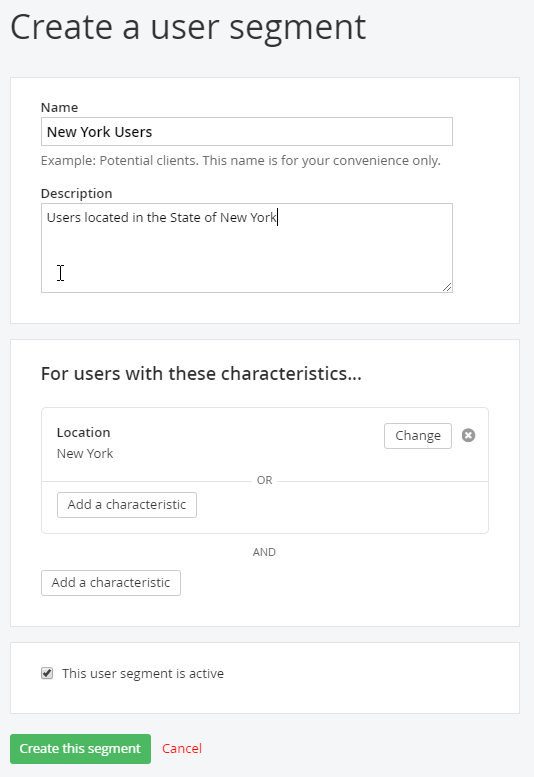

#### AND/OR Logic

You can create flexible criteria using AND and OR sections within the
editor. For example, the user visited the Welcome page AND the location
is New York and the time is between 8 and 10 AM OR the visit was between 0
and 180 seconds.

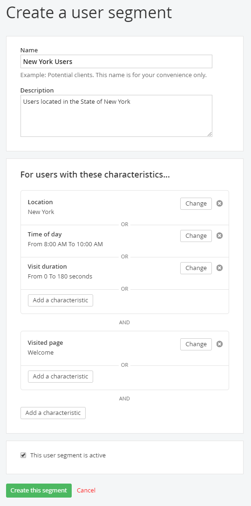

Users that match all criteria of a segment will be identified as
members of that segment. Users can belong to several different
segments simultaneously.

#### Segment Priority

Users segments are displayed in priority order, from top to bottom.
The topmost matched segment determines the personalized
content a user will see.

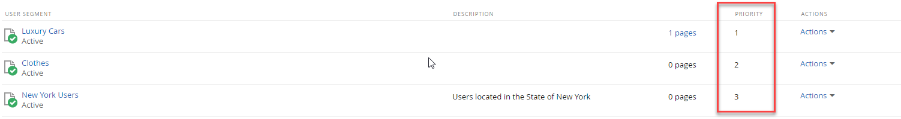

To reset priority, use the *Up* and *Down* options from the Actions menu.

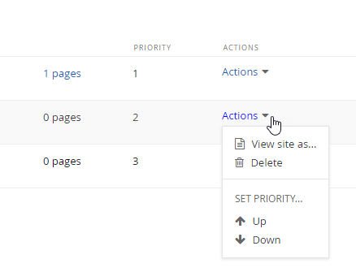

#### Creating Personalized Pages

Your initial, "original" pages are served to everyone that isn't part
of a segment. To personalize Sitefinity pages, create alternate
versions for specific users.

From the top of a Page in edit mode, click the down arrow next to the Personalization icon as you see below in the screenshot, and click on **Create personalized page**

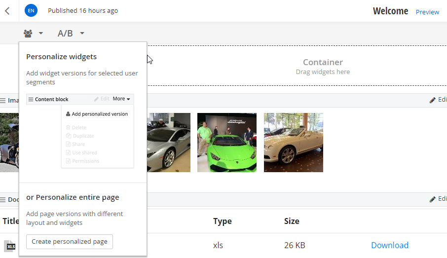

Sitefinity will prompt you to select a segment. Click the *Create and
go to edit content* button. A copy of the original page is created.
You can edit the copied page just like you would with any other
Sitefinity page and publish your changes.

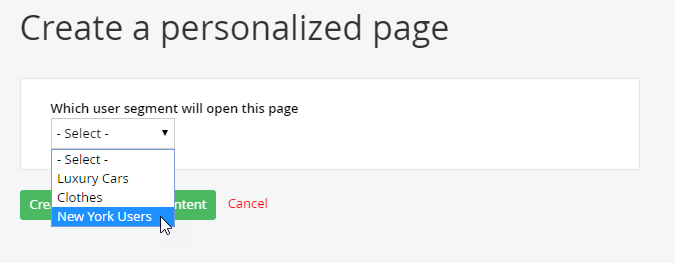

Reloading the pages list reveals a new Personalized link next to the
page.

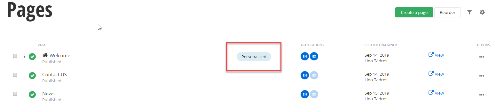

Previewing Personalized Pages
-----------------------------

To test that segment criteria and personalized pages work as expected,
open the preview console from *Marketing \> Personalization*, then
click *View site as...* button.

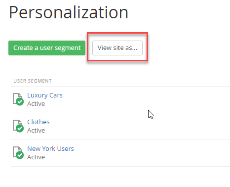

The personalization console sidebar lets you view the page as if you
were part of a segment.

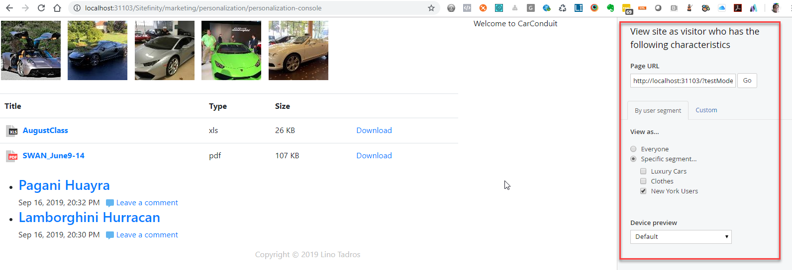

To define an ad-hoc set of characteristics, click the *Custom* link.

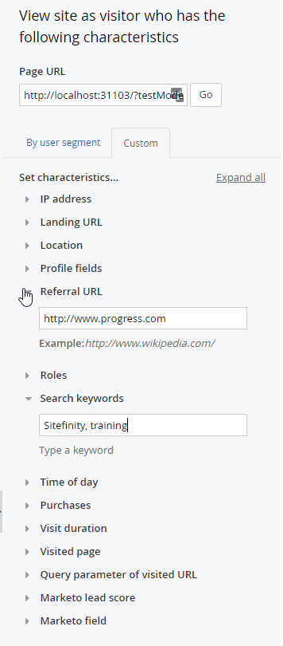

The Device preview drop down switches between views of the page
displayed on various smart devices like iPhone, Android and tablets.

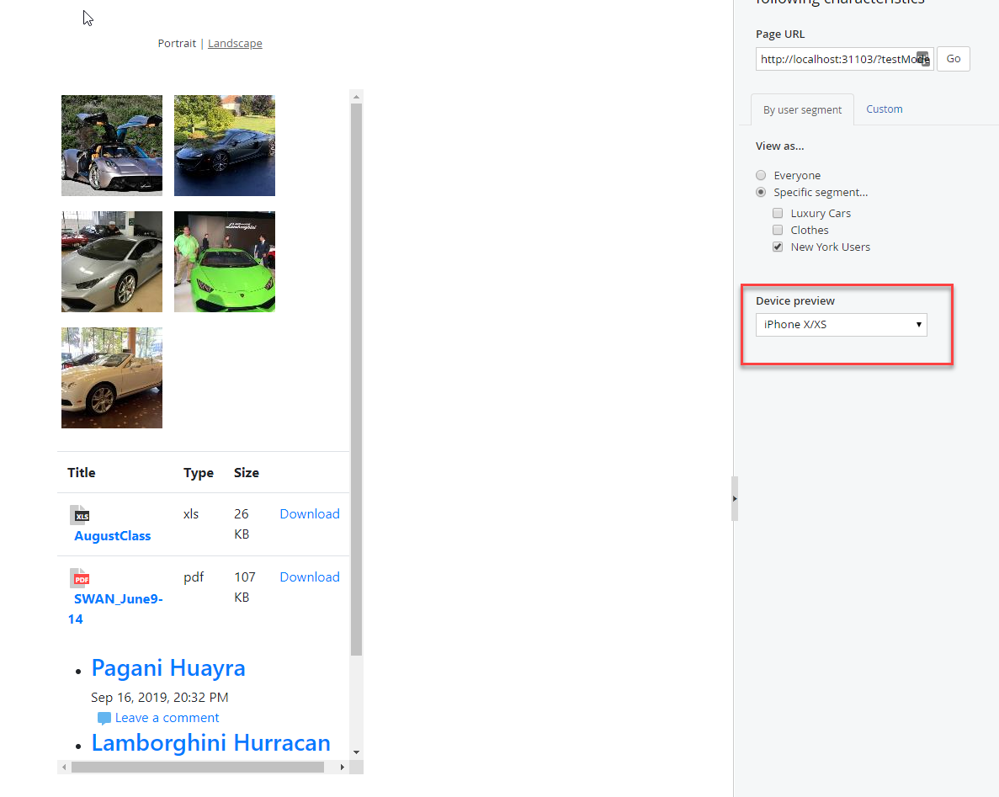

**Next Topic**
[Modules](../Modules/readme.md)