Workflow
--------

A workflow is an approval process for publishing documents. By
default, there are no custom workflows, so you can publish a document
directly without additional steps. A simple custom workflow might have just
two steps, one to approve the document (perhaps a manager must review
before the document is published) and the publishing step itself. At
the other end of the spectrum, government organizations have strict
protocols for publishing with many steps in their approval process.

Workflows can include notification so that a manager receives an email
when a document is awaiting approval.

#### Defining a Workflow

**To define a custom workflow:**

1.  In the administration menu, click the *System \> Workflow* item.

2.  No custom workflows have been created yet, so click the *Define a workflow* link.
 
3.  Enter a *Name* for the workflow.

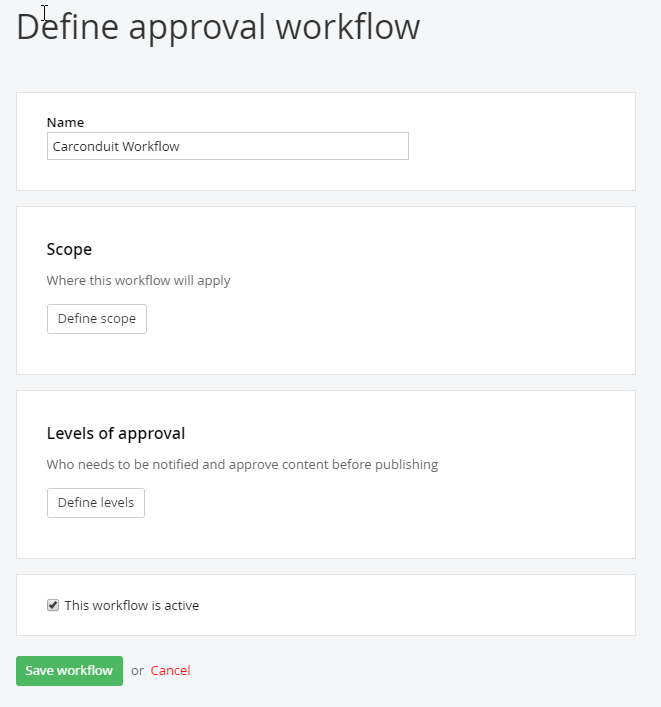

4.  The *Scope* section defines where the workflow will apply. Choose **Page** and **Blogs**. This means that the workflow will be triggered anytime the save button is clicked for any page or nes item. The remaining workflow options can be left with default values.

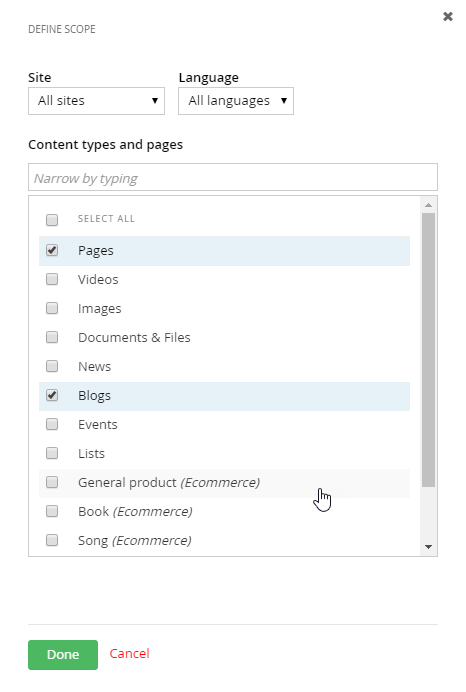

5.  In the **Level of Approval** section, click on **Define Levels** 
    - One level of Approval is a single level of approval before the content is published and becomes available on the website. 
    - *2 levels of approval* before publishing is for organizations that need different role to approving then to publishing. If you select this option, you need to define the two roles that need to approve the content. 
    - *3 levels of approval* before publishing is for organization they require different rols for reviwing, approving and publishing.   If you select this option, you need to define the three roles that need to review, approve and publish the content. 
    - No Approval Workflow before publishing allows the user to publish right after creation right away.
   
 
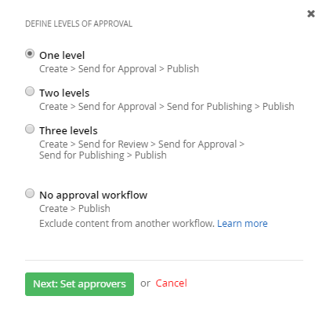

6.  Click the *Next:Set approvers* button.

7.  Choose the **editors** group to be able to approve content

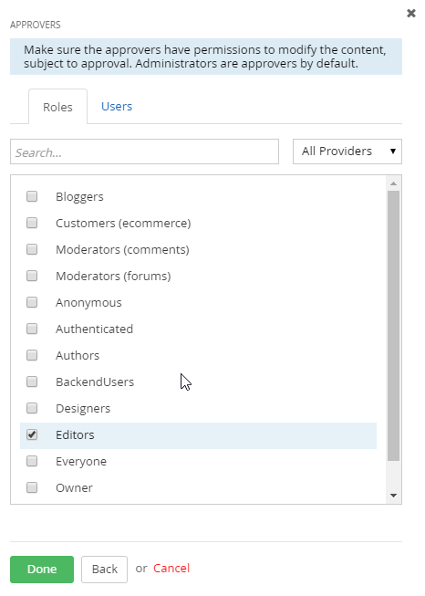

8. Save the role.

**Note**: The *Allow administrators to skip the workflow* option is
recommended so that you don\'t have to slog through the approval
process when you\'re making a lot of changes to the backend.

9. finally, your workflow should look like this:

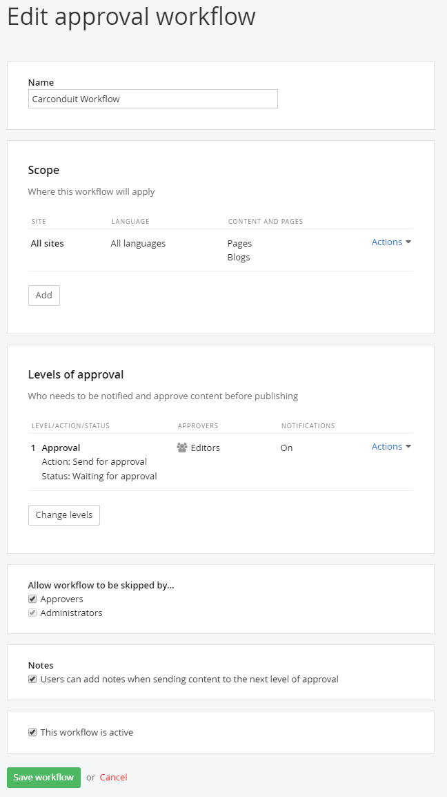

10.  Click the *Save workflow* button.

Testing the Workflow
--------------------

1.  Log out, then log back in as the user you created for the previous permissions example.

2.  Edit one of the existing blog posts.

3.  Click the *Save Draft* button (notice that there is no *Publish* button).

4.  Click the new *Send for Approval* button. Now the list of blog posts
    shows a new status indicating the content is waiting on approval. A
    user with an editor or administrator role can publish the content.

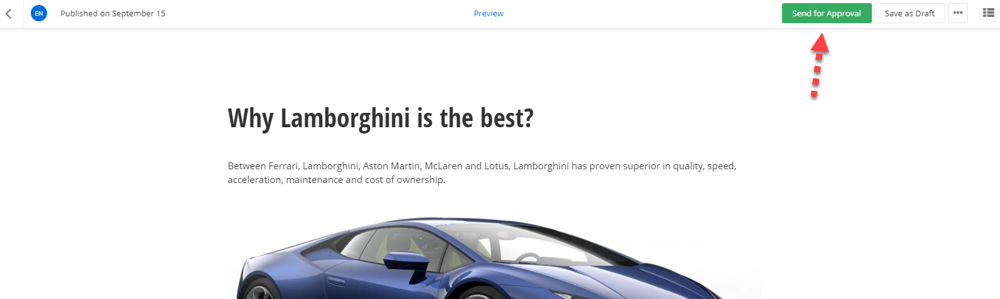

#### Site Management Notes on Upgrading

The [Sitefinity documentation on
upgrading](http://www.sitefinity.com/documentation/documentationarticles/installation-and-administration-guide/upgrade)
details how to upgrade from Sitefinity 3.7 (and even earlier) to the
present release of Sitefinity. Many of these instructions center on
the Upgrade option on the right-click menu of the Project Manager. The
catch is that the upgrade option will wipe out the Visual Studio
project file to the default settings and the web configuration file
also gets set back to its "vanilla" settings. If there is the
slightest customization, non-standard references, or web configuration
file changes in your Sitefinity project, these customizations can get
lost by taking the upgrade menu option.

You can manually merge the Visual Studio project file (.csproj) web
configuration (web.config) by comparing the files located in the
Sitefinity installation directory under

\_EmptyProject against your site. The \_EmptyProject files are used to
create new sites. By comparing your site with the \_EmptyProject you
can see how the site has been customized since it was created. You can
use any source comparison tool to compare the project and web config
files.

Notes on Deployment

The [Sitefinity documentation on
deployment](http://www.sitefinity.com/documentation/documentationarticles/installation-and-administration-guide/deployment)
details how to move your Sitefinity application to a production
server. In addition, be sure not to overwrite the app\_data folder or
the database in production. These are live and constantly changing.
With changes happening every second, overwriting the database can
cause the database to become corrupt. Even when deploying code files
to the app\_data folder, the database is being updated.

When deploying, zip the project except for the app\_data folder and
then overwrite the production files. You should merge the web.config
manually, just as you would with any .NET application.

#### Continuous Delivery

*Continuous delivery* is an approach of automating development changes
to production frequently and reliably, usually on a regular schedule.
Continuous delivery isn't about moving content, but deploying elements
that require development, like new modules or widget modifications.

Earlier versions of Sitefinity weren't suited for continuous delivery.

-   Sitefinity configuration was tightly bound to the database. Guids in
    the database had to stay in sync with the XML configuration files.
    Moving a configuration file directly to production was likely to
    break the site.

-   You couldn't export dynamic modules that didn't already exist on the
    production server.

-   You couldn't transfer custom fields using Site Sync. You had to
    manually create custom fields on the target site.

Now, Sitefinity configuration files are cleanly implemented, without
tight coupling between database and configuration files. Sitefinity is
able to pick up dynamic module changes automatically. You no longer
have to manually create custom fields on the production server, you
can export custom fields on the development server and Sitefinity on
the production server will automatically detect and apply the changes.

#### Site Synchronization

The Site Sync module automatically copies content from one site to
another. For example, if you have a live server and staging server you
can refresh the staging server with live data. Both servers should be
running the same version of Sitefinity with the same licensing.

In the example that follows we have two sites named Site1 and Site2
configured to run in IIS. There is an administrative user in each
project called SiteSyncIUser1 and SiteSyncUser2, respectively. You can
setup both sites side-by-side. Site1 will be configured to send data
to Site2.

#### To enable site synchronization:

1.  The projects should be hosted in IIS. Configure the Sitefinity
    projects to work in your version of IIS using the steps in the
    documentation foun[d
    here.](http://www.sitefinity.com/documentation/documentationarticles/installation-and-administration-guide/install-sitefinity/configuring-the-iis-to-host-sitefinity-projects)

2.  Run both sites and login to the backend of each.

3.  By default, site synchronization is not installed or active so your
    first step will be to select the Administration \> Modules &
    Services menu option. Click the Install option in the Actions menu
    of the Staging and Syncing item. Do this for both sites.

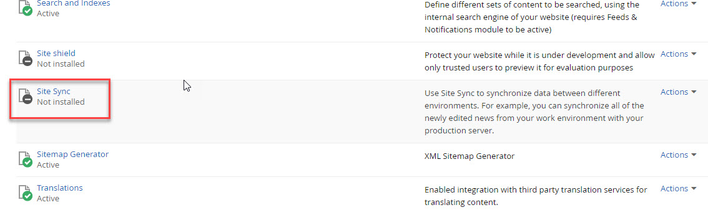

4.  [Create a new user](#Creating_a_User) from the *Administration \>
    Users* menu option. This user will only be used for site
    synchronization and will never be logged in. The user should have
    the Administrator role. Do this for both sites and make the name
    unique for each site, e.g. SiteSyncIUser1 and SiteSyncUser2.

5.  Now select the new menu item *Administration \> Staging and Syncing*
    for both sites.

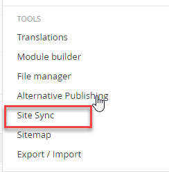

6.  Click the Synchronization Settings for each site.

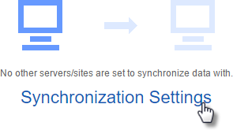

7.  Select the *Allow content from other sites to be published to this
    site* checkbox on both sites. In the Site key text box, enter 1 for
    the first site and 2 for the second site. Click the Save changes
    button.

8.  In Site1, click the *Add a server button*. In the dialog that
    displays, enter the URL for Site2. Use the administrative username
    and password to the server. Click the *Add this server* button.

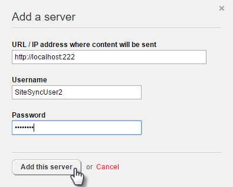

The Staging and Synchronization screen for the first site now looks like this:

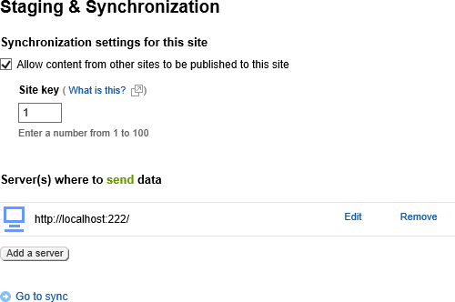

9.  In the first site, click the *Go to sync* link.

10. Click the *Test connection* button.

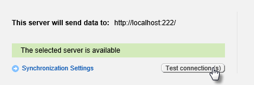

11. In the What do you want to sync? Area, you can select all kinds of
    Sitefinity content, but for now just select Blogs and Blog Posts.

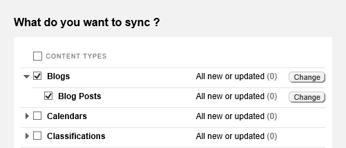

12. Click the *Sync now* button. You will be warned that related data
    may be synced. Click the *OK* button.

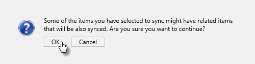

A progress bar will display briefly, depending on the amount of data
being transferred. A summary screen will display the results of the
sync operation.

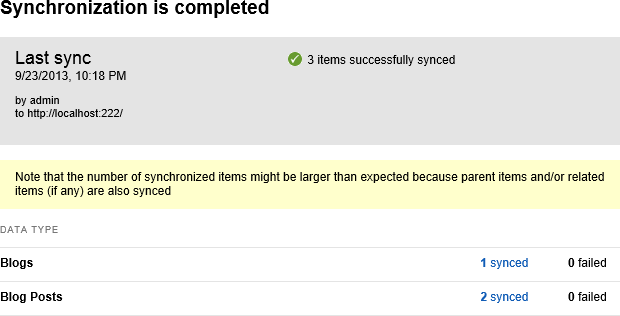

#### Synchronizing on a schedule

Instead of clicking the *Sync now* button, you can choose the
*Schedule sync* button and set the sync to run at a regular time,
every Sunday at 1am for example. Choose the schedule frequency using
the drop down lists and then click the *Schedule* button. You can run
the schedule Today or Tomorrow, Every day, or on a specific day or
date.

**Next Topic**
[Azure Deployment](../Azure%20Deployment/readme.md)